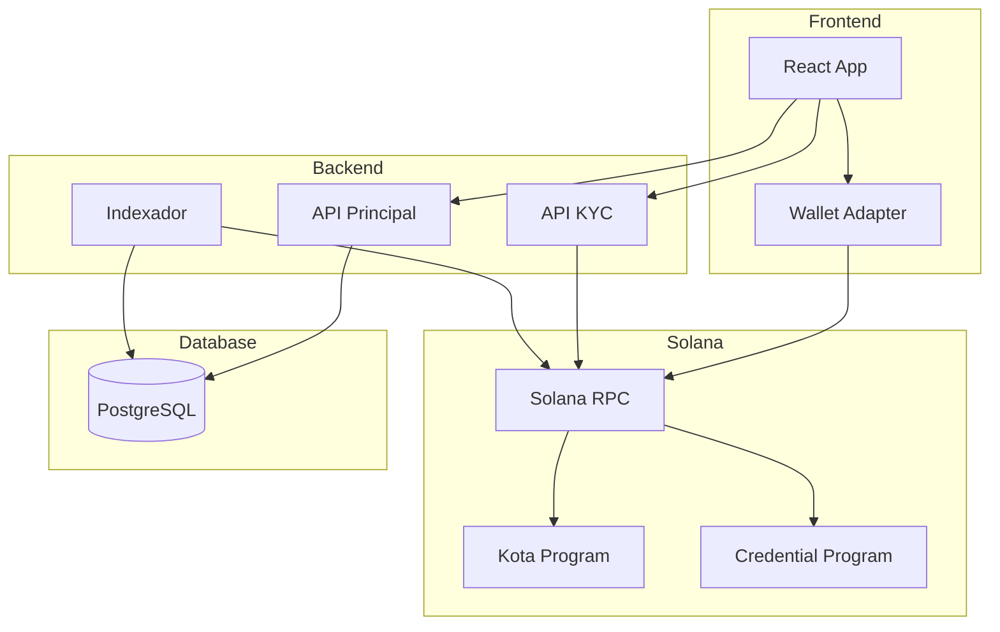

# Diagrama: Arquitetura do Sistema Kota

## Descrição
Diagrama de arquitetura geral do sistema Kota, mostrando todas as camadas: Frontend, Backend, Blockchain e Database.

## Propósito
Mostrar como os componentes do sistema se conectam e comunicam entre si.

## Mermaid Atual


## Componentes
- **Frontend**: React App + Solana Wallet Adapter
- **Backend**: API Principal (Node.js:3004), KYC API (Node.js:3005), Indexador (Go:9090)
- **Blockchain**: Solana RPC, Kota Program, Credential Program
- **Database**: PostgreSQL

## Paleta de Cores do Site
```
Background:
- #030712 (quase preto - fundo principal)
- #111827 (gray-900)
- #1f2937 (gray-800)

Primary (Purple):
- #9333ea (purple-600)
- #7c3aed (purple-600 darker)
- #a855f7 (purple-500)
- #c084fc (purple-400)

Accent:
- #14F195 (Solana green)
- #22d3ee (cyan-400)

Text:
- #f3f4f6 (gray-100 - títulos)
- #d1d5db (gray-300 - texto principal)
- #9ca3af (gray-400 - texto secundário)
- #6b7280 (gray-500 - texto muted)

Borders:
- #374151 (gray-700)
- #4b5563 (gray-600)
```

## Estilo Desejado
- Design moderno e dark mode
- Gradientes sutis do purple para cyan
- Ícones minimalistas para cada componente
- Linhas de conexão com setas elegantes
- Sombras suaves e glassmorphism
- Cantos arredondados
- Grupos/subgraphs com bordas sutis e fundo semi-transparente

## Referência Visual
Estilo similar a diagramas de arquitetura modernos como Vercel, Supabase ou Linear - clean, minimalista, com foco em legibilidade.
