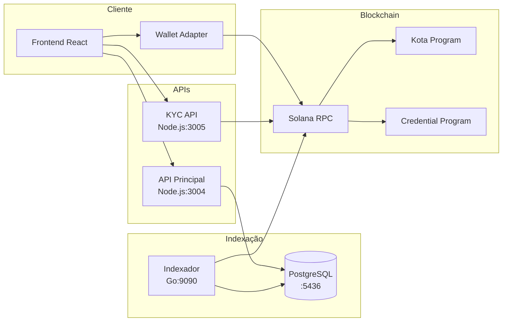

# Diagrama: Arquitetura Detalhada com Portas

## Descrição
Versão detalhada da arquitetura mostrando portas de cada serviço e fluxo de dados entre componentes.

## Propósito
Documentação técnica para desenvolvedores entenderem a infraestrutura completa.

## Mermaid Atual


## Componentes e Portas
| Serviço | Porta | Tecnologia |
|---------|-------|------------|
| Frontend | 5174 | React + Vite |
| API Principal | 3004 | Node.js + Express |
| KYC API | 3005 | Node.js + Express |
| Indexador | 9090 | Go |
| PostgreSQL | 5436 | PostgreSQL 15 |

## Paleta de Cores do Site
```
Background:
- #030712 (quase preto)
- #111827 (gray-900)
- #1f2937 (gray-800)

Primary (Purple):
- #9333ea (purple-600)
- #a855f7 (purple-500)
- #c084fc (purple-400)

Accent:
- #14F195 (Solana green)
- #22d3ee (cyan-400)

Text:
- #f3f4f6 (gray-100)
- #d1d5db (gray-300)
- #9ca3af (gray-400)
```

## Estilo Desejado
- Layout horizontal (left to right)
- Cada grupo com cor de fundo distinta mas harmoniosa
- Badges com portas em destaque
- Conexões com linhas elegantes e direcionais
- Ícones representativos (React logo, Node.js, Go gopher, PostgreSQL elephant, Solana logo)
