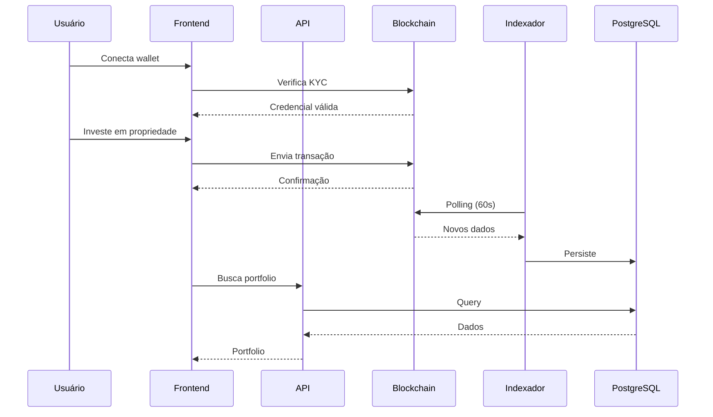

# Diagrama: Fluxo de Dados (Sequência)

## Descrição
Diagrama de sequência mostrando o fluxo completo de um investimento, desde conexão da wallet até recebimento de tokens.

## Propósito
Explicar o fluxo temporal das operações entre usuário, frontend, blockchain e banco de dados.

## Mermaid Atual


## Participantes
1. **Usuário** - Investidor usando a plataforma
2. **Frontend** - Aplicação React
3. **API** - API Principal (Node.js)
4. **Blockchain** - Solana (programas on-chain)
5. **Indexador** - Serviço Go de indexação
6. **PostgreSQL** - Banco de dados

## Paleta de Cores do Site
```
Background: #030712, #111827
Primary Purple: #9333ea, #a855f7, #c084fc
Accent: #14F195 (Solana green), #22d3ee (cyan)
Text: #f3f4f6, #d1d5db, #9ca3af
Success: #22c55e (green-500)
```

## Estilo Desejado
- Fundo escuro (#030712)
- Participantes com cores distintas:
  - Usuário: cyan (#22d3ee)
  - Frontend: purple (#a855f7)
  - API: blue (#3b82f6)
  - Blockchain: Solana green (#14F195)
  - Indexador: orange (#f97316)
  - Database: gray (#6b7280)
- Setas com gradiente
- Caixas de ação com bordas arredondadas
- Labels claros e legíveis
- Estilo moderno tipo diagrams.net ou Excalidraw dark mode
