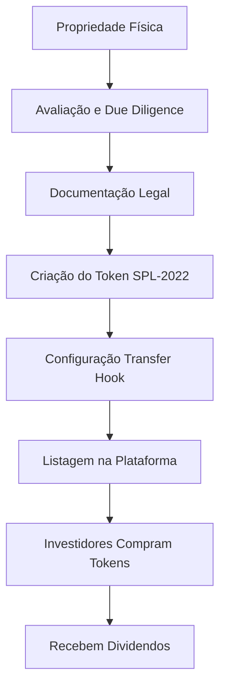

# Diagrama: Fluxo de Tokenização

## Descrição
Processo de tokenização de um imóvel físico até se tornar tokens negociáveis.

## Propósito
Explicar as etapas desde a propriedade física até investidores receberem dividendos.

## Mermaid Atual


## Etapas
1. **Propriedade Física** - Imóvel real selecionado
2. **Avaliação e Due Diligence** - Verificação legal e avaliação de mercado
3. **Documentação Legal** - SPV e estrutura jurídica
4. **Criação do Token SPL-2022** - Mint do token na Solana
5. **Configuração Transfer Hook** - Setup de compliance KYC
6. **Listagem na Plataforma** - Disponibilização para investidores
7. **Investidores Compram Tokens** - Aquisição fracionada
8. **Recebem Dividendos** - Distribuição de receitas

## Paleta de Cores do Site
```
Background: #030712, #111827
Primary Purple: #9333ea, #a855f7, #c084fc
Accent: #14F195 (Solana green), #22d3ee (cyan)
Text: #f3f4f6, #d1d5db
```

## Estilo Desejado
- Fluxo vertical (top to bottom)
- Cada etapa com ícone representativo:
  - Casa para propriedade física
  - Lupa para due diligence
  - Documento para legal
  - Moeda/token para criação
  - Shield/check para compliance
  - Store para listagem
  - Pessoas para investidores
  - Dinheiro para dividendos
- Gradiente de cores do purple ao green conforme avança
- Conectores com setas animadas (se possível)
- Estilo infográfico moderno
