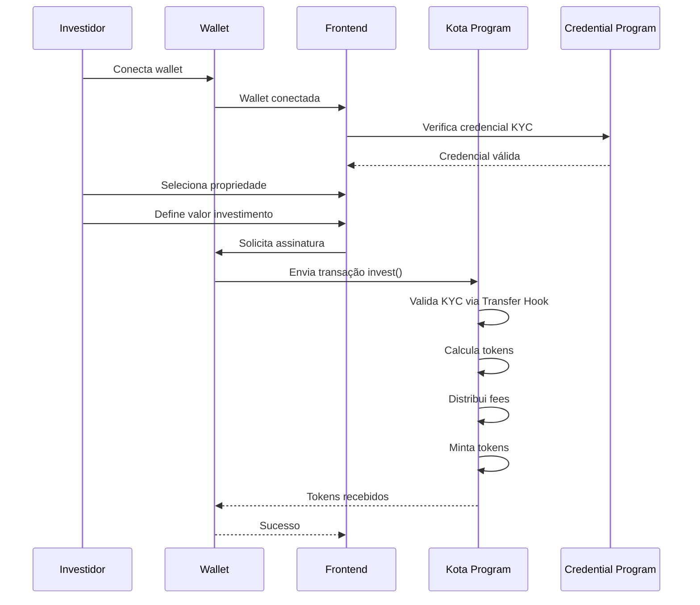

# Diagrama: Sequência de Investimento

## Descrição
Diagrama de sequência detalhado do processo de investimento em uma propriedade.

## Propósito
Mostrar todas as interações técnicas quando um usuário investe.

## Mermaid Atual


## Participantes
1. **Investidor** - Usuário final
2. **Wallet** - Phantom, Solflare, etc.
3. **Frontend** - Aplicação React
4. **Kota Program** - Smart contract de tokenização
5. **Credential Program** - Smart contract de KYC

## Paleta de Cores do Site
```
Background: #030712, #111827
Purple: #9333ea, #a855f7, #c084fc
Green (Solana): #14F195
Cyan: #22d3ee
Text: #f3f4f6, #d1d5db
```

## Estilo Desejado
- Fundo escuro
- Participantes com ícones:
  - Investidor: pessoa/avatar
  - Wallet: carteira/phantom logo
  - Frontend: tela/app
  - Kota Program: smart contract/código
  - Credential Program: badge/certificado
- Cores distintas por participante
- Self-calls (KP->>KP) destacados com cor diferente
- Mensagens de sucesso em verde
- Estilo limpo e profissional
