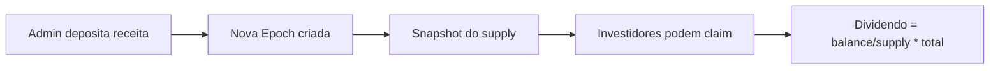

# Diagrama: Fluxo de Dividendos

## Descrição
Processo de distribuição de dividendos aos holders de tokens.

## Propósito
Explicar como receitas de aluguel são distribuídas proporcionalmente.

## Mermaid Atual


## Etapas
1. **Admin deposita receita** - Receita de aluguel depositada
2. **Nova Epoch criada** - Sistema cria período de distribuição
3. **Snapshot do supply** - Registro do supply circulante
4. **Investidores podem claim** - Período de resgate aberto
5. **Cálculo do dividendo** - Proporcional aos tokens

## Fórmula
```
Dividendo = (balance_do_holder / supply_total_na_epoch) * receita_da_epoch
```

## Paleta de Cores do Site
```
Background: #030712, #111827
Purple: #9333ea, #a855f7
Green (Money/Success): #22c55e, #14F195
Cyan: #22d3ee
Gold (Dividendos): #fbbf24, #f59e0b
Text: #f3f4f6, #d1d5db
```

## Estilo Desejado
- Fluxo horizontal (left to right)
- Ícones em cada etapa:
  - Moeda/dinheiro para depósito
  - Calendário para epoch
  - Câmera/foto para snapshot
  - Pessoas/usuários para claim
  - Calculadora para fórmula
- Cores que evoluem de purple (início) para gold (dividendos)
- Estilo financeiro/fintech moderno
- Pode incluir mini-gráfico ou números de exemplo
