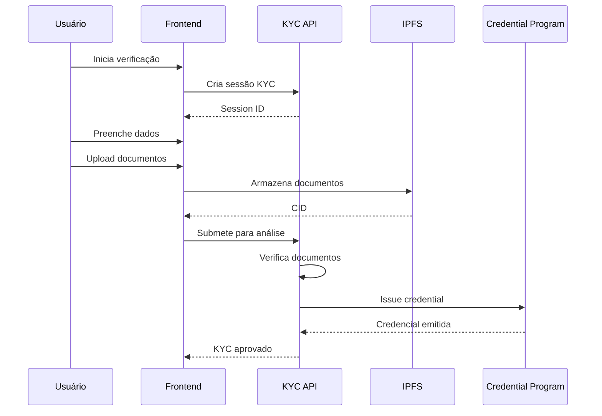

# Diagrama: Sequência de Verificação KYC

## Descrição
Processo completo de verificação KYC e emissão de credencial on-chain.

## Propósito
Mostrar o fluxo de compliance desde upload de documentos até credencial emitida.

## Mermaid Atual


## Participantes
1. **Usuário** - Pessoa realizando KYC
2. **Frontend** - Interface da aplicação
3. **KYC API** - Serviço de verificação
4. **IPFS** - Armazenamento descentralizado (Pinata)
5. **Credential Program** - Smart contract de credenciais

## Paleta de Cores do Site
```
Background: #030712, #111827
Purple: #9333ea, #a855f7
Blue (Verificação): #3b82f6, #60a5fa
Green (Sucesso): #22c55e, #14F195
Cyan: #22d3ee
Text: #f3f4f6, #d1d5db
```

## Estilo Desejado
- Fundo escuro
- Participantes com ícones:
  - Usuário: pessoa com documento
  - Frontend: tela/interface
  - KYC API: servidor/verificação
  - IPFS: nuvem descentralizada
  - Credential Program: badge/certificado
- Self-call (API->>API) destacado como processo interno
- Cores que progridem de azul (processo) para verde (sucesso)
- Indicar claramente o momento de aprovação
- Estilo seguro/compliance
