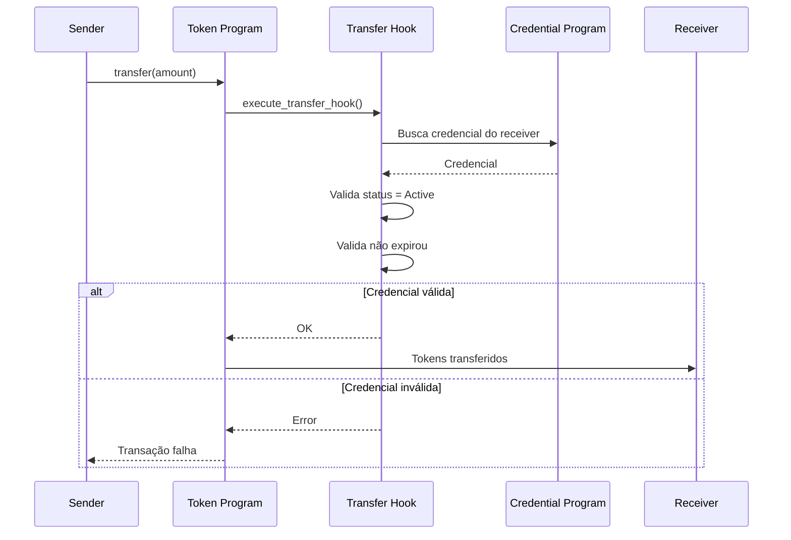

# Diagrama: Transfer Hook (Validação KYC em Transferências)

## Descrição
Diagrama de sequência mostrando como o Transfer Hook valida KYC em cada transferência de tokens.

## Propósito
Explicar o mecanismo de compliance automático em transferências.

## Mermaid Atual


## Participantes
1. **Sender** - Quem envia tokens
2. **Token Program** - SPL Token-2022
3. **Transfer Hook** - Hook de validação
4. **Credential Program** - Programa de credenciais
5. **Receiver** - Quem recebe tokens

## Fluxo Condicional
- **Credencial válida**: Transferência aprovada
- **Credencial inválida**: Transferência rejeitada

## Paleta de Cores do Site
```
Background: #030712, #111827
Purple: #9333ea, #a855f7
Green (Sucesso): #22c55e, #14F195
Red (Erro): #ef4444, #dc2626
Cyan: #22d3ee
Yellow (Warning): #eab308
Text: #f3f4f6, #d1d5db
```

## Estilo Desejado
- Fundo escuro
- Bloco ALT claramente visível com duas cores:
  - Verde para caminho de sucesso
  - Vermelho para caminho de erro
- Participantes com ícones:
  - Sender: pessoa enviando
  - Token Program: moeda/token Solana
  - Transfer Hook: gancho/shield
  - Credential Program: badge
  - Receiver: pessoa recebendo
- Self-calls (TH->>TH) como processo de validação
- Destacar que é validação automática on-chain
- Estilo segurança/compliance
