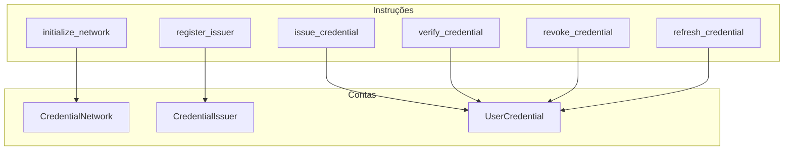

# Diagrama: Estrutura do Credential Program

## Descrição
Arquitetura do programa de credenciais mostrando contas e instruções.

## Propósito
Documentar a estrutura do smart contract de KYC/credenciais.

## Mermaid Atual


## Contas (PDAs)
| Conta | Seed | Descrição |
|-------|------|-----------|
| CredentialNetwork | ["network"] | Configuração global |
| CredentialIssuer | ["issuer", issuer_pubkey] | Emissor autorizado |
| UserCredential | ["credential", user_wallet] | Credencial do usuário |

## Instruções
| Instrução | Permissão | Ação |
|-----------|-----------|------|
| initialize_network | Admin | Inicializa a rede |
| register_issuer | Admin | Registra novo emissor |
| issue_credential | Issuer | Emite credencial |
| verify_credential | Público | Verifica validade |
| revoke_credential | Issuer/Admin | Revoga credencial |
| refresh_credential | Issuer | Renova expiração |

## Paleta de Cores do Site
```
Background: #030712, #111827
Purple: #9333ea, #a855f7
Blue (Contas): #3b82f6, #60a5fa
Green (Instruções): #22c55e, #10b981
Cyan: #22d3ee
Text: #f3f4f6, #d1d5db
```

## Estilo Desejado
- Dois grupos distintos: Contas e Instruções
- Contas em azul (dados/storage)
- Instruções em verde (ações/funções)
- Setas mostrando qual instrução modifica qual conta
- Ícones:
  - CredentialNetwork: globo/rede
  - CredentialIssuer: empresa/emissor
  - UserCredential: pessoa com badge
  - Instruções: engrenagem/código
- Layout claro mostrando relacionamentos
- Estilo documentação técnica
