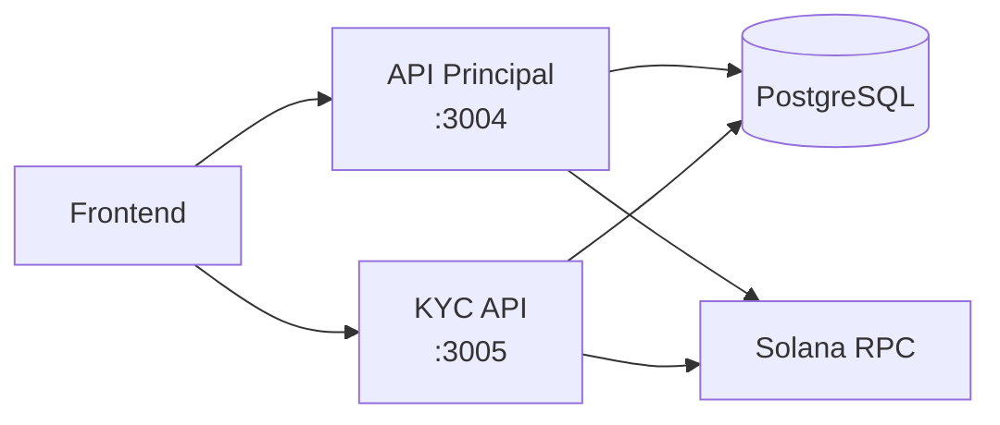

# Diagrama: Visão Geral das APIs

## Descrição
Conexões entre Frontend e os serviços de backend.

## Propósito
Mostrar quais APIs o frontend consome e suas responsabilidades.

## Mermaid Atual


## Serviços
| Serviço | Porta | Responsabilidade |
|---------|-------|------------------|
| API Principal | 3004 | Propriedades, investimentos, portfolio |
| KYC API | 3005 | Autenticação, KYC, credenciais |
| PostgreSQL | 5436 | Persistência de dados |
| Solana RPC | - | Blockchain |

## Paleta de Cores do Site
```
Background: #030712, #111827
Purple: #9333ea, #a855f7
Blue (APIs): #3b82f6, #60a5fa
Green (Solana): #14F195
Gray (Database): #6b7280
Text: #f3f4f6, #d1d5db
```

## Estilo Desejado
- Layout horizontal simples
- Frontend à esquerda
- APIs no centro
- Database e Blockchain à direita
- Cores distintas por tipo de serviço:
  - Frontend: purple
  - APIs: blue
  - Database: gray
  - Blockchain: Solana green
- Ícones representativos
- Badges com portas visíveis
- Design limpo e minimalista
