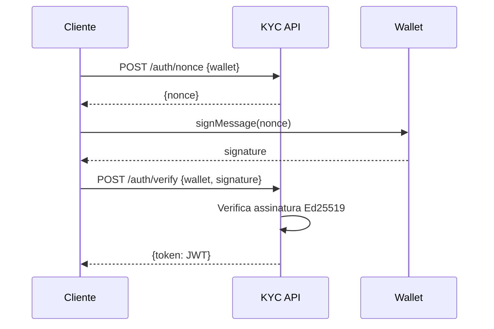

# Diagrama: Sequência de Autenticação (Sign-In with Solana)

## Descrição
Processo de autenticação usando assinatura de wallet Solana.

## Propósito
Mostrar o fluxo de login sem senha usando criptografia Ed25519.

## Mermaid Atual


## Participantes
1. **Cliente** - Browser/aplicação
2. **KYC API** - Serviço de autenticação
3. **Wallet** - Phantom, Solflare, etc.

## Fluxo
1. Cliente solicita nonce
2. API gera nonce único
3. Cliente assina mensagem com wallet
4. Wallet retorna assinatura Ed25519
5. Cliente envia assinatura para verificação
6. API valida assinatura criptográfica
7. API retorna JWT válido

## Paleta de Cores do Site
```
Background: #030712, #111827
Purple: #9333ea, #a855f7
Blue (API): #3b82f6, #60a5fa
Cyan (Wallet): #22d3ee
Green (Success/JWT): #22c55e
Text: #f3f4f6, #d1d5db
```

## Estilo Desejado
- Fundo escuro
- Participantes com ícones:
  - Cliente: browser/laptop
  - KYC API: servidor com cadeado
  - Wallet: carteira crypto
- Self-call (A->>A) destacado como validação criptográfica
- Final em verde indicando sucesso (JWT)
- Mencionar que é "Sign-In with Solana"
- Estilo segurança/auth moderno
