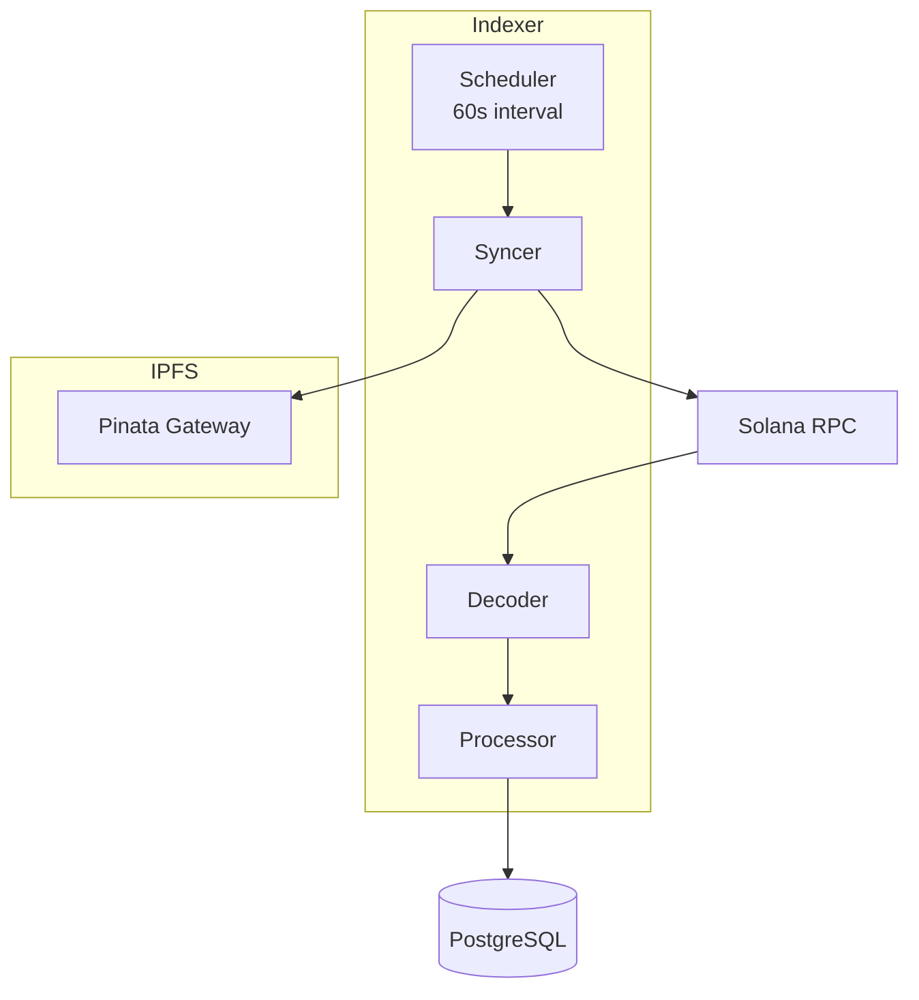

# Diagrama: Arquitetura do Indexador

## Descrição
Estrutura interna do indexador Go que sincroniza dados da blockchain.

## Propósito
Mostrar os componentes internos e fluxo de dados do indexador.

## Mermaid Atual


## Componentes
| Componente | Função |
|------------|--------|
| Scheduler | Dispara sync a cada 60 segundos |
| Syncer | Busca dados da blockchain |
| Decoder | Decodifica contas Anchor |
| Processor | Persiste no banco |
| IPFS | Busca metadados |

## Tecnologia
- **Linguagem**: Go 1.21+
- **Porta**: 9090
- **Intervalo**: 60 segundos
- **Banco**: PostgreSQL

## Paleta de Cores do Site
```
Background: #030712, #111827
Purple: #9333ea, #a855f7
Orange (Go): #f97316, #fb923c
Green (Solana): #14F195
Blue (IPFS): #3b82f6
Gray (Database): #6b7280
Text: #f3f4f6, #d1d5db
```

## Estilo Desejado
- Grupo central destacado (Indexer box)
- Componentes internos com cores Go (orange/cyan)
- Conexões externas:
  - Solana RPC: green
  - PostgreSQL: gray
  - Pinata/IPFS: blue
- Ícones:
  - Scheduler: relógio
  - Syncer: setas de sync
  - Decoder: código/parse
  - Processor: engrenagem
  - RPC: blockchain
  - DB: cilindro de banco
  - IPFS: nuvem
- Mostrar intervalo de 60s
- Estilo técnico/backend
