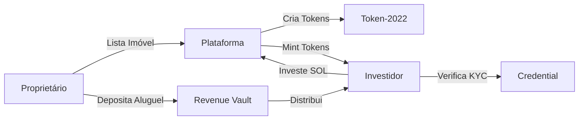

# Visão Geral do Hub Token

## O que é o Hub Token?

O **Hub Token** é uma plataforma de **tokenização de ativos imobiliários** construída na blockchain Solana que revoluciona a forma como pessoas investem em imóveis. Através da tecnologia blockchain, permitimos que qualquer pessoa, em qualquer lugar do mundo, possa se tornar proprietário de uma fração de imóveis de alto valor.

## Conceitos Fundamentais

### Tokenização de Ativos (RWA)

**RWA (Real World Assets)** ou Ativos do Mundo Real refere-se à representação digital de ativos físicos na blockchain. No caso do Hub Token:

- Um imóvel avaliado em **R$ 30 milhões** pode ser dividido em **5 milhões de tokens**
- Cada token representa uma **fração de propriedade** do imóvel
- O valor de cada token é **R$ 6,00**
- Investidores podem comprar quantos tokens desejarem

### Benefícios da Tokenização

| Benefício | Descrição |
|-----------|-----------|
| **Acessibilidade** | Investir em imóveis de alto valor com pouco capital |
| **Liquidez** | Tokens podem ser negociados no mercado secundário |
| **Transparência** | Todas as transações registradas na blockchain |
| **Dividendos** | Receba rendimentos proporcionais à sua participação |
| **Global** | Invista de qualquer lugar do mundo |

## Público-Alvo

### Investidores
- Pessoas físicas que desejam diversificar investimentos
- Investidores que buscam renda passiva através de aluguéis
- Quem quer exposição ao mercado imobiliário sem grandes capitais

### Proprietários de Imóveis
- Incorporadoras que desejam captar recursos
- Proprietários que querem vender frações do imóvel
- Fundos imobiliários buscando tokenização

## Diferenciais da Plataforma

### 1. Compliance Integrado
Toda transferência de tokens passa por verificação KYC automática através do **Transfer Hook** do Token-2022. Isso garante que apenas investidores verificados possam possuir tokens.

### 2. Distribuição Automática de Dividendos
Quando o proprietário deposita os rendimentos do aluguel, o sistema distribui automaticamente para todos os holders de tokens, proporcionalmente à sua participação.

### 3. Escrow com Milestones
O valor pago pelo investidor fica em escrow e é liberado gradualmente conforme a venda progride:
- **50% vendido** → Libera 50% do escrow
- **75% vendido** → Libera mais 30%
- **100% vendido** → Libera os 20% restantes

### 4. Mercado Secundário Regulado
Investidores podem vender seus tokens para outros investidores verificados, criando liquidez no mercado.

## Números da Plataforma

```
┌─────────────────────────────────────────────────────────────┐
│                    MÉTRICAS DO HUB TOKEN                    │
├─────────────────────────────────────────────────────────────┤
│                                                             │
│   Total Value Locked (TVL)         $XX,XXX,XXX             │
│   Propriedades Tokenizadas         XX                       │
│   Investidores Ativos              X,XXX                    │
│   Yield Médio Anual                8.5%                     │
│                                                             │
└─────────────────────────────────────────────────────────────┘
```

## Como Funciona (Resumo)



### Passo a Passo

1. **Proprietário lista o imóvel** na plataforma com todos os detalhes
2. **Plataforma cria os tokens** usando o padrão Token-2022 da Solana
3. **Investidor faz KYC** e recebe uma credencial Hub Credential
4. **Investidor investe** pagando em SOL
5. **Sistema distribui** as taxas (2.5% plataforma, 7.5% reserva, 90% vendedor)
6. **Investidor recebe tokens** proporcionais ao investimento
7. **Proprietário deposita aluguéis** periodicamente
8. **Investidores recebem dividendos** proporcionais

## Próximos Passos

Para entender melhor cada componente do sistema, navegue pelos módulos da documentação:

- [Problema e Solução](./problema-solucao.md) - Por que tokenização imobiliária?
- [Stack Tecnológico](./stack-tecnologico.md) - Tecnologias utilizadas
- [Arquitetura](../arquitetura/README.md) - Como os componentes se conectam

---

[← Voltar ao Índice](../README.md) | [Próximo: Problema e Solução →](./problema-solucao.md)
