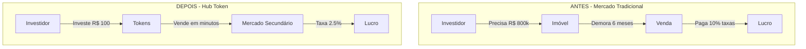
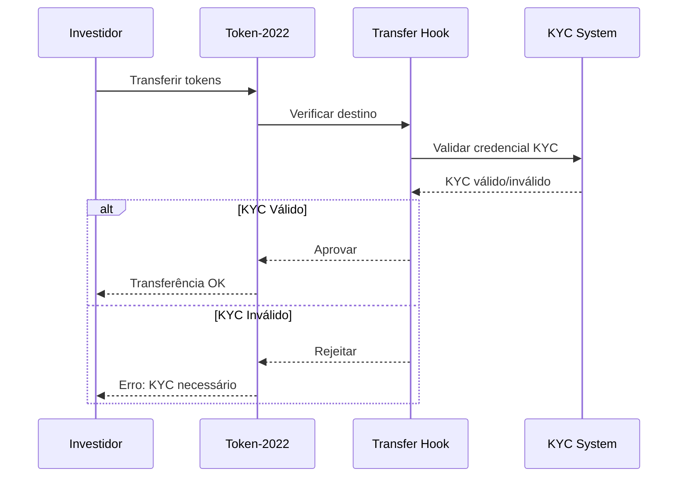

# Problema e Solução

## O Problema do Mercado Imobiliário Tradicional

### Barreiras de Entrada

O mercado imobiliário tradicional apresenta diversas barreiras que impedem a participação da maioria das pessoas:

```
┌─────────────────────────────────────────────────────────────────────────┐
│                    PROBLEMAS DO MERCADO TRADICIONAL                     │
├─────────────────────────────────────────────────────────────────────────┤
│                                                                         │
│  💰 ALTO CAPITAL INICIAL                                                │
│     Comprar um imóvel requer centenas de milhares de reais             │
│                                                                         │
│  🔒 BAIXA LIQUIDEZ                                                      │
│     Vender um imóvel pode levar meses ou anos                          │
│                                                                         │
│  📍 LIMITAÇÃO GEOGRÁFICA                                                │
│     Investir em imóveis de outras cidades/países é complexo            │
│                                                                         │
│  📄 BUROCRACIA EXCESSIVA                                                │
│     Cartórios, escrituras, ITBI, financiamentos...                     │
│                                                                         │
│  🏦 INTERMEDIÁRIOS CAROS                                                │
│     Corretores, imobiliárias, bancos cobram taxas elevadas             │
│                                                                         │
│  📊 FALTA DE TRANSPARÊNCIA                                              │
│     Dificuldade em verificar histórico e valorização                   │
│                                                                         │
└─────────────────────────────────────────────────────────────────────────┘
```

### Números que Ilustram o Problema

| Métrica | Valor |
|---------|-------|
| Valor médio de um apartamento em SP | R$ 800.000+ |
| Tempo médio para vender um imóvel | 6-12 meses |
| Taxa de corretagem | 5-6% |
| Custos de transferência (ITBI + Cartório) | 4-5% |
| Brasileiros que investem em imóveis | ~15% |

### Exclusão Financeira

A maioria da população está **excluída** do mercado imobiliário como investimento:

- **85%** dos brasileiros não têm capital para investir em imóveis
- Apenas **0.5%** investe em fundos imobiliários
- Investimentos alternativos têm **yield inferior** ao mercado imobiliário

---

## A Solução: Tokenização Imobiliária

### O que Muda com o Hub Token



### Comparativo Detalhado

| Aspecto | Tradicional | Hub Token |
|---------|-------------|-----------|
| **Investimento Mínimo** | R$ 100.000+ | R$ 10 |
| **Tempo para Vender** | 6-12 meses | Minutos |
| **Custos de Transação** | 10-15% | 2.5% |
| **Diversificação** | Difícil | Fácil (vários imóveis) |
| **Recebimento de Aluguéis** | Mensal via banco | Automático na blockchain |
| **Transparência** | Limitada | Total (on-chain) |
| **Acesso Global** | Não | Sim |
| **Horário de Negociação** | Comercial | 24/7 |

### Benefícios para Cada Stakeholder

#### Para Investidores

```
┌─────────────────────────────────────────────────────────────┐
│                   BENEFÍCIOS INVESTIDOR                     │
├─────────────────────────────────────────────────────────────┤
│                                                             │
│  ✅ Investir com pouco capital                              │
│  ✅ Diversificar em múltiplos imóveis                       │
│  ✅ Receber dividendos automáticos                          │
│  ✅ Vender quando quiser (liquidez)                         │
│  ✅ Acompanhar valorização em tempo real                    │
│  ✅ Sem burocracia de cartório                              │
│  ✅ Investir de qualquer lugar                              │
│                                                             │
└─────────────────────────────────────────────────────────────┘
```

#### Para Proprietários/Incorporadoras

```
┌─────────────────────────────────────────────────────────────┐
│               BENEFÍCIOS PROPRIETÁRIO                       │
├─────────────────────────────────────────────────────────────┤
│                                                             │
│  ✅ Captar recursos rapidamente                             │
│  ✅ Vender frações mantendo parte da propriedade            │
│  ✅ Acesso a pool global de investidores                    │
│  ✅ Redução de custos com intermediários                    │
│  ✅ Distribuição automática de aluguéis                     │
│  ✅ Compliance KYC integrado                                │
│                                                             │
└─────────────────────────────────────────────────────────────┘
```

### Exemplo Prático

**Imóvel:** Edifício Comercial em São Paulo
**Valor:** R$ 30.000.000
**Tokens:** 5.000.000
**Preço por Token:** R$ 6,00
**Yield Anual Esperado:** 8.5%

| Investimento | Tokens | Participação | Dividendo Mensal* |
|--------------|--------|--------------|-------------------|
| R$ 600 | 100 | 0.002% | ~R$ 4,25 |
| R$ 6.000 | 1.000 | 0.02% | ~R$ 42,50 |
| R$ 60.000 | 10.000 | 0.2% | ~R$ 425,00 |
| R$ 600.000 | 100.000 | 2% | ~R$ 4.250,00 |

*Valores estimados baseados no yield de 8.5% a.a.

---

## Diferenciais Técnicos

### Por que Solana?

| Característica | Solana | Ethereum | Bitcoin |
|----------------|--------|----------|---------|
| **TPS** | 65.000+ | ~30 | ~7 |
| **Taxa Média** | $0.00025 | $2-50 | $1-20 |
| **Finalidade** | ~400ms | ~12min | ~60min |
| **Token Standard** | Token-2022 | ERC-20 | - |
| **Transfer Hooks** | ✅ Nativo | ❌ | ❌ |

### Por que Token-2022?

O padrão **Token-2022** da Solana oferece funcionalidades avançadas:

1. **Transfer Hook** - Executa verificação KYC em cada transferência
2. **Metadata** - Armazena informações do imóvel no token
3. **Confidential Transfers** - Transferências privadas (futuro)
4. **Permanent Delegate** - Controle regulatório se necessário

### Compliance by Design



---

## Regulamentação e Compliance

### Marco Regulatório

O Hub Token foi desenvolvido considerando:

- **CVM 88** - Crowdfunding de investimento
- **Lei 14.478/2022** - Marco Legal das Criptomoedas
- **LGPD** - Proteção de dados pessoais
- **Normas BACEN** - Prevenção à lavagem de dinheiro

### Medidas de Compliance

1. **KYC Obrigatório** - Todo investidor deve verificar identidade
2. **Verificação AML** - Análise anti-lavagem de dinheiro
3. **Limites de Investimento** - Conforme perfil do investidor
4. **Auditoria On-Chain** - Todas as transações rastreáveis
5. **Segregação de Recursos** - Escrow para proteção

---

## Conclusão

O Hub Token resolve os principais problemas do mercado imobiliário tradicional através da tecnologia blockchain:

| Problema | Solução Hub Token |
|----------|-------------------|
| Alto capital inicial | Tokenização fracionada |
| Baixa liquidez | Mercado secundário 24/7 |
| Burocracia | Automação on-chain |
| Falta de transparência | Blockchain público |
| Custos elevados | Taxas reduzidas |
| Exclusão financeira | Acesso democratizado |

---

[← Voltar](./README.md) | [Próximo: Stack Tecnológico →](./stack-tecnologico.md)
