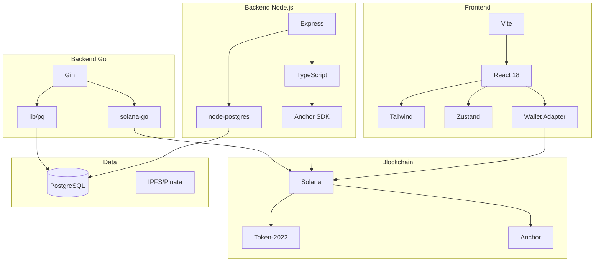

# Stack Tecnológico

## Visão Geral das Tecnologias

O Hub Token utiliza um conjunto moderno de tecnologias escolhidas por sua performance, segurança e escalabilidade.

```
┌─────────────────────────────────────────────────────────────────────────┐
│                         STACK TECNOLÓGICO                               │
├─────────────────────────────────────────────────────────────────────────┤
│                                                                         │
│  BLOCKCHAIN          Solana + Token-2022 + Anchor Framework             │
│  ───────────────────────────────────────────────────────────────────    │
│  BACKEND             Node.js + TypeScript + Express + Go                │
│  ───────────────────────────────────────────────────────────────────    │
│  FRONTEND            React 18 + TypeScript + Tailwind CSS               │
│  ───────────────────────────────────────────────────────────────────    │
│  DATABASE            PostgreSQL 15                                      │
│  ───────────────────────────────────────────────────────────────────    │
│  INFRAESTRUTURA      Docker + Kong Gateway + Nginx                      │
│  ───────────────────────────────────────────────────────────────────    │
│  STORAGE             IPFS (Pinata)                                      │
│                                                                         │
└─────────────────────────────────────────────────────────────────────────┘
```

---

## Camada Blockchain

### Solana

**Por que Solana?**

| Característica | Valor |
|----------------|-------|
| Transações por segundo | 65.000+ |
| Tempo de bloco | ~400ms |
| Custo médio por transação | $0.00025 |
| Consenso | Proof of History + Proof of Stake |

**Vantagens:**
- Altíssima velocidade de transação
- Custos extremamente baixos
- Ecossistema DeFi robusto
- Suporte nativo a tokens avançados

### Token-2022 (SPL Token)

O padrão **Token-2022** é a evolução do SPL Token com funcionalidades extras:

```rust
// Extensões utilizadas no Hub Token
- TransferHook       // Verificação KYC em transferências
- MetadataPointer    // Apontar para metadata do imóvel
- PermanentDelegate  // Controle regulatório (opcional)
```

**Transfer Hook** - A funcionalidade mais importante:
- Intercepta TODAS as transferências de tokens
- Verifica se o destinatário tem KYC válido
- Bloqueia transferências para carteiras não verificadas

### Anchor Framework

Framework para desenvolvimento de smart contracts na Solana:

```rust
// Exemplo de instrução Anchor
#[program]
pub mod hub_token_program {
    pub fn invest_in_property(
        ctx: Context<InvestInProperty>,
        amount: u64,
    ) -> Result<()> {
        // Lógica de investimento
    }
}
```

**Versão:** 0.30.1

**Benefícios:**
- Segurança de tipos em tempo de compilação
- Serialização automática de dados
- Geração de IDL (Interface Definition Language)
- Testes integrados

---

## Camada Backend

### API Principal (Node.js)

**Stack:**
- **Runtime:** Node.js 20 LTS
- **Linguagem:** TypeScript 5.x
- **Framework:** Express.js 4.x
- **Arquitetura:** Clean Architecture
- **DI:** TSyringe

**Bibliotecas Principais:**

| Biblioteca | Propósito |
|------------|-----------|
| `@coral-xyz/anchor` | SDK Solana/Anchor |
| `@solana/web3.js` | Cliente Solana |
| `pg` | Cliente PostgreSQL |
| `tsyringe` | Injeção de dependência |
| `zod` | Validação de schemas |
| `winston` | Logging |
| `axios` | Cliente HTTP |

### API KYC (Node.js)

**Stack similar à API Principal com adições:**
- Rate limiting (100 req/15min)
- Session management
- JWT authentication

### Indexador (Go)

**Por que Go para o Indexador?**

| Aspecto | Benefício |
|---------|-----------|
| Performance | Compilado, muito rápido |
| Concorrência | Goroutines nativas |
| Memória | Baixo footprint |
| Deploy | Binário único |

**Bibliotecas:**

| Biblioteca | Propósito |
|------------|-----------|
| `gin-gonic/gin` | Framework web |
| `lib/pq` | Driver PostgreSQL |
| `gagliardetto/solana-go` | SDK Solana |

---

## Camada Frontend

### React + TypeScript

**Versões:**
- React 18.2
- TypeScript 5.x
- Vite 5.x (build tool)

### Gerenciamento de Estado

**Zustand** - Escolhido por:
- API simples e direta
- Sem boilerplate
- Ótima performance
- TypeScript first

```typescript
// Exemplo de store
const useAppStore = create<AppState>((set) => ({
  selectedProperty: null,
  setSelectedProperty: (property) => set({ selectedProperty: property }),
}));
```

### Estilização

**Tailwind CSS 3.4**

Tema customizado com cores Solana:

```javascript
// tailwind.config.js
colors: {
  solana: {
    purple: {
      500: '#9945FF',  // Roxo principal Solana
    },
    green: {
      500: '#14F195',  // Verde principal Solana
    },
    dark: {
      950: '#020617',  // Background escuro
    }
  }
}
```

### Integração Wallet

**Solana Wallet Adapter**

Suporte a múltiplas carteiras:
- Phantom
- Solflare
- Backpack
- Ledger
- E outras...

```typescript
// Providers configurados
<WalletProvider wallets={wallets}>
  <WalletModalProvider>
    <App />
  </WalletModalProvider>
</WalletProvider>
```

### Bibliotecas Frontend

| Biblioteca | Propósito |
|------------|-----------|
| `react-router-dom` | Roteamento |
| `@tanstack/react-query` | Cache e fetching |
| `recharts` | Gráficos |
| `lucide-react` | Ícones |
| `i18next` | Internacionalização |
| `clsx` | Classes condicionais |

---

## Camada de Dados

### PostgreSQL 15

**Schema Principal:**

```sql
-- Tabelas principais
properties          -- Imóveis tokenizados
user_preferences    -- Preferências de usuários
user_activities     -- Log de atividades
portfolio_snapshots -- Histórico de portfólio
```

**Características:**
- JSONB para dados flexíveis
- Índices otimizados
- Full-text search disponível

### IPFS (Pinata)

Armazenamento descentralizado para:
- Imagens dos imóveis
- Documentos (quando necessário)
- Metadata JSON dos tokens

---

## Infraestrutura

### Docker

Todos os serviços containerizados:

```yaml
services:
  postgres:     # Banco de dados
  indexer:      # Indexador Go
  api:          # API Principal
  kyc-api:      # API KYC
  frontend:     # React App
```

### Kong Gateway

API Gateway para:
- Roteamento de requisições
- Rate limiting
- CORS management
- SSL termination

### Nginx

Servidor web para o frontend:
- Serve arquivos estáticos
- Compressão gzip
- Cache headers
- SPA routing

---

## Diagrama de Dependências



---

## Versões Utilizadas

| Tecnologia | Versão |
|------------|--------|
| Node.js | 20 LTS |
| Go | 1.21 |
| PostgreSQL | 15 |
| React | 18.2 |
| TypeScript | 5.x |
| Anchor | 0.30.1 |
| Solana CLI | 1.18+ |
| Docker | 24+ |
| Tailwind CSS | 3.4 |

---

## Considerações de Segurança por Tecnologia

| Camada | Medidas |
|--------|---------|
| **Blockchain** | Anchor security checks, PDA derivation, overflow protection |
| **Backend** | Input validation (Zod), parameterized queries, rate limiting |
| **Frontend** | HTTPS, CSP headers, no secrets in client |
| **Infra** | Docker isolation, Kong policies, firewall rules |

---

[← Voltar](./problema-solucao.md) | [Próximo: Arquitetura →](../arquitetura/README.md)
