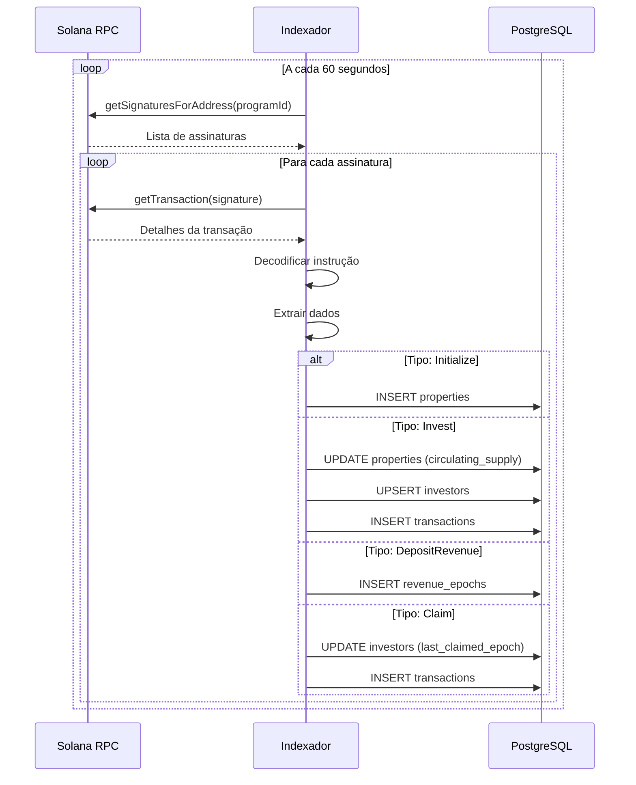

# Endpoints do Indexador

**Base URL:** `http://localhost:9090/api/v1` (interno)

> **Nota:** O Indexador é um serviço interno, não exposto publicamente. É consumido apenas pela API Principal.

---

## Properties (Propriedades)

### Listar Todas as Propriedades

```http
GET /properties
```

**Response:**

```json
{
  "data": [
    {
      "mint": "7xKXtg2CW87d97TXJSDpbD5jBkheTqA83TZRuJosgAsU",
      "property_state_pda": "9yZYu...",
      "authority": "AMuiRHoJLS2zhpRtUqVJUpYi4xEGbZcmMsJpqVT9uCJw",
      "seller_wallet": "34JKXfYohYJx3gH7BtGwuGWrozz57tHoZp6ZPZChpxHH",
      "status": 1,
      "total_supply": "5000000000000",
      "circulating_supply": "1250000000000",
      "decimals": 6,
      "property_address": "Av. Paulista, 1000",
      "property_type": "Comercial",
      "total_value_usd": 3000000000,
      "rental_yield_bps": 850,
      "metadata_uri": "https://gateway.pinata.cloud/ipfs/...",
      "current_epoch": 5,
      "created_at": "2025-01-01T00:00:00Z",
      "updated_at": "2025-01-15T00:00:00Z"
    }
  ]
}
```

---

### Obter Propriedade por Mint

```http
GET /properties/:mint
```

**Path Parameters:**

| Parâmetro | Tipo | Descrição |
|-----------|------|-----------|
| `mint` | string | Endereço do mint (base58) |

**Response:**

```json
{
  "data": {
    "mint": "7xKXtg2CW87d97TXJSDpbD5jBkheTqA83TZRuJosgAsU",
    "property_state_pda": "9yZYu...",
    "authority": "AMuiRHoJLS2zhpRtUqVJUpYi4xEGbZcmMsJpqVT9uCJw",
    "seller_wallet": "34JKXfYohYJx3gH7BtGwuGWrozz57tHoZp6ZPZChpxHH",
    "status": 1,
    "total_supply": "5000000000000",
    "circulating_supply": "1250000000000",
    "decimals": 6,
    "property_address": "Av. Paulista, 1000 - São Paulo",
    "property_type": "Comercial",
    "total_value_usd": 3000000000,
    "rental_yield_bps": 850,
    "metadata_uri": "https://gateway.pinata.cloud/ipfs/...",
    "current_epoch": 5,
    "created_at": "2025-01-01T00:00:00Z",
    "updated_at": "2025-01-15T00:00:00Z"
  }
}
```

---

## Investors (Investidores)

### Listar Investidores de uma Propriedade

```http
GET /properties/:mint/investors
```

**Response:**

```json
{
  "data": [
    {
      "wallet": "AMuiRHoJLS2zhpRtUqVJUpYi4xEGbZcmMsJpqVT9uCJw",
      "token_account": "5xK9...",
      "balance": "1666666666",
      "last_claimed_epoch": 4,
      "first_investment_at": "2025-01-10T00:00:00Z",
      "last_activity_at": "2025-01-15T10:00:00Z"
    }
  ]
}
```

---

### Obter Holdings de uma Wallet

```http
GET /investors/:wallet/holdings
```

**Response:**

```json
{
  "data": [
    {
      "mint": "7xKXtg2CW87d97TXJSDpbD5jBkheTqA83TZRuJosgAsU",
      "token_account": "5xK9...",
      "balance": "1666666666",
      "last_claimed_epoch": 4
    }
  ]
}
```

---

## Transactions (Transações)

### Listar Transações de uma Propriedade

```http
GET /properties/:mint/transactions
```

**Query Parameters:**

| Parâmetro | Tipo | Descrição |
|-----------|------|-----------|
| `type` | string | Filtrar por tipo |
| `limit` | number | Limite de resultados |
| `offset` | number | Offset para paginação |

**Transaction Types:**

| Tipo | Descrição |
|------|-----------|
| `initialize` | Criação da propriedade |
| `invest` | Investimento |
| `claim` | Resgate de dividendos |
| `transfer` | Transferência de tokens |
| `deposit_revenue` | Depósito de receita |
| `release_escrow` | Liberação de escrow |

**Response:**

```json
{
  "data": [
    {
      "signature": "5xK9abc...",
      "block_time": 1705312800,
      "slot": 123456789,
      "tx_type": "invest",
      "mint": "7xKXtg...",
      "from_wallet": "AMuiRHo...",
      "to_wallet": "34JKXfY...",
      "amount": "10000000000",
      "fee": "25000000",
      "success": true,
      "created_at": "2025-01-15T10:00:00Z"
    }
  ],
  "meta": {
    "total": 150,
    "limit": 20,
    "offset": 0
  }
}
```

---

### Listar Transações de uma Wallet

```http
GET /investors/:wallet/transactions
```

**Response:**

```json
{
  "data": [
    {
      "signature": "5xK9abc...",
      "block_time": 1705312800,
      "tx_type": "invest",
      "mint": "7xKXtg...",
      "property_name": "Edifício Torre Norte",
      "amount": "10000000000",
      "tokens_received": "1666666666",
      "success": true,
      "created_at": "2025-01-15T10:00:00Z"
    }
  ]
}
```

---

## Revenue (Receitas)

### Listar Receitas de uma Propriedade

```http
GET /properties/:mint/revenue
```

**Response:**

```json
{
  "data": [
    {
      "epoch": 5,
      "amount": "500000000000",
      "total_supply_at_epoch": "5000000000000",
      "deposited_at": "2025-01-15T00:00:00Z",
      "tx_signature": "5xK9..."
    },
    {
      "epoch": 4,
      "amount": "450000000000",
      "total_supply_at_epoch": "5000000000000",
      "deposited_at": "2025-01-01T00:00:00Z",
      "tx_signature": "4wJ8..."
    }
  ]
}
```

---

### Obter Dividendos Pendentes

```http
GET /investors/:wallet/claimable/:mint
```

**Response:**

```json
{
  "data": {
    "wallet": "AMuiRHoJLS2zhpRtUqVJUpYi4xEGbZcmMsJpqVT9uCJw",
    "mint": "7xKXtg2CW87d97TXJSDpbD5jBkheTqA83TZRuJosgAsU",
    "current_epoch": 5,
    "last_claimed_epoch": 3,
    "balance": "1666666666",
    "claimable_epochs": [
      {
        "epoch": 4,
        "revenue": "450000000000",
        "share": "150000000"
      },
      {
        "epoch": 5,
        "revenue": "500000000000",
        "share": "166666666"
      }
    ],
    "total_claimable": "316666666"
  }
}
```

---

## Escrow

### Status do Escrow

```http
GET /properties/:mint/escrow
```

**Response:**

```json
{
  "data": {
    "mint": "7xKXtg2CW87d97TXJSDpbD5jBkheTqA83TZRuJosgAsU",
    "escrow_pda": "9yZYu...",
    "total_collected": "100000000000000",
    "released_amount": "50000000000000",
    "pending_amount": "50000000000000",
    "milestones": [
      {
        "threshold": 50,
        "released": true,
        "released_at": "2025-01-10T00:00:00Z",
        "tx_signature": "5xK9..."
      },
      {
        "threshold": 75,
        "released": false,
        "released_at": null,
        "tx_signature": null
      },
      {
        "threshold": 100,
        "released": false,
        "released_at": null,
        "tx_signature": null
      }
    ],
    "current_sold_percent": 55.5
  }
}
```

---

## Stats (Estatísticas)

### Estatísticas Gerais

```http
GET /stats
```

**Response:**

```json
{
  "data": {
    "total_properties": 5,
    "active_properties": 4,
    "total_investors": 1250,
    "total_value_locked_lamports": "125000000000000000",
    "total_transactions": 15000,
    "total_revenue_distributed": "5000000000000000",
    "last_indexed_slot": 123456789,
    "last_indexed_at": "2025-01-15T10:00:00Z"
  }
}
```

---

### Estatísticas por Período

```http
GET /stats/period
```

**Query Parameters:**

| Parâmetro | Tipo | Descrição |
|-----------|------|-----------|
| `from` | string | Data inicial (ISO 8601) |
| `to` | string | Data final (ISO 8601) |

**Response:**

```json
{
  "data": {
    "period": {
      "from": "2025-01-01T00:00:00Z",
      "to": "2025-01-15T23:59:59Z"
    },
    "new_investors": 150,
    "new_investments": 250,
    "total_invested": "50000000000000",
    "total_claimed": "2500000000000",
    "avg_investment_size": "200000000000"
  }
}
```

---

## Sync (Sincronização)

### Status da Sincronização

```http
GET /sync/status
```

**Response:**

```json
{
  "data": {
    "status": "running",
    "last_sync_at": "2025-01-15T10:00:00Z",
    "last_slot": 123456789,
    "current_slot": 123456800,
    "slots_behind": 11,
    "sync_interval": "60s",
    "next_sync_at": "2025-01-15T10:01:00Z"
  }
}
```

---

### Forçar Sincronização

```http
POST /sync/trigger
```

**Response:**

```json
{
  "data": {
    "triggered": true,
    "message": "Sync triggered successfully"
  }
}
```

---

## Health

### Health Check

```http
GET /health
```

**Response:**

```json
{
  "status": "healthy",
  "checks": {
    "database": true,
    "solana_rpc": true
  },
  "version": "1.0.0",
  "uptime": "72h15m30s"
}
```

---

## Estrutura do Banco de Dados

O Indexador mantém as seguintes tabelas:

```sql
-- Propriedades tokenizadas
properties (
    mint VARCHAR PRIMARY KEY,
    property_state_pda VARCHAR,
    authority VARCHAR,
    seller_wallet VARCHAR,
    status INTEGER,
    total_supply BIGINT,
    circulating_supply BIGINT,
    -- ... outros campos
)

-- Investidores e holdings
investors (
    wallet VARCHAR,
    mint VARCHAR,
    token_account VARCHAR,
    balance BIGINT,
    last_claimed_epoch INTEGER,
    PRIMARY KEY (wallet, mint)
)

-- Transações indexadas
transactions (
    signature VARCHAR PRIMARY KEY,
    block_time BIGINT,
    slot BIGINT,
    tx_type VARCHAR,
    mint VARCHAR,
    from_wallet VARCHAR,
    to_wallet VARCHAR,
    amount BIGINT,
    success BOOLEAN
)

-- Receitas por época
revenue_epochs (
    mint VARCHAR,
    epoch INTEGER,
    amount BIGINT,
    total_supply_at_epoch BIGINT,
    deposited_at TIMESTAMP,
    PRIMARY KEY (mint, epoch)
)
```

---

## Fluxo de Indexação



---

[← Voltar](./endpoints-kyc.md) | [Próximo: Backend →](../backend/README.md)
