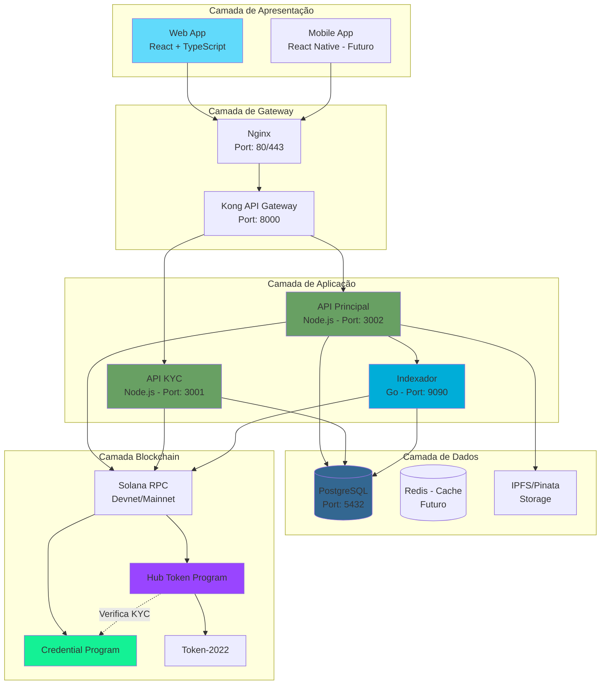
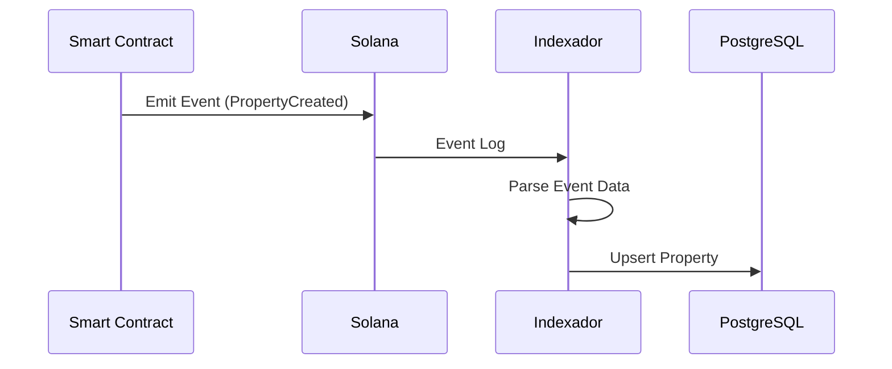
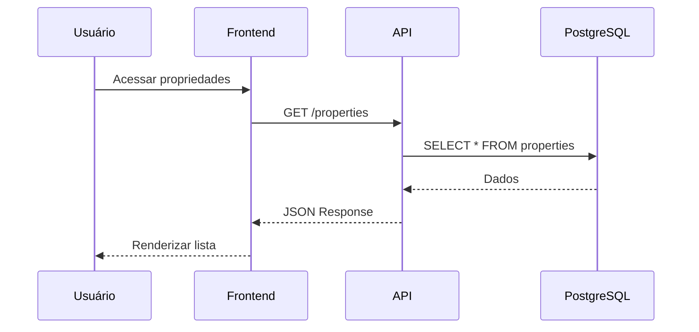
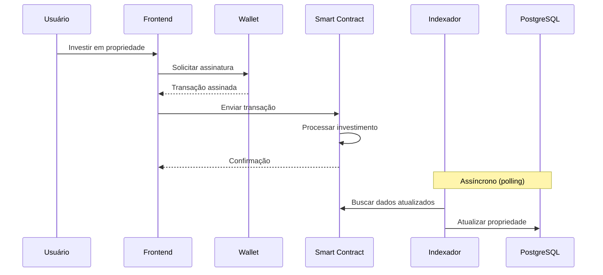

# Arquitetura do Sistema

## Visão Geral

O Hub Token é construído seguindo uma arquitetura de **microsserviços** com clara separação de responsabilidades. O sistema é composto por múltiplas camadas que se comunicam de forma assíncrona e síncrona.

## Diagrama de Arquitetura Completo



## Princípios Arquiteturais

### 1. Separação de Responsabilidades

Cada serviço tem uma responsabilidade bem definida:

| Serviço | Responsabilidade |
|---------|------------------|
| **Frontend** | Interface do usuário, UX |
| **API Principal** | Lógica de negócio, orquestração |
| **API KYC** | Autenticação, credenciais |
| **Indexador** | Sincronização blockchain → DB |
| **Smart Contracts** | Regras de negócio on-chain |

### 2. Clean Architecture (API Principal)

```
┌─────────────────────────────────────────────────────────────┐
│                        INTERFACES                           │
│              (Controllers, Routes, Middlewares)             │
├─────────────────────────────────────────────────────────────┤
│                       APPLICATION                           │
│                  (Use Cases, Services)                      │
├─────────────────────────────────────────────────────────────┤
│                         DOMAIN                              │
│                   (Entities, Value Objects)                 │
├─────────────────────────────────────────────────────────────┤
│                      INFRASTRUCTURE                         │
│            (Repositories, External Services)                │
└─────────────────────────────────────────────────────────────┘

                    Direção da Dependência
                            ↑
                            │
                   (De fora para dentro)
```

### 3. Event-Driven (Blockchain)

Os smart contracts emitem eventos que são capturados pelo indexador:



## Camadas Detalhadas

### Camada de Apresentação

**Frontend Web (React)**
- Single Page Application (SPA)
- Server-Side Rendering: Não (CSR only)
- Hospedagem: Nginx em container Docker

**Comunicação:**
- REST API para dados
- WebSocket para notificações (futuro)
- Wallet Adapter para blockchain

### Camada de Gateway

**Kong Gateway**
- Roteamento de requisições
- Rate limiting
- CORS management
- Autenticação (futuro)

**Nginx**
- Serve arquivos estáticos
- SSL termination
- Compressão gzip
- Cache de assets

### Camada de Aplicação

**API Principal (Node.js)**
```
Responsabilidades:
├── Gerenciamento de propriedades
├── Cálculo de investimentos
├── Gerenciamento de usuários
├── Integração com IPFS
└── Orquestração de transações
```

**API KYC (Node.js)**
```
Responsabilidades:
├── Autenticação por wallet
├── Gerenciamento de sessões KYC
├── Emissão de credenciais
├── Verificação de credenciais
└── Rate limiting
```

**Indexador (Go)**
```
Responsabilidades:
├── Polling da blockchain
├── Parsing de contas
├── Sincronização com DB
├── API de consulta
└── Trigger manual de indexação
```

### Camada de Dados

**PostgreSQL**
- Dados de propriedades (cache do blockchain)
- Preferências de usuários
- Histórico de atividades
- Snapshots de portfólio

**IPFS (Pinata)**
- Imagens de propriedades
- Metadata JSON
- Documentos

### Camada Blockchain

**Hub Token Program**
- Criação de propriedades
- Minting de tokens
- Investimentos
- Distribuição de dividendos

**Credential Program**
- Emissão de credenciais KYC
- Verificação de credenciais
- Revogação de credenciais

## Fluxo de Dados

### Leitura (Query)



### Escrita (Command)



## Tolerância a Falhas

### Estratégias por Camada

| Camada | Estratégia |
|--------|------------|
| **Frontend** | Retry automático, offline mode (futuro) |
| **API** | Circuit breaker, graceful degradation |
| **Indexador** | Retry com backoff, idempotência |
| **Blockchain** | Confirmação de transação, retry |

### Health Checks

Todos os serviços expõem endpoints de health:

```
GET /health          → Status do serviço
GET /health/ready    → Pronto para receber tráfego
GET /health/live     → Serviço está vivo
```

## Escalabilidade

### Horizontal

| Componente | Escalável? | Como |
|------------|------------|------|
| Frontend | ✅ | Múltiplas instâncias Nginx |
| API | ✅ | Load balancer |
| KYC API | ✅ | Load balancer |
| Indexador | ⚠️ | Sharding por propriedade |
| PostgreSQL | ✅ | Read replicas |

### Vertical

- Todas as instâncias podem ter recursos aumentados
- PostgreSQL beneficia de mais memória para cache

## Segurança por Camada

```
┌─────────────────────────────────────────────────────────────┐
│  FRONTEND        │ HTTPS, CSP, No secrets                   │
├──────────────────┼──────────────────────────────────────────┤
│  GATEWAY         │ Rate limiting, CORS, WAF (futuro)        │
├──────────────────┼──────────────────────────────────────────┤
│  API             │ Input validation, Auth, Audit logs       │
├──────────────────┼──────────────────────────────────────────┤
│  DATABASE        │ Parameterized queries, Encryption        │
├──────────────────┼──────────────────────────────────────────┤
│  BLOCKCHAIN      │ Signature verification, PDA checks       │
└──────────────────┴──────────────────────────────────────────┘
```

---

## Próximos Documentos

- [Componentes Detalhados](./componentes.md)
- [Comunicação entre Serviços](./comunicacao.md)
- [Banco de Dados](./banco-dados.md)

---

[← Voltar](../01-visao-geral/stack-tecnologico.md) | [Próximo: Componentes →](./componentes.md)
