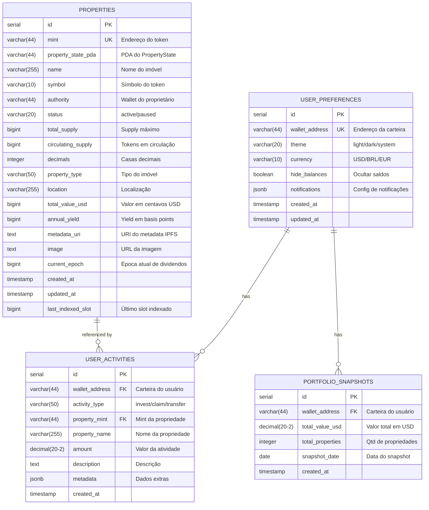

# Banco de Dados

## Visão Geral

O Hub Token utiliza **PostgreSQL 15** como banco de dados principal. O banco serve como cache dos dados on-chain e armazena dados específicos da aplicação como preferências de usuários e histórico de atividades.

## Diagrama ER (Entity Relationship)



---

## Esquema Detalhado

### Tabela: properties

Armazena cache das propriedades indexadas da blockchain.

```sql
CREATE TABLE properties (
    id SERIAL PRIMARY KEY,

    -- Identificadores blockchain
    mint VARCHAR(44) UNIQUE NOT NULL,
    property_state_pda VARCHAR(44) NOT NULL,

    -- Informações básicas
    name VARCHAR(255) NOT NULL,
    symbol VARCHAR(10) NOT NULL,
    authority VARCHAR(44) NOT NULL,
    status VARCHAR(20) DEFAULT 'active',

    -- Supply
    total_supply BIGINT DEFAULT 0,
    circulating_supply BIGINT DEFAULT 0,
    decimals INTEGER DEFAULT 6,

    -- Detalhes do imóvel
    property_type VARCHAR(50),
    location VARCHAR(255),
    total_value_usd BIGINT DEFAULT 0,       -- Em centavos
    annual_yield BIGINT DEFAULT 0,           -- Em basis points (850 = 8.5%)

    -- Metadata
    metadata_uri TEXT,
    image TEXT,

    -- Revenue
    current_epoch BIGINT DEFAULT 0,

    -- Timestamps
    created_at TIMESTAMP DEFAULT NOW(),
    updated_at TIMESTAMP DEFAULT NOW(),

    -- Indexação
    last_indexed_slot BIGINT DEFAULT 0
);

-- Índices
CREATE INDEX idx_properties_mint ON properties(mint);
CREATE INDEX idx_properties_status ON properties(status);
CREATE INDEX idx_properties_type ON properties(property_type);
CREATE INDEX idx_properties_updated ON properties(updated_at);
```

### Tabela: user_preferences

Preferências de usuário (off-chain).

```sql
CREATE TABLE user_preferences (
    id SERIAL PRIMARY KEY,

    -- Identificador
    wallet_address VARCHAR(44) UNIQUE NOT NULL,

    -- Preferências
    theme VARCHAR(20) DEFAULT 'system',      -- light, dark, system
    currency VARCHAR(10) DEFAULT 'USD',      -- USD, BRL, EUR
    hide_balances BOOLEAN DEFAULT false,

    -- Notificações
    notifications JSONB DEFAULT '{
        "email": false,
        "push": false,
        "investment_updates": true,
        "dividend_alerts": true,
        "price_alerts": false
    }',

    -- Timestamps
    created_at TIMESTAMP DEFAULT NOW(),
    updated_at TIMESTAMP DEFAULT NOW()
);

-- Índice
CREATE INDEX idx_user_prefs_wallet ON user_preferences(wallet_address);
```

### Tabela: user_activities

Log de atividades do usuário.

```sql
CREATE TABLE user_activities (
    id SERIAL PRIMARY KEY,

    -- Identificadores
    wallet_address VARCHAR(44) NOT NULL,
    property_mint VARCHAR(44),
    property_name VARCHAR(255),

    -- Atividade
    activity_type VARCHAR(50) NOT NULL,      -- invest, claim, transfer, kyc
    amount DECIMAL(20, 2),
    description TEXT,

    -- Dados extras
    metadata JSONB DEFAULT '{}',

    -- Timestamp
    created_at TIMESTAMP DEFAULT NOW()
);

-- Índices
CREATE INDEX idx_activities_wallet ON user_activities(wallet_address);
CREATE INDEX idx_activities_created ON user_activities(created_at);
CREATE INDEX idx_activities_type ON user_activities(activity_type);
CREATE INDEX idx_activities_property ON user_activities(property_mint);
```

### Tabela: portfolio_snapshots

Histórico de valor do portfólio.

```sql
CREATE TABLE portfolio_snapshots (
    id SERIAL PRIMARY KEY,

    -- Identificador
    wallet_address VARCHAR(44) NOT NULL,

    -- Valores
    total_value_usd DECIMAL(20, 2),
    total_properties INTEGER,

    -- Data
    snapshot_date DATE NOT NULL,

    -- Timestamp
    created_at TIMESTAMP DEFAULT NOW(),

    -- Unique por wallet + data
    UNIQUE(wallet_address, snapshot_date)
);

-- Índices
CREATE INDEX idx_snapshots_wallet ON portfolio_snapshots(wallet_address);
CREATE INDEX idx_snapshots_date ON portfolio_snapshots(snapshot_date);
```

---

## Queries Comuns

### Listar Propriedades Ativas

```sql
SELECT
    mint,
    name,
    symbol,
    property_type,
    location,
    total_value_usd / 100.0 as value_usd,
    annual_yield / 100.0 as yield_percent,
    circulating_supply::float / total_supply * 100 as sold_percent,
    image
FROM properties
WHERE status = 'active'
ORDER BY created_at DESC;
```

### Buscar Propriedade por Mint

```sql
SELECT
    p.*,
    p.total_value_usd / 100.0 as value_usd_formatted,
    p.annual_yield / 100.0 as yield_formatted,
    p.total_value_usd::float / p.total_supply as price_per_token
FROM properties p
WHERE mint = $1;
```

### Histórico de Atividades do Usuário

```sql
SELECT
    activity_type,
    property_name,
    amount,
    description,
    metadata,
    created_at
FROM user_activities
WHERE wallet_address = $1
ORDER BY created_at DESC
LIMIT $2 OFFSET $3;
```

### Evolução do Portfólio

```sql
SELECT
    snapshot_date,
    total_value_usd,
    total_properties
FROM portfolio_snapshots
WHERE wallet_address = $1
    AND snapshot_date >= $2
ORDER BY snapshot_date ASC;
```

### Estatísticas da Plataforma

```sql
SELECT
    COUNT(*) as total_properties,
    SUM(total_value_usd) / 100.0 as total_value_locked,
    AVG(annual_yield) / 100.0 as avg_yield,
    SUM(circulating_supply) as total_tokens_minted
FROM properties
WHERE status = 'active';
```

---

## Tipos de Atividade

| Tipo | Descrição |
|------|-----------|
| `invest` | Investimento em propriedade |
| `claim` | Resgate de dividendos |
| `transfer_in` | Recebimento de tokens |
| `transfer_out` | Envio de tokens |
| `kyc_started` | Início do KYC |
| `kyc_approved` | KYC aprovado |
| `kyc_rejected` | KYC rejeitado |
| `login` | Login na plataforma |

---

## Estrutura JSONB

### notifications (user_preferences)

```json
{
  "email": false,
  "push": false,
  "investment_updates": true,
  "dividend_alerts": true,
  "price_alerts": false,
  "weekly_summary": true
}
```

### metadata (user_activities)

```json
{
  "tx_signature": "5xK9...",
  "sol_amount": 1.5,
  "token_amount": 1000,
  "fees": {
    "platform": 0.0375,
    "reserve": 0.1125,
    "seller": 1.35
  }
}
```

---

## Migrations

### Criar Tabelas

```sql
-- migrations/001_create_properties.sql
CREATE TABLE IF NOT EXISTS properties (
    -- ... schema completo
);

-- migrations/002_create_user_preferences.sql
CREATE TABLE IF NOT EXISTS user_preferences (
    -- ... schema completo
);

-- migrations/003_create_user_activities.sql
CREATE TABLE IF NOT EXISTS user_activities (
    -- ... schema completo
);

-- migrations/004_create_portfolio_snapshots.sql
CREATE TABLE IF NOT EXISTS portfolio_snapshots (
    -- ... schema completo
);
```

### Adicionar Coluna

```sql
-- migrations/005_add_seller_wallet.sql
ALTER TABLE properties
ADD COLUMN IF NOT EXISTS seller_wallet VARCHAR(44);
```

---

## Conexão

### Node.js (TypeScript)

```typescript
// database/index.ts
import { Pool } from 'pg';

const pool = new Pool({
  connectionString: process.env.DATABASE_URL,
  max: 20,
  idleTimeoutMillis: 30000,
  connectionTimeoutMillis: 2000,
});

export const query = (text: string, params?: any[]) =>
  pool.query(text, params);

export const getClient = () => pool.connect();
```

### Go

```go
// database/database.go
package database

import (
    "database/sql"
    _ "github.com/lib/pq"
)

func Connect(connStr string) (*sql.DB, error) {
    db, err := sql.Open("postgres", connStr)
    if err != nil {
        return nil, err
    }

    db.SetMaxOpenConns(25)
    db.SetMaxIdleConns(5)
    db.SetConnMaxLifetime(5 * time.Minute)

    return db, db.Ping()
}
```

---

## Backup e Restore

### Backup

```bash
# Backup completo
pg_dump -h localhost -U postgres -d hub_indexer > backup.sql

# Backup comprimido
pg_dump -h localhost -U postgres -d hub_indexer | gzip > backup.sql.gz

# Backup de tabela específica
pg_dump -h localhost -U postgres -d hub_indexer -t properties > properties.sql
```

### Restore

```bash
# Restore completo
psql -h localhost -U postgres -d hub_indexer < backup.sql

# Restore de arquivo comprimido
gunzip -c backup.sql.gz | psql -h localhost -U postgres -d hub_indexer
```

---

## Performance

### Índices Recomendados

```sql
-- Para buscas frequentes
CREATE INDEX CONCURRENTLY idx_properties_mint ON properties(mint);
CREATE INDEX CONCURRENTLY idx_properties_status ON properties(status);

-- Para ordenação
CREATE INDEX CONCURRENTLY idx_activities_created ON user_activities(created_at DESC);

-- Para range queries
CREATE INDEX CONCURRENTLY idx_snapshots_date ON portfolio_snapshots(snapshot_date);
```

### Vacuum e Analyze

```sql
-- Executar periodicamente
VACUUM ANALYZE properties;
VACUUM ANALYZE user_activities;
VACUUM ANALYZE portfolio_snapshots;
```

---

## Monitoramento

### Queries Lentas

```sql
-- Habilitar log de queries lentas
ALTER SYSTEM SET log_min_duration_statement = 1000;  -- 1 segundo

-- Ver queries em execução
SELECT pid, now() - pg_stat_activity.query_start AS duration, query
FROM pg_stat_activity
WHERE state = 'active'
ORDER BY duration DESC;
```

### Estatísticas de Tabelas

```sql
SELECT
    schemaname,
    relname,
    n_live_tup as rows,
    n_dead_tup as dead_rows,
    last_vacuum,
    last_autovacuum
FROM pg_stat_user_tables;
```

---

[← Voltar](./comunicacao.md) | [Próximo: Smart Contracts →](../smart-contracts/README.md)
