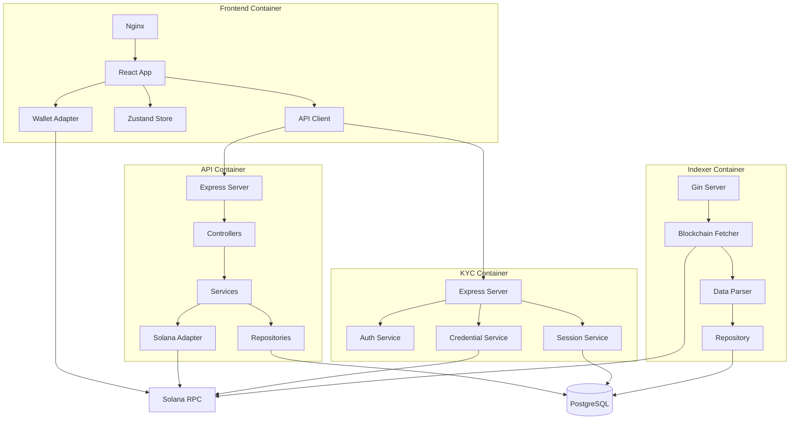
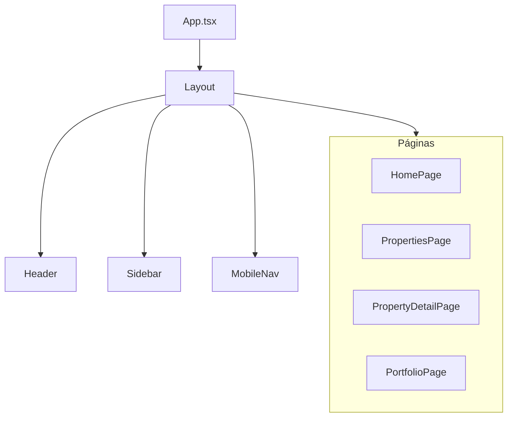
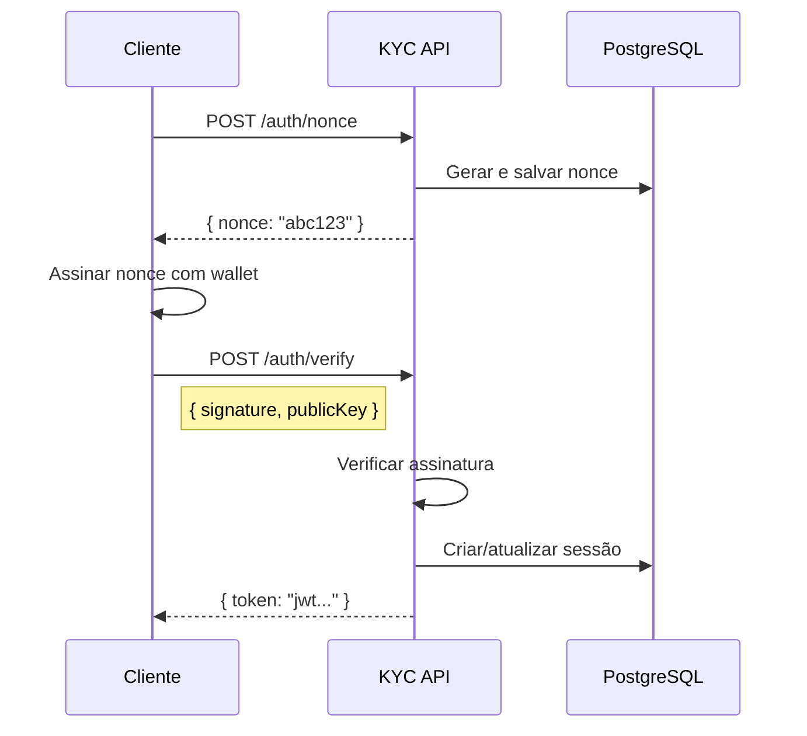
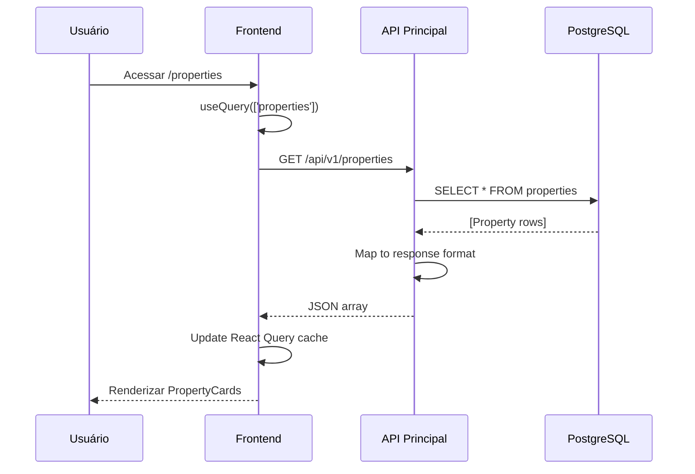
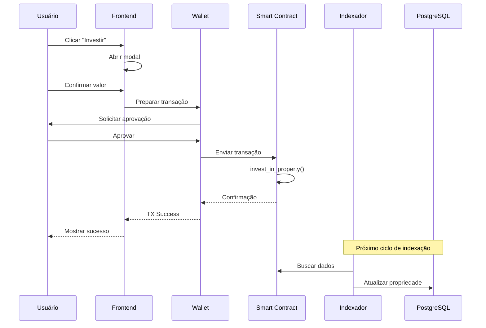

# Componentes do Sistema

## Diagrama de Componentes Detalhado



---

## Frontend (React)

### Estrutura de Diretórios

```
app/src/
├── main.tsx                    # Entry point
├── App.tsx                     # Root component + Routes
├── pages/                      # Páginas da aplicação
│   ├── HomePage.tsx            # Dashboard principal
│   ├── PropertiesPage.tsx      # Lista de propriedades
│   ├── PropertyDetailPage.tsx  # Detalhes do imóvel
│   ├── PortfolioPage.tsx       # Portfólio do usuário
│   ├── DividendsPage.tsx       # Dividendos
│   ├── KycPage.tsx             # Verificação KYC
│   ├── AdminPage.tsx           # Painel admin
│   └── SettingsPage.tsx        # Configurações
├── components/                 # Componentes reutilizáveis
│   ├── layout/                 # Header, Sidebar, Footer
│   ├── ui/                     # Button, Card, Input, etc.
│   ├── wallet/                 # WalletConnectButton
│   ├── property/               # PropertyCard, Gallery
│   ├── investment/             # InvestmentModal
│   └── dividends/              # ClaimCard
├── hooks/                      # Custom hooks
├── stores/                     # Zustand stores
├── services/                   # API clients
│   └── api/
│       ├── client.ts           # Axios instance
│       ├── properties.ts       # Properties API
│       ├── kyc.ts              # KYC API
│       └── invest.ts           # Investment API
├── providers/                  # Context providers
│   ├── WalletProvider.tsx      # Solana wallet
│   └── HubCredentialProvider.tsx # KYC context
├── types/                      # TypeScript types
├── i18n/                       # Internacionalização
│   ├── pt-BR.json              # Português
│   └── en.json                 # Inglês
└── styles/                     # CSS global
    └── index.css               # Tailwind + custom
```

### Componentes Principais



### Store (Zustand)

```typescript
// useAppStore.ts
interface AppState {
  selectedProperty: Property | null;
  setSelectedProperty: (p: Property | null) => void;

  userPreferences: UserPreferences;
  setUserPreferences: (p: UserPreferences) => void;
}

// useKycStore.ts
interface KycState {
  isVerified: boolean;
  credential: HubCredential | null;
  checkCredential: (wallet: string) => Promise<void>;
}
```

---

## API Principal (Node.js)

### Estrutura de Diretórios

```
services/api/src/
├── index.ts                    # Entry point
├── app.ts                      # Express setup
├── domain/                     # Camada de Domínio
│   └── entities/
│       ├── Property.ts         # Entidade Property
│       ├── Investor.ts         # Entidade Investor
│       ├── Revenue.ts          # Entidade Revenue
│       └── Dividend.ts         # Entidade Dividend
├── application/                # Camada de Aplicação
│   ├── ports/                  # Interfaces (contratos)
│   │   ├── PropertyRepository.ts
│   │   └── UserRepository.ts
│   ├── use-cases/              # Casos de uso
│   │   ├── GetProperties.ts
│   │   ├── InvestInProperty.ts
│   │   └── ClaimDividends.ts
│   └── services/               # Serviços de aplicação
│       ├── PropertyService.ts
│       └── InvestmentService.ts
├── infrastructure/             # Camada de Infraestrutura
│   ├── config/                 # Configurações
│   ├── database/               # Conexão PostgreSQL
│   ├── repositories/           # Implementações
│   │   ├── PropertyRepositoryImpl.ts
│   │   └── UserRepositoryImpl.ts
│   ├── solana/                 # Adapter Solana
│   │   └── SolanaConnectionAdapter.ts
│   └── ipfs/                   # Adapter IPFS
│       └── PinataService.ts
├── interfaces/                 # Camada de Interface
│   └── http/
│       ├── controllers/        # Controllers
│       │   ├── PropertyController.ts
│       │   ├── InvestController.ts
│       │   ├── AdminController.ts
│       │   └── UserController.ts
│       ├── routes/             # Rotas
│       │   └── v1/
│       │       ├── properties.ts
│       │       ├── invest.ts
│       │       └── users.ts
│       └── middlewares/        # Middlewares
│           ├── errorHandler.ts
│           └── validation.ts
└── shared/                     # Compartilhado
    ├── container.ts            # DI Container (TSyringe)
    └── tokens.ts               # Injection tokens
```

### Injeção de Dependência

```typescript
// container.ts
import { container } from 'tsyringe';

// Registrar repositórios
container.registerSingleton(
  TOKENS.PropertyRepository,
  PropertyRepositoryImpl
);

// Registrar serviços externos
container.registerSingleton(
  TOKENS.SolanaConnection,
  SolanaConnectionAdapter
);
```

### Controllers Pattern

```typescript
// PropertyController.ts
@injectable()
export class PropertyController {
  constructor(
    @inject(TOKENS.PropertyService)
    private propertyService: PropertyService
  ) {}

  async getAll(req: Request, res: Response) {
    const properties = await this.propertyService.findAll();
    res.json(properties);
  }

  async getByMint(req: Request, res: Response) {
    const { mint } = req.params;
    const property = await this.propertyService.findByMint(mint);
    res.json(property);
  }
}
```

---

## API KYC (Node.js)

### Estrutura de Diretórios

```
services/kyc-api/src/
├── app.ts                      # Express + middlewares
├── config.ts                   # Configurações
├── routes/
│   ├── auth.ts                 # Autenticação wallet
│   ├── credential.ts           # Operações de credencial
│   ├── kyc.ts                  # Sessões KYC
│   └── admin.ts                # Endpoints admin
├── services/
│   ├── kycSessionService.ts    # Gerencia sessões
│   ├── credentialService.ts    # Emissão/verificação
│   └── solanaService.ts        # Interação blockchain
├── middleware/
│   ├── auth.ts                 # JWT validation
│   ├── rateLimit.ts            # Rate limiting
│   └── validation.ts           # Input validation
├── types/
│   └── index.ts                # TypeScript types
└── utils/
    └── crypto.ts               # Funções de criptografia
```

### Fluxo de Autenticação



---

## Indexador (Go)

### Estrutura de Diretórios

```
services/indexer/
├── cmd/
│   └── main.go                 # Entry point
├── internal/
│   ├── config/
│   │   └── config.go           # Load .env
│   ├── database/
│   │   └── database.go         # PostgreSQL connection
│   ├── models/
│   │   └── property.go         # Data models
│   ├── indexer/
│   │   ├── indexer.go          # Loop principal
│   │   └── solana.go           # Cliente Solana
│   └── api/
│       ├── handler.go          # HTTP handlers
│       └── router.go           # Gin routes
├── go.mod
└── go.sum
```

### Loop de Indexação

```go
// indexer.go
func (i *Indexer) Start() {
    ticker := time.NewTicker(i.config.Interval)
    defer ticker.Stop()

    for {
        select {
        case <-ticker.C:
            i.indexProperties()
        case <-i.stop:
            return
        }
    }
}

func (i *Indexer) indexProperties() {
    // 1. Buscar todas as contas do programa
    accounts, _ := i.solana.GetProgramAccounts(programID)

    // 2. Para cada conta, fazer parse dos dados
    for _, acc := range accounts {
        property := parsePropertyState(acc.Data)

        // 3. Upsert no banco
        i.db.UpsertProperty(property)
    }
}
```

### API REST

```go
// router.go
func SetupRouter(h *Handler) *gin.Engine {
    r := gin.Default()

    r.GET("/health", h.Health)

    v1 := r.Group("/api/v1")
    {
        v1.GET("/properties", h.GetProperties)
        v1.GET("/properties/:mint", h.GetProperty)
        v1.POST("/index/trigger", h.TriggerIndex)
    }

    return r
}
```

---

## Interação entre Componentes

### Cenário: Usuário Lista Propriedades



### Cenário: Usuário Investe



---

## Mapeamento de Portas

```
┌─────────────────────────────────────────────────────────────┐
│                    PORTAS DOS SERVIÇOS                      │
├─────────────────────────────────────────────────────────────┤
│                                                             │
│  ┌─────────────┐    ┌─────────────┐    ┌─────────────┐     │
│  │  Frontend   │    │    API      │    │   KYC API   │     │
│  │    5173     │    │    3002     │    │    3001     │     │
│  └─────────────┘    └─────────────┘    └─────────────┘     │
│                                                             │
│  ┌─────────────┐    ┌─────────────┐    ┌─────────────┐     │
│  │  Indexador  │    │  PostgreSQL │    │    Kong     │     │
│  │    9090     │    │    5432     │    │    8000     │     │
│  └─────────────┘    └─────────────┘    └─────────────┘     │
│                                                             │
└─────────────────────────────────────────────────────────────┘
```

---

[← Voltar](./README.md) | [Próximo: Comunicação →](./comunicacao.md)
