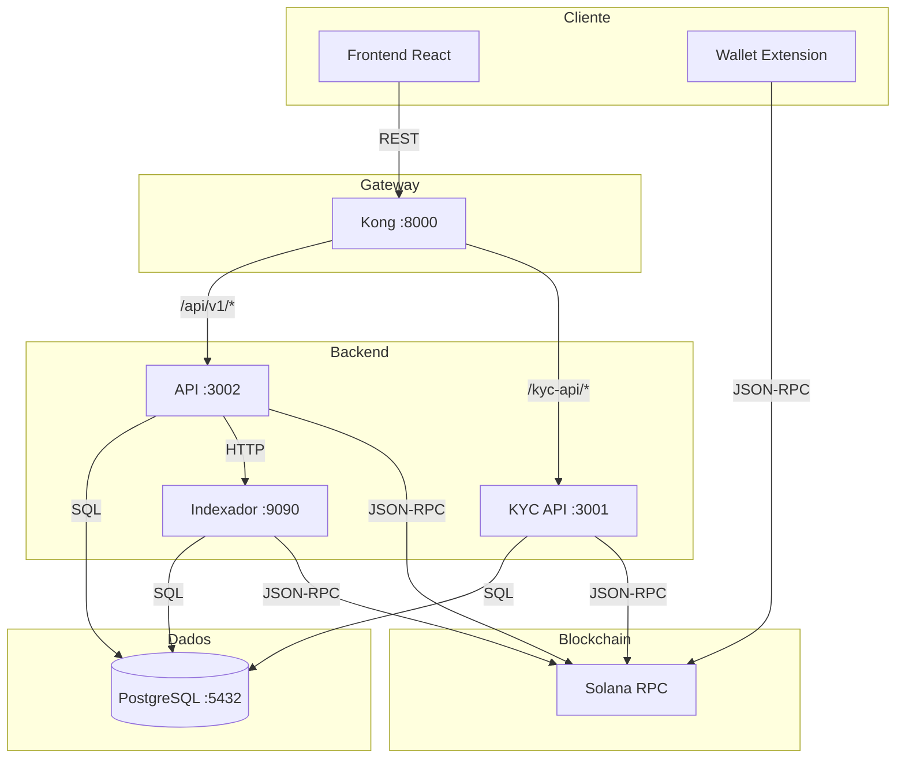
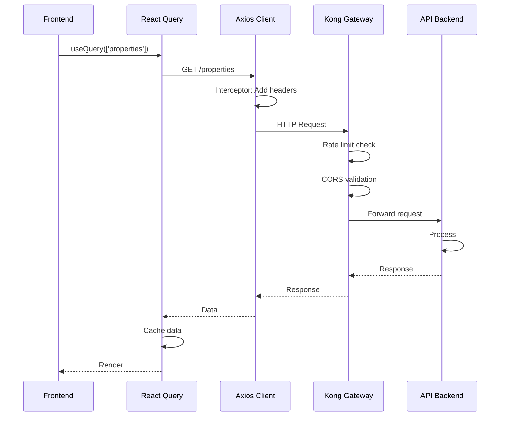
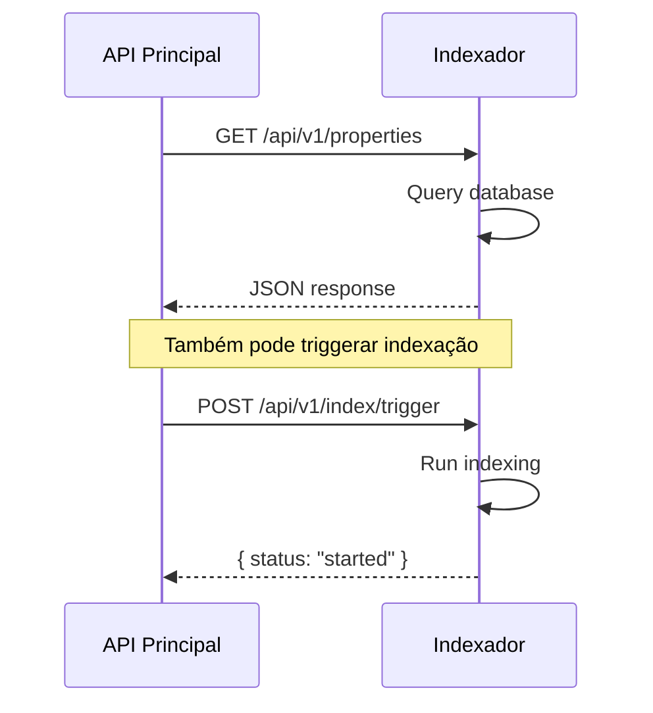
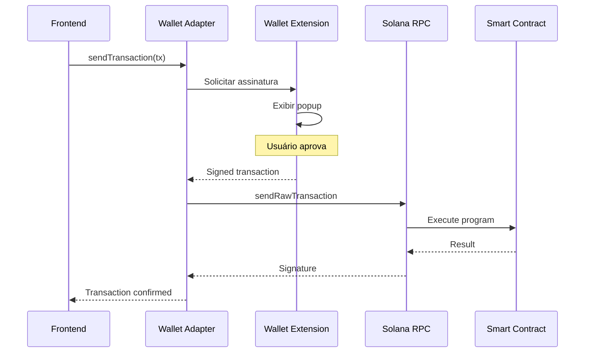
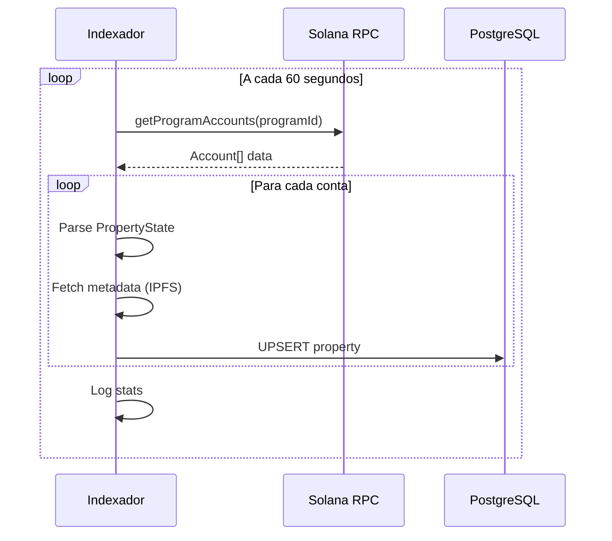

# Comunicação entre Serviços

## Visão Geral

O sistema Hub Token utiliza diferentes padrões de comunicação dependendo do contexto:

| Tipo | Protocolo | Uso |
|------|-----------|-----|
| **Síncrono** | REST/HTTP | Frontend → Backend, Backend → Backend |
| **Blockchain** | JSON-RPC | Backend → Solana, Frontend → Solana |
| **Assíncrono** | Polling | Indexador → Blockchain |

---

## Diagrama de Comunicação



---

## REST APIs

### Convenções de Endpoint

```
Base URL: https://rwa.hubweb3.com

API Principal:  /api/v1/...
KYC API:        /kyc-api/api/...
Indexador:      /indexer/api/v1/...
```

### Formato de Request/Response

**Headers Padrão:**
```http
Content-Type: application/json
Accept: application/json
Authorization: Bearer <token>  # Quando necessário
```

**Response de Sucesso:**
```json
{
  "data": { ... },
  "meta": {
    "page": 1,
    "limit": 20,
    "total": 100
  }
}
```

**Response de Erro:**
```json
{
  "error": {
    "code": "VALIDATION_ERROR",
    "message": "Campo 'amount' é obrigatório",
    "details": [
      {
        "field": "amount",
        "message": "Required"
      }
    ]
  }
}
```

### Códigos HTTP Utilizados

| Código | Significado | Uso |
|--------|-------------|-----|
| 200 | OK | Requisição bem sucedida |
| 201 | Created | Recurso criado |
| 400 | Bad Request | Erro de validação |
| 401 | Unauthorized | Não autenticado |
| 403 | Forbidden | Sem permissão |
| 404 | Not Found | Recurso não encontrado |
| 429 | Too Many Requests | Rate limit |
| 500 | Internal Error | Erro do servidor |

---

## Comunicação Frontend → Backend

### Fluxo de Requisição



### Configuração do Axios Client

```typescript
// services/api/client.ts
import axios from 'axios';

const apiClient = axios.create({
  baseURL: import.meta.env.VITE_API_URL || '/api/v1',
  timeout: 30000,
  headers: {
    'Content-Type': 'application/json',
  },
});

// Interceptor de Request
apiClient.interceptors.request.use((config) => {
  // Adicionar token se existir
  const token = localStorage.getItem('token');
  if (token) {
    config.headers.Authorization = `Bearer ${token}`;
  }
  return config;
});

// Interceptor de Response
apiClient.interceptors.response.use(
  (response) => response,
  (error) => {
    if (error.response?.status === 401) {
      // Redirect to login
    }
    return Promise.reject(error);
  }
);

export { apiClient };
```

### React Query Cache

```typescript
// Configuração global
const queryClient = new QueryClient({
  defaultOptions: {
    queries: {
      staleTime: 60000,      // 1 minuto
      cacheTime: 300000,     // 5 minutos
      refetchOnWindowFocus: false,
      retry: 3,
    },
  },
});

// Uso em componente
const { data: properties, isLoading } = useQuery({
  queryKey: ['properties'],
  queryFn: () => propertiesApi.getAll(),
});
```

---

## Comunicação Backend → Backend

### API → Indexador



### API → KYC API (Interno)

```typescript
// Verificação de credencial
async function verifyCredential(wallet: string): Promise<boolean> {
  const response = await axios.get(
    `${KYC_API_URL}/api/credentials/${wallet}`
  );

  return response.data.status === 'active' &&
         new Date(response.data.expiresAt) > new Date();
}
```

---

## Comunicação com Blockchain

### Padrão JSON-RPC

Solana usa JSON-RPC 2.0 para comunicação:

```json
// Request
{
  "jsonrpc": "2.0",
  "id": 1,
  "method": "getAccountInfo",
  "params": [
    "FDfkSAAqk8uweJusJb8MSNRHXGRvFqokNfjw9m8ve6om",
    { "encoding": "base64" }
  ]
}

// Response
{
  "jsonrpc": "2.0",
  "id": 1,
  "result": {
    "context": { "slot": 123456 },
    "value": {
      "data": ["base64data...", "base64"],
      "executable": true,
      "lamports": 1000000,
      "owner": "BPFLoaderUpgradeab1e11111111111111111111111",
      "rentEpoch": 123
    }
  }
}
```

### Frontend → Blockchain (via Wallet)



### Backend → Blockchain

```typescript
// SolanaConnectionAdapter.ts
import { Connection, PublicKey } from '@solana/web3.js';
import { Program, AnchorProvider } from '@coral-xyz/anchor';

export class SolanaConnectionAdapter {
  private connection: Connection;
  private program: Program;

  constructor() {
    this.connection = new Connection(
      process.env.SOLANA_RPC_URL!,
      'confirmed'
    );

    // Setup provider e program
    const provider = new AnchorProvider(
      this.connection,
      wallet,
      { commitment: 'confirmed' }
    );

    this.program = new Program(IDL, PROGRAM_ID, provider);
  }

  async getProperty(mint: PublicKey) {
    const [propertyPda] = PublicKey.findProgramAddressSync(
      [Buffer.from('property'), mint.toBuffer()],
      this.program.programId
    );

    return await this.program.account.propertyState.fetch(propertyPda);
  }
}
```

---

## Indexador → Blockchain (Polling)

### Fluxo de Indexação



### Código Go do Indexador

```go
// solana.go
func (s *SolanaClient) GetProgramAccounts(programID string) ([]Account, error) {
    resp, err := s.rpc.Call("getProgramAccounts", programID, map[string]interface{}{
        "encoding": "base64",
        "filters": []map[string]interface{}{
            {
                "memcmp": map[string]interface{}{
                    "offset": 0,
                    "bytes":  propertyDiscriminator,
                },
            },
        },
    })

    if err != nil {
        return nil, err
    }

    // Parse response...
    return accounts, nil
}
```

---

## Rate Limiting

### Configuração por Serviço

| Serviço | Limite | Janela |
|---------|--------|--------|
| API Principal | 1000 req | 15 min |
| KYC API | 100 req | 15 min |
| Indexador | Sem limite | - |

### Implementação (KYC API)

```typescript
// middleware/rateLimit.ts
import rateLimit from 'express-rate-limit';

export const apiLimiter = rateLimit({
  windowMs: 15 * 60 * 1000,  // 15 minutos
  max: 100,                   // 100 requisições
  message: {
    error: {
      code: 'RATE_LIMIT_EXCEEDED',
      message: 'Muitas requisições. Tente novamente em 15 minutos.'
    }
  }
});

// Uso
app.use('/api', apiLimiter);
```

---

## CORS

### Configuração Kong

```yaml
# Kong CORS Plugin
plugins:
  - name: cors
    config:
      origins:
        - https://rwa.hubweb3.com
        - http://localhost:5173
        - http://localhost:5174
      methods:
        - GET
        - POST
        - PUT
        - DELETE
        - OPTIONS
      headers:
        - Content-Type
        - Authorization
        - Accept
      credentials: true
      max_age: 3600
```

### Configuração Express (Fallback)

```typescript
// app.ts
import cors from 'cors';

app.use(cors({
  origin: (origin, callback) => {
    const allowedOrigins = config.cors.allowedOrigins;
    if (!origin || allowedOrigins.includes(origin)) {
      callback(null, true);
    } else {
      callback(new Error('Not allowed by CORS'));
    }
  },
  credentials: true,
  methods: ['GET', 'POST', 'PUT', 'DELETE', 'OPTIONS'],
  allowedHeaders: ['Content-Type', 'Authorization', 'Accept'],
}));
```

---

## Timeout e Retry

### Configuração de Timeouts

| Operação | Timeout |
|----------|---------|
| API Request | 30s |
| Blockchain Read | 10s |
| Blockchain Write | 60s |
| Database Query | 5s |

### Retry Strategy

```typescript
// Exponential backoff
async function withRetry<T>(
  fn: () => Promise<T>,
  maxRetries = 3
): Promise<T> {
  let lastError: Error;

  for (let i = 0; i < maxRetries; i++) {
    try {
      return await fn();
    } catch (error) {
      lastError = error as Error;
      const delay = Math.pow(2, i) * 1000; // 1s, 2s, 4s
      await sleep(delay);
    }
  }

  throw lastError!;
}
```

---

## Health Checks

### Endpoints

```
GET /health         → { status: "healthy" }
GET /health/ready   → { ready: true/false }
GET /health/live    → { live: true/false }
```

### Verificações por Serviço

| Serviço | Checks |
|---------|--------|
| API | Database, Solana RPC |
| KYC | Database, Solana RPC |
| Indexador | Database, Solana RPC |

```typescript
// healthController.ts
async function healthCheck(req: Request, res: Response) {
  const checks = {
    database: await checkDatabase(),
    solana: await checkSolana(),
  };

  const healthy = Object.values(checks).every(c => c === true);

  res.status(healthy ? 200 : 503).json({
    status: healthy ? 'healthy' : 'unhealthy',
    checks,
    timestamp: new Date().toISOString(),
  });
}
```

---

[← Voltar](./componentes.md) | [Próximo: Banco de Dados →](./banco-dados.md)
