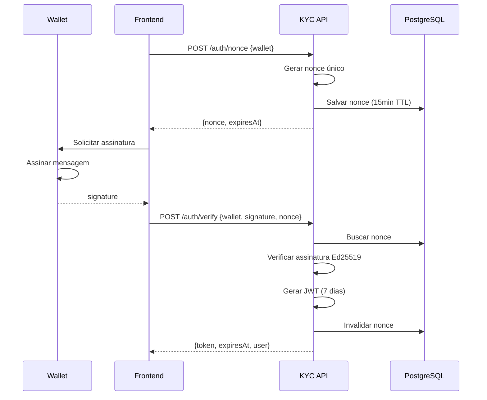
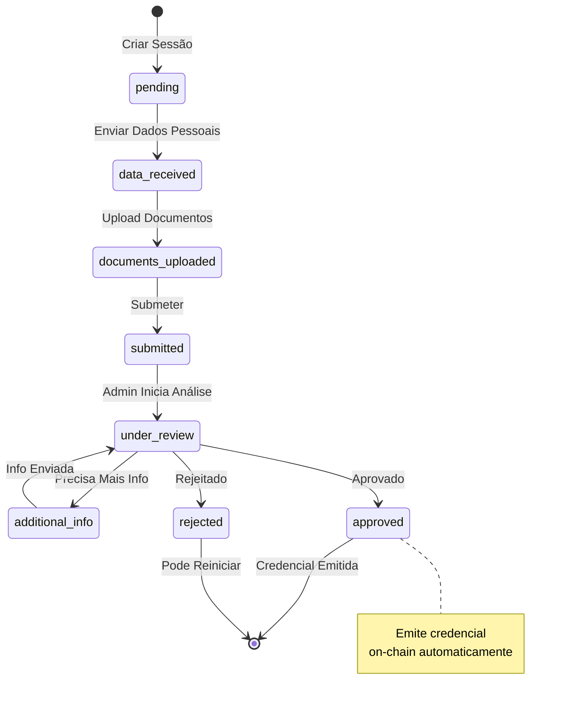

# API KYC

## Visão Geral

A API KYC gerencia autenticação de wallets, sessões de verificação de identidade e emissão de credenciais on-chain. É o gateway de compliance da plataforma.

---

## Configuração

### config.ts

```typescript
import dotenv from 'dotenv';
dotenv.config();

export const config = {
  // Server
  port: parseInt(process.env.PORT || '3001'),
  host: process.env.HOST || '0.0.0.0',
  nodeEnv: process.env.NODE_ENV || 'development',

  // Database
  databaseUrl: process.env.DATABASE_URL!,

  // Solana
  solanaRpcUrl: process.env.SOLANA_RPC_URL!,
  credentialProgramId: process.env.CREDENTIAL_PROGRAM_ID!,

  // Issuer
  issuerWallet: process.env.ISSUER_WALLET!,
  issuerPrivateKey: process.env.ISSUER_PRIVATE_KEY!,

  // JWT
  jwtSecret: process.env.JWT_SECRET!,
  jwtExpiresIn: process.env.JWT_EXPIRES_IN || '7d',

  // CORS
  corsOrigins: process.env.CORS_ORIGINS?.split(',') || ['http://localhost:5173'],

  // Rate Limiting
  rateLimitWindowMs: parseInt(process.env.RATE_LIMIT_WINDOW_MS || '900000'),
  rateLimitMaxRequests: parseInt(process.env.RATE_LIMIT_MAX_REQUESTS || '100'),
};

// Validação de variáveis obrigatórias
const required = ['DATABASE_URL', 'SOLANA_RPC_URL', 'CREDENTIAL_PROGRAM_ID', 'JWT_SECRET'];
for (const key of required) {
  if (!process.env[key]) {
    throw new Error(`Missing required env var: ${key}`);
  }
}
```

---

## App Setup

### app.ts

```typescript
import express from 'express';
import cors from 'cors';
import helmet from 'helmet';
import rateLimit from 'express-rate-limit';
import { config } from './config';
import { authRoutes } from './routes/auth';
import { credentialsRoutes } from './routes/credentials';
import { kycRoutes } from './routes/kyc';
import { adminRoutes } from './routes/admin';
import { errorHandler } from './middleware/errorHandler';

const app = express();

// Segurança
app.use(helmet());
app.use(cors({
  origin: config.corsOrigins,
  credentials: true,
}));
app.use(express.json());

// Rate limiting global
app.use(rateLimit({
  windowMs: config.rateLimitWindowMs,
  max: config.rateLimitMaxRequests,
  message: {
    error: {
      code: 'RATE_LIMIT_EXCEEDED',
      message: 'Muitas requisições. Tente novamente em 15 minutos.',
    },
  },
}));

// Rotas
app.use('/api/auth', authRoutes);
app.use('/api/credentials', credentialsRoutes);
app.use('/api/kyc', kycRoutes);
app.use('/api/admin', adminRoutes);

// Health check
app.get('/api/health', (req, res) => {
  res.json({ status: 'healthy', timestamp: new Date().toISOString() });
});

// Error handler
app.use(errorHandler);

// Start server
app.listen(config.port, config.host, () => {
  console.log(`KYC API running on ${config.host}:${config.port}`);
});

export { app };
```

---

## Fluxo de Autenticação



---

## Rotas de Autenticação

### routes/auth.ts

```typescript
import { Router } from 'express';
import { AuthService } from '../services/AuthService';
import { validateBody } from '../middleware/validation';
import { authMiddleware } from '../middleware/auth';
import { nonceSchema, verifySchema } from '../schemas/auth';

const router = Router();
const authService = new AuthService();

// Rate limit específico para auth
const authLimiter = rateLimit({
  windowMs: 15 * 60 * 1000, // 15 min
  max: 20,
});

router.use(authLimiter);

// POST /auth/nonce
router.post('/nonce',
  validateBody(nonceSchema),
  async (req, res, next) => {
    try {
      const { wallet } = req.body;
      const result = await authService.generateNonce(wallet);
      res.json(result);
    } catch (error) {
      next(error);
    }
  }
);

// POST /auth/verify
router.post('/verify',
  validateBody(verifySchema),
  async (req, res, next) => {
    try {
      const { wallet, signature, nonce } = req.body;
      const result = await authService.verifySignature(wallet, signature, nonce);
      res.json(result);
    } catch (error) {
      next(error);
    }
  }
);

// GET /auth/me
router.get('/me',
  authMiddleware,
  async (req, res, next) => {
    try {
      const user = await authService.getCurrentUser(req.user!.wallet);
      res.json(user);
    } catch (error) {
      next(error);
    }
  }
);

export { router as authRoutes };
```

---

## Services

### services/AuthService.ts

```typescript
import { randomBytes } from 'crypto';
import nacl from 'tweetnacl';
import bs58 from 'bs58';
import jwt from 'jsonwebtoken';
import { config } from '../config';
import { prisma } from '../database';
import { CredentialService } from './CredentialService';

export class AuthService {
  private credentialService = new CredentialService();

  async generateNonce(wallet: string): Promise<{ nonce: string; expiresAt: Date }> {
    // Validar formato da wallet
    if (!this.isValidWallet(wallet)) {
      throw new Error('Endereço de wallet inválido');
    }

    // Gerar nonce único
    const randomPart = randomBytes(16).toString('hex');
    const nonce = `Hub Token Authentication: ${randomPart}`;
    const expiresAt = new Date(Date.now() + 15 * 60 * 1000); // 15 min

    // Salvar no banco
    await prisma.authNonce.upsert({
      where: { wallet },
      create: { wallet, nonce, expiresAt },
      update: { nonce, expiresAt },
    });

    return { nonce, expiresAt };
  }

  async verifySignature(
    wallet: string,
    signature: string,
    nonce: string
  ): Promise<{
    token: string;
    expiresAt: Date;
    user: {
      wallet: string;
      hasCredential: boolean;
      credentialStatus?: string;
    };
  }> {
    // Buscar nonce salvo
    const stored = await prisma.authNonce.findUnique({
      where: { wallet },
    });

    if (!stored || stored.nonce !== nonce) {
      throw new Error('Nonce inválido');
    }

    if (stored.expiresAt < new Date()) {
      throw new Error('Nonce expirado');
    }

    // Verificar assinatura Ed25519
    const messageBytes = new TextEncoder().encode(nonce);
    const signatureBytes = bs58.decode(signature);
    const publicKeyBytes = bs58.decode(wallet);

    const isValid = nacl.sign.detached.verify(
      messageBytes,
      signatureBytes,
      publicKeyBytes
    );

    if (!isValid) {
      throw new Error('Assinatura inválida');
    }

    // Invalidar nonce (uso único)
    await prisma.authNonce.delete({ where: { wallet } });

    // Verificar credencial
    const credential = await this.credentialService.getCredential(wallet);

    // Gerar JWT
    const expiresIn = config.jwtExpiresIn;
    const expiresAt = new Date(Date.now() + this.parseExpiry(expiresIn));

    const token = jwt.sign(
      {
        wallet,
        hasCredential: !!credential,
      },
      config.jwtSecret,
      { expiresIn }
    );

    return {
      token,
      expiresAt,
      user: {
        wallet,
        hasCredential: !!credential,
        credentialStatus: credential?.status,
      },
    };
  }

  async getCurrentUser(wallet: string) {
    const credential = await this.credentialService.getCredential(wallet);

    return {
      wallet,
      hasCredential: !!credential,
      credentialType: credential?.credentialType,
      credentialStatus: credential?.status,
      expiresAt: credential?.expiresAt,
    };
  }

  private isValidWallet(wallet: string): boolean {
    try {
      const bytes = bs58.decode(wallet);
      return bytes.length === 32;
    } catch {
      return false;
    }
  }

  private parseExpiry(expiry: string): number {
    const match = expiry.match(/^(\d+)([dhms])$/);
    if (!match) return 7 * 24 * 60 * 60 * 1000; // default 7d

    const value = parseInt(match[1]);
    const unit = match[2];

    switch (unit) {
      case 'd': return value * 24 * 60 * 60 * 1000;
      case 'h': return value * 60 * 60 * 1000;
      case 'm': return value * 60 * 1000;
      case 's': return value * 1000;
      default: return 7 * 24 * 60 * 60 * 1000;
    }
  }
}
```

### services/CredentialService.ts

```typescript
import { Connection, PublicKey, Keypair, Transaction } from '@solana/web3.js';
import { Program, AnchorProvider, Wallet } from '@coral-xyz/anchor';
import bs58 from 'bs58';
import { config } from '../config';
import { IDL } from '../idl/credential_program';

interface Credential {
  pda: string;
  wallet: string;
  credentialType: string;
  status: string;
  issuer: string;
  issuedAt: Date;
  expiresAt: Date;
  metadataUri?: string;
}

export class CredentialService {
  private connection: Connection;
  private program: Program;
  private issuerKeypair: Keypair;

  constructor() {
    this.connection = new Connection(config.solanaRpcUrl, 'confirmed');

    // Setup issuer keypair
    if (config.issuerPrivateKey) {
      this.issuerKeypair = Keypair.fromSecretKey(
        bs58.decode(config.issuerPrivateKey)
      );
    }

    // Setup program
    const wallet = new Wallet(this.issuerKeypair || Keypair.generate());
    const provider = new AnchorProvider(this.connection, wallet, {});
    this.program = new Program(
      IDL,
      new PublicKey(config.credentialProgramId),
      provider
    );
  }

  async getCredential(wallet: string): Promise<Credential | null> {
    const walletPubkey = new PublicKey(wallet);

    // Derivar PDA da credencial
    const [credentialPda] = PublicKey.findProgramAddressSync(
      [Buffer.from('credential'), walletPubkey.toBuffer()],
      this.program.programId
    );

    try {
      const account = await this.program.account.userCredential.fetch(credentialPda);

      // Mapear status enum
      const statusMap: Record<number, string> = {
        0: 'pending',
        1: 'active',
        2: 'suspended',
        3: 'revoked',
        4: 'expired',
      };

      // Mapear tipo de credencial
      const typeMap: Record<number, string> = {
        0: 'KycBasic',
        1: 'KycFull',
        2: 'AccreditedInvestor',
        3: 'QualifiedPurchaser',
        4: 'BrazilianCpf',
        5: 'BrazilianCnpj',
      };

      const expiresAt = new Date(account.expiresAt.toNumber() * 1000);
      const now = new Date();

      return {
        pda: credentialPda.toBase58(),
        wallet: account.wallet.toBase58(),
        credentialType: typeMap[account.credentialType] || 'Unknown',
        status: expiresAt < now ? 'expired' : statusMap[account.status] || 'unknown',
        issuer: account.issuer.toBase58(),
        issuedAt: new Date(account.issuedAt.toNumber() * 1000),
        expiresAt,
        metadataUri: account.metadataUri,
      };
    } catch (error: any) {
      // Account não existe
      if (error.message?.includes('Account does not exist')) {
        return null;
      }
      throw error;
    }
  }

  async issueCredential(
    wallet: string,
    credentialType: string,
    validityDays: number,
    metadataUri?: string
  ): Promise<{ pda: string; txSignature: string }> {
    const walletPubkey = new PublicKey(wallet);

    // Derivar PDA
    const [credentialPda] = PublicKey.findProgramAddressSync(
      [Buffer.from('credential'), walletPubkey.toBuffer()],
      this.program.programId
    );

    // Mapear tipo
    const typeMap: Record<string, number> = {
      'KycBasic': 0,
      'KycFull': 1,
      'AccreditedInvestor': 2,
      'QualifiedPurchaser': 3,
      'BrazilianCpf': 4,
      'BrazilianCnpj': 5,
    };

    const credentialTypeValue = typeMap[credentialType];
    if (credentialTypeValue === undefined) {
      throw new Error('Tipo de credencial inválido');
    }

    // Calcular expiração
    const expiresAt = Math.floor(Date.now() / 1000) + (validityDays * 24 * 60 * 60);

    // Construir transação
    const tx = await this.program.methods
      .issueCredential(
        credentialTypeValue,
        expiresAt,
        metadataUri || ''
      )
      .accounts({
        issuer: this.issuerKeypair.publicKey,
        wallet: walletPubkey,
        credential: credentialPda,
        systemProgram: PublicKey.default,
      })
      .signers([this.issuerKeypair])
      .rpc();

    return {
      pda: credentialPda.toBase58(),
      txSignature: tx,
    };
  }

  async refreshCredential(
    wallet: string,
    validityDays: number
  ): Promise<{ newExpiresAt: Date; txSignature: string }> {
    const walletPubkey = new PublicKey(wallet);

    const [credentialPda] = PublicKey.findProgramAddressSync(
      [Buffer.from('credential'), walletPubkey.toBuffer()],
      this.program.programId
    );

    const newExpiresAt = Math.floor(Date.now() / 1000) + (validityDays * 24 * 60 * 60);

    const tx = await this.program.methods
      .refreshCredential(newExpiresAt)
      .accounts({
        issuer: this.issuerKeypair.publicKey,
        credential: credentialPda,
      })
      .signers([this.issuerKeypair])
      .rpc();

    return {
      newExpiresAt: new Date(newExpiresAt * 1000),
      txSignature: tx,
    };
  }

  async revokeCredential(
    wallet: string,
    reason: string
  ): Promise<{ txSignature: string }> {
    const walletPubkey = new PublicKey(wallet);

    const [credentialPda] = PublicKey.findProgramAddressSync(
      [Buffer.from('credential'), walletPubkey.toBuffer()],
      this.program.programId
    );

    const tx = await this.program.methods
      .revokeCredential(reason)
      .accounts({
        issuer: this.issuerKeypair.publicKey,
        credential: credentialPda,
      })
      .signers([this.issuerKeypair])
      .rpc();

    return { txSignature: tx };
  }
}
```

---

## Middleware de Autenticação

### middleware/auth.ts

```typescript
import { Request, Response, NextFunction } from 'express';
import jwt from 'jsonwebtoken';
import { config } from '../config';

interface JwtPayload {
  wallet: string;
  hasCredential: boolean;
  iat: number;
  exp: number;
}

declare global {
  namespace Express {
    interface Request {
      user?: JwtPayload;
    }
  }
}

export function authMiddleware(req: Request, res: Response, next: NextFunction) {
  const authHeader = req.headers.authorization;

  if (!authHeader || !authHeader.startsWith('Bearer ')) {
    return res.status(401).json({
      error: {
        code: 'UNAUTHORIZED',
        message: 'Token não fornecido',
      },
    });
  }

  const token = authHeader.substring(7);

  try {
    const decoded = jwt.verify(token, config.jwtSecret) as JwtPayload;
    req.user = decoded;
    next();
  } catch (error: any) {
    if (error.name === 'TokenExpiredError') {
      return res.status(401).json({
        error: {
          code: 'TOKEN_EXPIRED',
          message: 'Token expirado',
        },
      });
    }

    return res.status(401).json({
      error: {
        code: 'INVALID_TOKEN',
        message: 'Token inválido',
      },
    });
  }
}

export function requireCredential(req: Request, res: Response, next: NextFunction) {
  if (!req.user?.hasCredential) {
    return res.status(403).json({
      error: {
        code: 'CREDENTIAL_REQUIRED',
        message: 'Credencial KYC necessária para esta operação',
      },
    });
  }
  next();
}
```

---

## Rotas de KYC

### routes/kyc.ts

```typescript
import { Router } from 'express';
import multer from 'multer';
import { KycService } from '../services/KycService';
import { authMiddleware } from '../middleware/auth';
import { validateBody } from '../middleware/validation';

const router = Router();
const kycService = new KycService();

// Configurar upload
const upload = multer({
  storage: multer.memoryStorage(),
  limits: { fileSize: 10 * 1024 * 1024 }, // 10MB
  fileFilter: (req, file, cb) => {
    const allowed = ['image/jpeg', 'image/png', 'application/pdf'];
    if (allowed.includes(file.mimetype)) {
      cb(null, true);
    } else {
      cb(new Error('Tipo de arquivo não suportado'));
    }
  },
});

// Requer autenticação em todas as rotas
router.use(authMiddleware);

// POST /kyc/session - Criar sessão
router.post('/session', async (req, res, next) => {
  try {
    const session = await kycService.createSession(req.user!.wallet);
    res.json(session);
  } catch (error) {
    next(error);
  }
});

// GET /kyc/session/:sessionId - Status da sessão
router.get('/session/:sessionId', async (req, res, next) => {
  try {
    const session = await kycService.getSession(
      req.params.sessionId,
      req.user!.wallet
    );
    res.json(session);
  } catch (error) {
    next(error);
  }
});

// PUT /kyc/session/:sessionId - Atualizar dados
router.put('/session/:sessionId',
  validateBody(updateSessionSchema),
  async (req, res, next) => {
    try {
      const result = await kycService.updateSession(
        req.params.sessionId,
        req.user!.wallet,
        req.body
      );
      res.json(result);
    } catch (error) {
      next(error);
    }
  }
);

// POST /kyc/upload - Upload de documento
router.post('/upload',
  upload.single('file'),
  async (req, res, next) => {
    try {
      const { sessionId, documentType } = req.body;
      const file = req.file!;

      const result = await kycService.uploadDocument(
        sessionId,
        req.user!.wallet,
        documentType,
        file
      );

      res.json(result);
    } catch (error) {
      next(error);
    }
  }
);

// POST /kyc/session/:sessionId/submit - Submeter para análise
router.post('/session/:sessionId/submit', async (req, res, next) => {
  try {
    const result = await kycService.submitSession(
      req.params.sessionId,
      req.user!.wallet
    );
    res.json(result);
  } catch (error) {
    next(error);
  }
});

export { router as kycRoutes };
```

---

## Schemas

### schemas/auth.ts

```typescript
import { z } from 'zod';

export const nonceSchema = z.object({
  wallet: z.string()
    .length(44, 'Endereço de wallet deve ter 44 caracteres')
    .regex(/^[1-9A-HJ-NP-Za-km-z]+$/, 'Endereço de wallet inválido'),
});

export const verifySchema = z.object({
  wallet: z.string()
    .length(44)
    .regex(/^[1-9A-HJ-NP-Za-km-z]+$/),
  signature: z.string()
    .min(64, 'Assinatura inválida'),
  nonce: z.string()
    .startsWith('Hub Token Authentication:', 'Nonce inválido'),
});
```

---

## Prisma Schema

### prisma/schema.prisma

```prisma
generator client {
  provider = "prisma-client-js"
}

datasource db {
  provider = "postgresql"
  url      = env("DATABASE_URL")
}

model AuthNonce {
  wallet    String   @id
  nonce     String
  expiresAt DateTime
  createdAt DateTime @default(now())

  @@map("auth_nonces")
}

model KycSession {
  id           String   @id @default(uuid())
  wallet       String
  status       String   @default("pending")
  personalData Json?
  documents    Json?
  progress     Int      @default(0)
  submittedAt  DateTime?
  reviewedAt   DateTime?
  reviewedBy   String?
  notes        String?
  createdAt    DateTime @default(now())
  updatedAt    DateTime @updatedAt
  expiresAt    DateTime

  @@index([wallet])
  @@index([status])
  @@map("kyc_sessions")
}

model KycDocument {
  id           String   @id @default(uuid())
  sessionId    String
  documentType String
  ipfsHash     String
  fileName     String
  mimeType     String
  size         Int
  uploadedAt   DateTime @default(now())

  @@index([sessionId])
  @@map("kyc_documents")
}
```

---

## Fluxo Completo KYC



---

[← Voltar](./api-principal.md) | [Próximo: Indexador →](./indexador.md)
