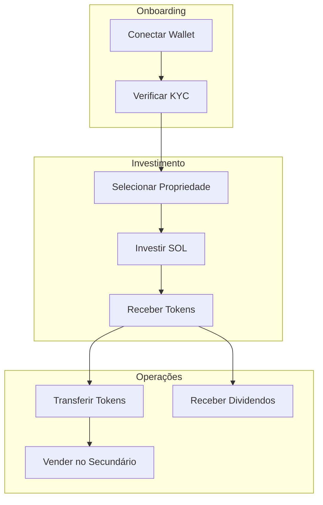
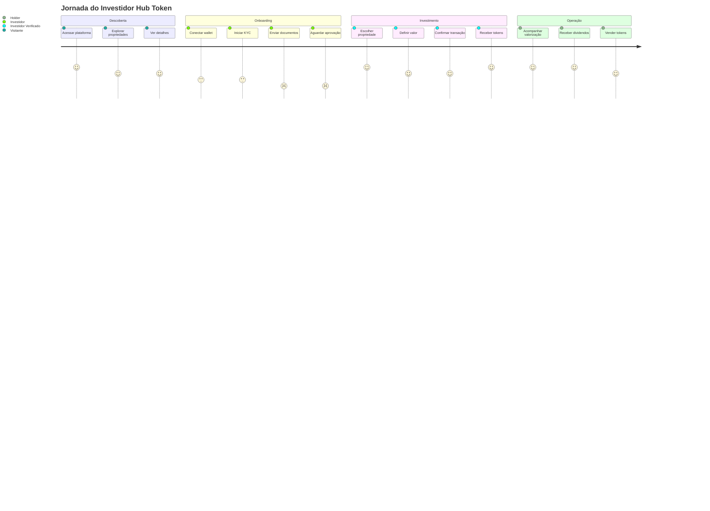
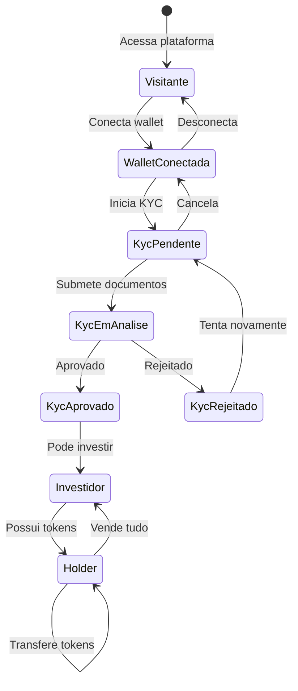

# Fluxos de Negócio

## Visão Geral

Esta seção documenta os principais fluxos de negócio do Hub Token, desde o onboarding do usuário até a distribuição de dividendos.

## Fluxos Principais

## Lista de Fluxos

| Fluxo | Descrição | Atores |
|-------|-----------|--------|
| [Investimento](./investimento.md) | Como um usuário investe em uma propriedade | Investidor |
| [KYC](./kyc.md) | Processo de verificação de identidade | Investidor, Admin |
| [Dividendos](./dividendos.md) | Distribuição e resgate de rendimentos | Proprietário, Investidor |
| [Transferência](./transferencia.md) | Venda/compra no mercado secundário | Investidores |

---

## Diagrama de Jornada do Usuário

---

## Estados do Usuário

---

## Requisitos por Fluxo

### Investimento

| Requisito | Obrigatório | Descrição |
|-----------|-------------|-----------|
| Wallet conectada | Sim | Phantom, Solflare, etc. |
| KYC aprovado | Sim | Credencial Hub válida |
| SOL suficiente | Sim | Para investimento + gas |
| Propriedade ativa | Sim | Status = active |

### Transferência

| Requisito | Obrigatório | Descrição |
|-----------|-------------|-----------|
| Wallet conectada | Sim | Ambas as partes |
| KYC do destinatário | Sim | Transfer Hook verifica |
| Saldo de tokens | Sim | >= quantidade |
| SOL para gas | Sim | ~0.00001 SOL |

### Dividendos

| Requisito | Obrigatório | Descrição |
|-----------|-------------|-----------|
| Ser holder | Sim | Possuir tokens |
| Época depositada | Sim | Revenue depositado |
| Não ter resgatado | Sim | Primeira vez na época |

---

## Próximos Documentos

- [Fluxo de Investimento](./investimento.md)
- [Fluxo de KYC](./kyc.md)
- [Distribuição de Dividendos](./dividendos.md)
- [Transferência de Tokens](./transferencia.md)

---

[← Voltar](../smart-contracts/credential-program.md) | [Próximo: Investimento →](./investimento.md)
