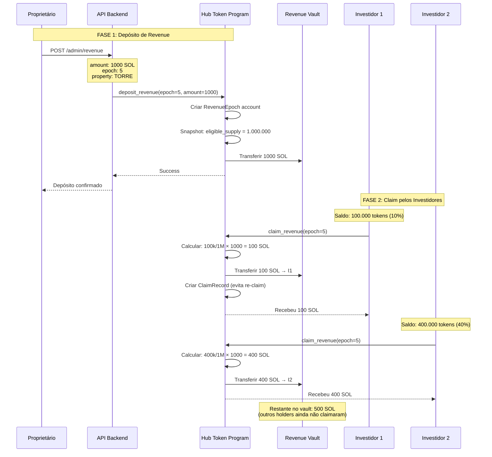
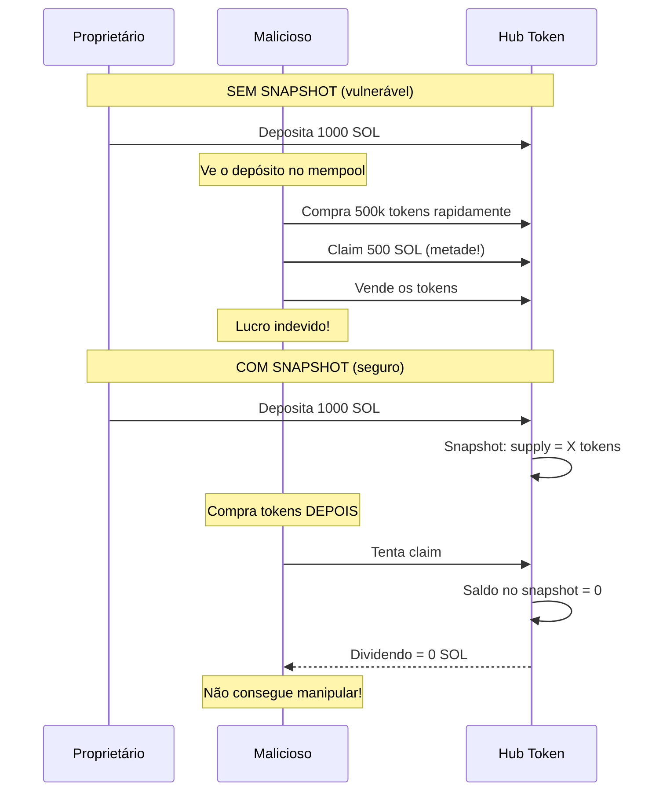

# Distribuição de Dividendos

## Visão Geral

O sistema de dividendos permite que proprietários de imóveis distribuam rendimentos (aluguéis) para todos os holders de tokens de forma proporcional e transparente.

## Conceitos Importantes

### Época (Epoch)
Período de distribuição de dividendos, geralmente mensal. Cada depósito cria uma nova época.

### Supply Elegível
Quantidade de tokens em circulação no momento do depósito. Capturada via snapshot para evitar gaming.

### Claim
Ação do investidor de resgatar seus dividendos de uma época específica.

---

## Fluxo Completo



---

## Fórmula de Cálculo

```
dividendo = (saldo_do_investidor / supply_elegível) × total_depositado
```

### Exemplo Detalhado

**Cenário:**
- Propriedade: Edifício Torre Norte (TORRE)
- Total depositado: 1.000 SOL
- Supply elegível (snapshot): 1.000.000 tokens

| Investidor | Saldo (tokens) | Participação | Dividendo |
|------------|----------------|--------------|-----------|
| Alice | 100.000 | 10% | 100 SOL |
| Bob | 400.000 | 40% | 400 SOL |
| Carol | 250.000 | 25% | 250 SOL |
| David | 150.000 | 15% | 150 SOL |
| Eve | 100.000 | 10% | 100 SOL |
| **Total** | **1.000.000** | **100%** | **1.000 SOL** |

---

## Diagrama do Vault

```
┌─────────────────────────────────────────────────────────────┐
│                     REVENUE VAULT                           │
│                    Propriedade: TORRE                       │
├─────────────────────────────────────────────────────────────┤
│                                                             │
│  Época 5                                                    │
│  ┌─────────────────────────────────────────────────────┐   │
│  │  Total Depositado:    1.000 SOL                      │   │
│  │  Supply Elegível:     1.000.000 tokens               │   │
│  │  Data do Depósito:    2025-01-15                     │   │
│  │                                                       │   │
│  │  Claims realizados:                                   │   │
│  │  ├─ Alice:    100 SOL ✓                              │   │
│  │  ├─ Bob:      400 SOL ✓                              │   │
│  │  └─ Carol:    250 SOL ✓                              │   │
│  │                                                       │   │
│  │  Restante:    250 SOL (David + Eve)                  │   │
│  └─────────────────────────────────────────────────────┘   │
│                                                             │
│  Época 4                                                    │
│  ┌─────────────────────────────────────────────────────┐   │
│  │  Total Depositado:    800 SOL                        │   │
│  │  Totalmente claimado: ✓                              │   │
│  └─────────────────────────────────────────────────────┘   │
│                                                             │
└─────────────────────────────────────────────────────────────┘
```

---

## Depósito de Revenue (Proprietário)

### Requisitos
- Ser o `authority` da propriedade
- Ter SOL suficiente para o depósito

### Estrutura da Transação

```rust
pub fn deposit_revenue(
    ctx: Context<DepositRevenue>,
    epoch_number: u64,
    amount: u64,
) -> Result<()> {
    // 1. Verificar autoridade
    require!(
        ctx.accounts.property_state.authority == ctx.accounts.depositor.key(),
        HubTokenError::Unauthorized
    );

    // 2. Criar RevenueEpoch
    let revenue_epoch = &mut ctx.accounts.revenue_epoch;
    revenue_epoch.property_mint = ctx.accounts.mint.key();
    revenue_epoch.epoch_number = epoch_number;
    revenue_epoch.total_revenue = amount;
    revenue_epoch.eligible_supply = ctx.accounts.property_state.circulating_supply;
    revenue_epoch.deposited_at = Clock::get()?.unix_timestamp;
    revenue_epoch.total_claimed = 0;

    // 3. Transferir SOL para o vault
    let cpi_ctx = CpiContext::new(
        ctx.accounts.system_program.to_account_info(),
        Transfer {
            from: ctx.accounts.depositor.to_account_info(),
            to: ctx.accounts.revenue_vault.to_account_info(),
        },
    );
    system_program::transfer(cpi_ctx, amount)?;

    // 4. Emitir evento
    emit!(RevenueDeposited {
        property: ctx.accounts.mint.key(),
        epoch: epoch_number,
        amount,
        eligible_supply: revenue_epoch.eligible_supply,
    });

    Ok(())
}
```

---

## Claim de Dividendos (Investidor)

### Requisitos
- Possuir tokens da propriedade
- Não ter claimado a época específica
- Época deve existir e ter saldo

### Estrutura da Transação

```rust
pub fn claim_revenue(
    ctx: Context<ClaimRevenue>,
    epoch_number: u64,
) -> Result<()> {
    let revenue_epoch = &ctx.accounts.revenue_epoch;

    // 1. Calcular dividendo
    let investor_balance = ctx.accounts.investor_token_account.amount;
    let claim_amount = (investor_balance as u128)
        .checked_mul(revenue_epoch.total_revenue as u128)
        .unwrap()
        .checked_div(revenue_epoch.eligible_supply as u128)
        .unwrap() as u64;

    // 2. Verificar se há saldo
    require!(
        claim_amount > 0,
        HubTokenError::InsufficientBalance
    );

    // 3. Transferir SOL do vault para investidor
    **ctx.accounts.revenue_vault.try_borrow_mut_lamports()? -= claim_amount;
    **ctx.accounts.investor.try_borrow_mut_lamports()? += claim_amount;

    // 4. Registrar claim
    let claim_record = &mut ctx.accounts.claim_record;
    claim_record.investor = ctx.accounts.investor.key();
    claim_record.epoch = epoch_number;
    claim_record.amount = claim_amount;
    claim_record.claimed_at = Clock::get()?.unix_timestamp;

    // 5. Atualizar total claimado
    ctx.accounts.revenue_epoch.total_claimed += claim_amount;

    // 6. Emitir evento
    emit!(DividendClaimed {
        property: ctx.accounts.mint.key(),
        investor: ctx.accounts.investor.key(),
        epoch: epoch_number,
        amount: claim_amount,
    });

    Ok(())
}
```

---

## Por que Snapshot?

O snapshot do supply elegível é **fundamental** para evitar manipulação:



---

## Interface do Usuário

### Tela de Dividendos

```
┌─────────────────────────────────────────────────────────────┐
│                    MEUS DIVIDENDOS                          │
│                                                             │
├─────────────────────────────────────────────────────────────┤
│                                                             │
│  Total Disponível para Resgate                             │
│  ┌───────────────────────────────────────────────────────┐ │
│  │                    250.5 SOL                          │ │
│  │               ≈ R$ 50.100,00                          │ │
│  └───────────────────────────────────────────────────────┘ │
│                                                             │
│  ┌───────────────────────────────────────────────────────┐ │
│  │              RESGATAR TODOS                           │ │
│  └───────────────────────────────────────────────────────┘ │
│                                                             │
├─────────────────────────────────────────────────────────────┤
│                                                             │
│  Por Propriedade                                           │
│                                                             │
│  ┌─────────────────────────────────────────────────────┐   │
│  │  🏢 Edifício Torre Norte                            │   │
│  │     Meus tokens: 100.000 TORRE                      │   │
│  │     Disponível: 100 SOL                             │   │
│  │     Épocas pendentes: 1                             │   │
│  │                                      [RESGATAR]     │   │
│  └─────────────────────────────────────────────────────┘   │
│                                                             │
│  ┌─────────────────────────────────────────────────────┐   │
│  │  🏢 Centro Empresarial Sul                          │   │
│  │     Meus tokens: 50.000 CESUL                       │   │
│  │     Disponível: 150.5 SOL                           │   │
│  │     Épocas pendentes: 3                             │   │
│  │                                      [RESGATAR]     │   │
│  └─────────────────────────────────────────────────────┘   │
│                                                             │
├─────────────────────────────────────────────────────────────┤
│                                                             │
│  Histórico de Resgates                                     │
│                                                             │
│  15/12/2025  Torre Norte   Época 4    +75 SOL     ✓       │
│  15/11/2025  Torre Norte   Época 3    +80 SOL     ✓       │
│  15/10/2025  Torre Norte   Época 2    +70 SOL     ✓       │
│                                                             │
└─────────────────────────────────────────────────────────────┘
```

---

## Considerações Importantes

### 1. Timing de Compra
Tokens comprados **depois** do depósito não têm direito ao dividendo daquela época. O snapshot garante isso.

### 2. Múltiplas Épocas
Um investidor pode ter dividendos pendentes de várias épocas. Pode claimar individualmente ou todas de uma vez.

### 3. Validade
Não há prazo para claim. Dividendos ficam disponíveis indefinidamente até serem resgatados.

### 4. Gas
Cada claim é uma transação separada. Para múltiplas épocas, considerar batch quando implementado.

---

## Eventos Emitidos

```rust
// Quando proprietário deposita
RevenueDeposited {
    property: Pubkey,
    epoch: u64,
    amount: u64,
    eligible_supply: u64,
}

// Quando investidor resgata
DividendClaimed {
    property: Pubkey,
    investor: Pubkey,
    epoch: u64,
    amount: u64,
}
```

---

[← Voltar](./kyc.md) | [Próximo: Transferência →](./transferencia.md)
