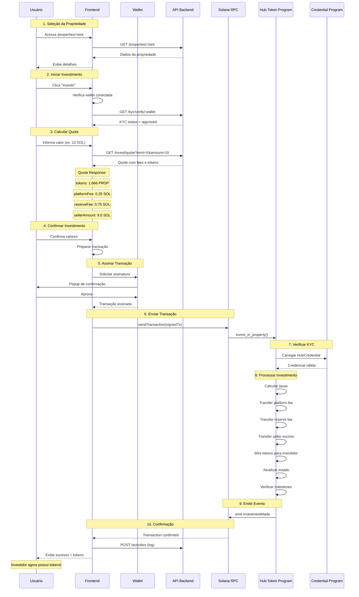
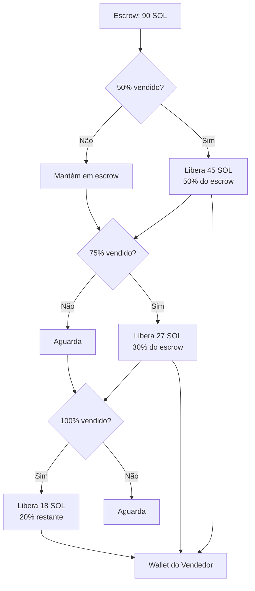

# Fluxo de Investimento

## Visão Geral

O fluxo de investimento permite que usuários verificados comprem tokens que representam frações de propriedades imobiliárias.

## Pré-requisitos

- ✅ Wallet Solana conectada (Phantom, Solflare, etc.)
- ✅ KYC aprovado (Hub Credential válida)
- ✅ SOL suficiente para investimento + taxas de gas

---

## Diagrama de Sequência Completo



---

## Detalhamento das Etapas

### 1. Seleção da Propriedade

O usuário navega pela lista de propriedades e seleciona uma para investir.

**Informações exibidas:**
- Nome e localização do imóvel
- Valor total e preço por token
- Yield anual estimado
- % já vendido
- Imagens e documentação

### 2. Verificação de Elegibilidade

Antes de permitir o investimento, o sistema verifica:

```typescript
// Frontend - Verificação
const canInvest = async (wallet: string, propertyMint: string) => {
  // 1. Verificar KYC
  const kyc = await kycApi.verify(wallet);
  if (!kyc.isVerified) {
    throw new Error('KYC necessário');
  }

  // 2. Verificar se propriedade está ativa
  const property = await propertiesApi.getByMint(propertyMint);
  if (property.status !== 'active') {
    throw new Error('Propriedade não disponível');
  }

  // 3. Verificar saldo de SOL
  const balance = await connection.getBalance(new PublicKey(wallet));
  if (balance < MIN_INVESTMENT + GAS_ESTIMATE) {
    throw new Error('Saldo insuficiente');
  }

  return true;
};
```

### 3. Cálculo do Quote

O backend calcula a cotação do investimento:

```typescript
// API - Cálculo de quote
interface InvestmentQuote {
  propertyMint: string;
  solAmount: number;         // SOL a investir
  tokensToReceive: number;   // Tokens que receberá
  platformFee: number;       // 2.5%
  reserveFee: number;        // 7.5%
  sellerAmount: number;      // 90%
  pricePerToken: number;     // Preço em SOL
  ownership: string;         // % de ownership
}

// Cálculo
const calculateQuote = (solAmount: number, property: Property): InvestmentQuote => {
  const platformFee = solAmount * 0.025;
  const reserveFee = solAmount * 0.075;
  const sellerAmount = solAmount * 0.90;

  // tokens = (sol * total_supply) / total_value_in_sol
  const pricePerToken = property.totalValueSol / property.totalSupply;
  const tokensToReceive = solAmount / pricePerToken;

  const ownership = (tokensToReceive / property.totalSupply) * 100;

  return {
    propertyMint: property.mint,
    solAmount,
    tokensToReceive,
    platformFee,
    reserveFee,
    sellerAmount,
    pricePerToken,
    ownership: ownership.toFixed(4) + '%',
  };
};
```

### 4. Preparação da Transação

```typescript
// Frontend - Preparar transação
const prepareInvestTransaction = async (
  wallet: PublicKey,
  propertyMint: PublicKey,
  solAmount: number
) => {
  const [propertyState] = PublicKey.findProgramAddressSync(
    [Buffer.from('property'), propertyMint.toBuffer()],
    PROGRAM_ID
  );

  const [investmentVault] = PublicKey.findProgramAddressSync(
    [Buffer.from('investment_vault'), propertyMint.toBuffer()],
    PROGRAM_ID
  );

  const [credential] = PublicKey.findProgramAddressSync(
    [Buffer.from('hub_credential'), wallet.toBuffer()],
    CREDENTIAL_PROGRAM_ID
  );

  const investorAta = getAssociatedTokenAddressSync(
    propertyMint,
    wallet,
    false,
    TOKEN_2022_PROGRAM_ID
  );

  return await program.methods
    .investInProperty(new BN(solAmount * LAMPORTS_PER_SOL))
    .accounts({
      investor: wallet,
      propertyState,
      mint: propertyMint,
      investmentVault,
      investorTokenAccount: investorAta,
      investorCredential: credential,
      platformTreasury: PLATFORM_TREASURY,
      reserveTreasury: RESERVE_TREASURY,
      tokenProgram: TOKEN_2022_PROGRAM_ID,
      associatedTokenProgram: ASSOCIATED_TOKEN_PROGRAM_ID,
      systemProgram: SystemProgram.programId,
    })
    .transaction();
};
```

### 5. Distribuição de Taxas

```
┌─────────────────────────────────────────────────────────────┐
│                  INVESTIMENTO: 100 SOL                      │
├─────────────────────────────────────────────────────────────┤
│                                                             │
│  ┌─────────────┐                                           │
│  │ PLATAFORMA  │ ◄─── 2.5 SOL (2.5%)                       │
│  │ Treasury    │      AMuiRHoJLS2zhpRtU...                 │
│  └─────────────┘                                           │
│                                                             │
│  ┌─────────────┐                                           │
│  │  RESERVA    │ ◄─── 7.5 SOL (7.5%)                       │
│  │ Treasury    │      34JKXfYohYJx3gH7B...                 │
│  └─────────────┘                                           │
│                                                             │
│  ┌─────────────┐                                           │
│  │  VENDEDOR   │ ◄─── 90 SOL (90%)                         │
│  │  (Escrow)   │      Liberado por milestones              │
│  └─────────────┘                                           │
│                                                             │
└─────────────────────────────────────────────────────────────┘
```

### 6. Sistema de Milestones

O valor do vendedor fica em escrow e é liberado gradualmente:



### 7. Minting de Tokens

Após o processamento do pagamento, os tokens são mintados:

```rust
// Mint tokens para o investidor
let cpi_ctx = CpiContext::new_with_signer(
    ctx.accounts.token_program.to_account_info(),
    MintTo {
        mint: ctx.accounts.mint.to_account_info(),
        to: ctx.accounts.investor_token_account.to_account_info(),
        authority: ctx.accounts.property_state.to_account_info(),
    },
    &[&seeds],
);

token_2022::mint_to(cpi_ctx, tokens_to_mint)?;
```

---

## Exemplo Prático

**Cenário:** João quer investir 50 SOL no Edifício Torre Norte

| Item | Valor |
|------|-------|
| Investimento | 50 SOL |
| Taxa Plataforma (2.5%) | 1.25 SOL |
| Taxa Reserva (7.5%) | 3.75 SOL |
| Valor Vendedor (90%) | 45 SOL |
| Preço por Token | 0.006 SOL |
| Tokens Recebidos | ~8.333 TORRE |
| Participação | 0.00016% |

---

## Tratamento de Erros

| Erro | Causa | Solução |
|------|-------|---------|
| `KycVerificationRequired` | KYC não aprovado | Completar KYC |
| `PropertyNotActive` | Propriedade pausada | Aguardar reativação |
| `ExceedsMaxSupply` | Tokens esgotados | Reduzir valor |
| `InsufficientBalance` | SOL insuficiente | Adicionar SOL |
| `CredentialExpired` | KYC vencido | Renovar credencial |

---

## Interface do Usuário

```
┌─────────────────────────────────────────────────────────────┐
│                    INVESTIR EM                              │
│                 Edifício Torre Norte                        │
├─────────────────────────────────────────────────────────────┤
│                                                             │
│  Valor a investir                                          │
│  ┌───────────────────────────────────────────────────────┐ │
│  │  50                                              SOL  │ │
│  └───────────────────────────────────────────────────────┘ │
│                                                             │
│  ─────────────────────────────────────────────────────────  │
│                                                             │
│  Resumo do Investimento                                    │
│                                                             │
│  Tokens a receber        8.333 TORRE                       │
│  Participação            0.00016%                          │
│  Preço por token         0.006 SOL                         │
│                                                             │
│  ─────────────────────────────────────────────────────────  │
│                                                             │
│  Taxas                                                      │
│  Plataforma (2.5%)       1.25 SOL                          │
│  Reserva (7.5%)          3.75 SOL                          │
│  Taxa de rede            ~0.00001 SOL                      │
│                                                             │
│  ─────────────────────────────────────────────────────────  │
│                                                             │
│  Total                   50.00001 SOL                      │
│                                                             │
│  ┌───────────────────────────────────────────────────────┐ │
│  │                  CONFIRMAR INVESTIMENTO               │ │
│  └───────────────────────────────────────────────────────┘ │
│                                                             │
└─────────────────────────────────────────────────────────────┘
```

---

[← Voltar](./README.md) | [Próximo: Fluxo de KYC →](./kyc.md)
