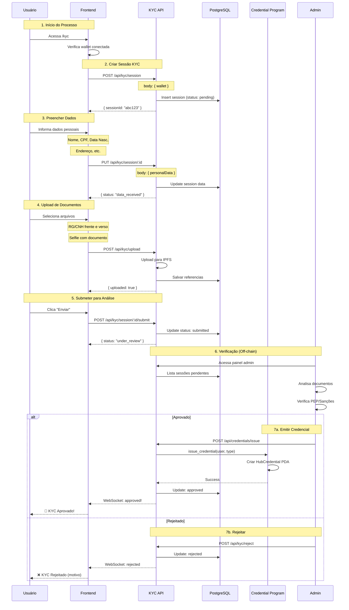
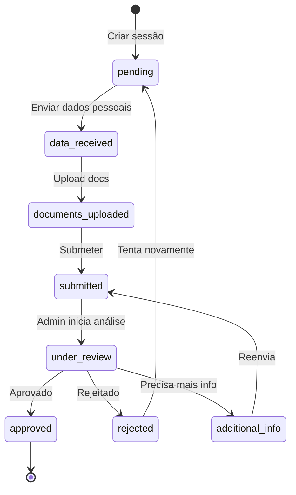
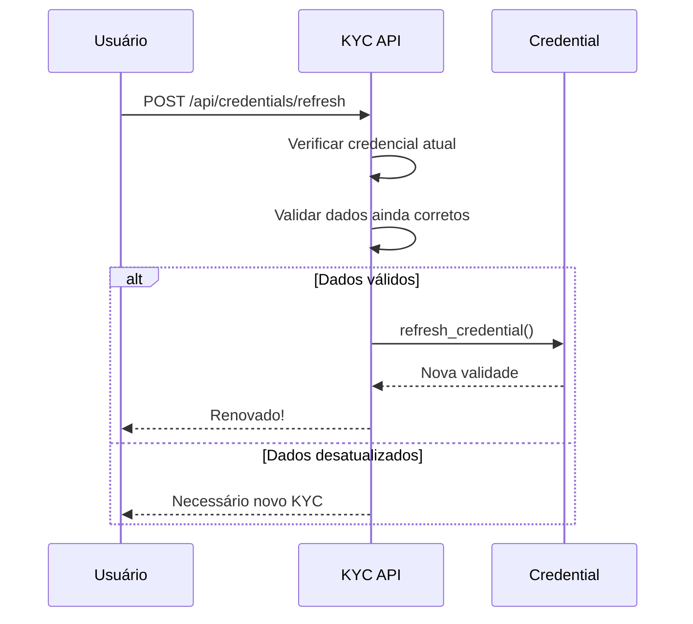

# Fluxo de KYC (Know Your Customer)

## Visão Geral

O processo de KYC é obrigatório para qualquer operação na plataforma Hub Token. Ele garante que apenas investidores verificados possam comprar, vender ou transferir tokens.

## Por que KYC?

```
┌─────────────────────────────────────────────────────────────┐
│                    MOTIVOS DO KYC                           │
├─────────────────────────────────────────────────────────────┤
│                                                             │
│  ⚖️  COMPLIANCE REGULATÓRIO                                 │
│      CVM, BACEN, Lei 14.478/2022                           │
│                                                             │
│  🛡️  PREVENÇÃO À LAVAGEM                                    │
│      AML/CFT requirements                                   │
│                                                             │
│  🔒  PROTEÇÃO DOS INVESTIDORES                              │
│      Apenas pessoas reais e verificadas                    │
│                                                             │
│  📊  RASTREABILIDADE                                        │
│      Auditoria de todas as transações                      │
│                                                             │
└─────────────────────────────────────────────────────────────┘
```

---

## Fluxo Completo



---

## Estados da Sessão KYC



---

## Dados Coletados

### Pessoa Física (CPF)

| Campo | Obrigatório | Validação |
|-------|-------------|-----------|
| Nome completo | Sim | Min 3 caracteres |
| CPF | Sim | Válido (11 dígitos) |
| Data de nascimento | Sim | Maior de 18 anos |
| E-mail | Sim | Formato válido |
| Telefone | Sim | Formato brasileiro |
| Endereço completo | Sim | CEP válido |
| Profissão | Sim | - |
| Renda mensal | Sim | Faixa |

### Pessoa Jurídica (CNPJ)

| Campo | Obrigatório | Validação |
|-------|-------------|-----------|
| Razão Social | Sim | - |
| CNPJ | Sim | Válido (14 dígitos) |
| Nome Fantasia | Não | - |
| Data de constituição | Sim | - |
| Endereço sede | Sim | CEP válido |
| Representante legal | Sim | Nome + CPF |
| Contrato social | Sim | Documento |

---

## Documentos Aceitos

### Identificação (um dos seguintes)

```
┌─────────────────────────────────────────────────────────────┐
│                  DOCUMENTOS DE IDENTIDADE                   │
├─────────────────────────────────────────────────────────────┤
│                                                             │
│  📄 RG (Carteira de Identidade)                            │
│     • Frente e verso                                        │
│     • Emitido há menos de 10 anos                          │
│                                                             │
│  🚗 CNH (Carteira de Motorista)                            │
│     • Frente e verso                                        │
│     • Dentro da validade                                    │
│                                                             │
│  🛂 Passaporte                                              │
│     • Página com foto                                       │
│     • Dentro da validade                                    │
│                                                             │
└─────────────────────────────────────────────────────────────┘
```

### Comprovante de Residência

- Conta de luz, água ou gás (últimos 3 meses)
- Fatura de cartão de crédito
- Extrato bancário
- Contrato de aluguel

### Selfie

- Foto segurando o documento
- Rosto e documento visíveis
- Boa iluminação

---

## Verificações Realizadas

### Automáticas

| Verificação | Descrição |
|-------------|-----------|
| **Validação de CPF/CNPJ** | Dígitos verificadores |
| **OCR de documentos** | Extração automática de dados |
| **Face match** | Compara selfie com documento |
| **Liveness** | Detecta se é foto de foto |

### Manuais (Admin)

| Verificação | Descrição |
|-------------|-----------|
| **PEP** | Pessoa Exposta Politicamente |
| **Sanções** | Listas OFAC, ONU, etc. |
| **Mídia negativa** | Notícias adversas |
| **Consistência** | Dados vs documentos |

---

## API Endpoints

### Criar Sessão

```http
POST /api/kyc/session
Content-Type: application/json

{
  "wallet": "AMuiRHoJLS2zhpRtUqVJUpYi4xEGbZcmMsJpqVT9uCJw"
}

Response:
{
  "sessionId": "550e8400-e29b-41d4-a716-446655440000",
  "status": "pending",
  "createdAt": "2025-01-15T10:00:00Z"
}
```

### Enviar Dados

```http
PUT /api/kyc/session/:sessionId
Content-Type: application/json

{
  "personalData": {
    "fullName": "João da Silva",
    "cpf": "123.456.789-00",
    "birthDate": "1990-05-15",
    "email": "joao@email.com",
    "phone": "+5511999999999",
    "address": {
      "street": "Av. Paulista",
      "number": "1000",
      "city": "São Paulo",
      "state": "SP",
      "zipCode": "01310-100"
    }
  }
}
```

### Upload de Documentos

```http
POST /api/kyc/upload
Content-Type: multipart/form-data

sessionId: 550e8400-e29b-41d4-a716-446655440000
documentType: identity_front
file: [binary]

Response:
{
  "uploaded": true,
  "documentType": "identity_front",
  "ipfsHash": "QmXxx..."
}
```

### Submeter para Análise

```http
POST /api/kyc/session/:sessionId/submit

Response:
{
  "status": "submitted",
  "message": "Sua solicitação foi enviada para análise"
}
```

### Verificar Status

```http
GET /api/kyc/session/:sessionId

Response:
{
  "sessionId": "550e8400-e29b-41d4-a716-446655440000",
  "status": "approved",
  "credentialType": "BrazilianCpf",
  "expiresAt": "2027-01-15T10:00:00Z"
}
```

---

## Interface do Usuário

### Tela de KYC

```
┌─────────────────────────────────────────────────────────────┐
│                    VERIFICAÇÃO KYC                          │
├─────────────────────────────────────────────────────────────┤
│                                                             │
│  Progresso                                                  │
│  [██████████░░░░░░░░░░░░░░░░░░] 40%                        │
│                                                             │
│  ✅ Dados pessoais                                          │
│  ✅ Documentos enviados                                     │
│  ⏳ Selfie                                                  │
│  ○ Em análise                                              │
│  ○ Aprovado                                                │
│                                                             │
├─────────────────────────────────────────────────────────────┤
│                                                             │
│  ETAPA 3: Selfie com Documento                             │
│                                                             │
│  Tire uma foto sua segurando o documento de identidade     │
│  ao lado do rosto.                                         │
│                                                             │
│  Dicas:                                                     │
│  • Boa iluminação                                          │
│  • Documento legível                                        │
│  • Rosto sem obstruções                                    │
│                                                             │
│  ┌───────────────────────────────────────────────────────┐ │
│  │                                                       │ │
│  │                    [📷 CÂMERA]                        │ │
│  │                                                       │ │
│  └───────────────────────────────────────────────────────┘ │
│                                                             │
│  ┌─────────────────────┐  ┌──────────────────────────────┐ │
│  │       VOLTAR        │  │          CONTINUAR           │ │
│  └─────────────────────┘  └──────────────────────────────┘ │
│                                                             │
└─────────────────────────────────────────────────────────────┘
```

---

## Tipos de Credencial Emitida

| Cenário | Credencial | Validade |
|---------|------------|----------|
| PF Brasileiro | `BrazilianCpf` | 2 anos |
| PJ Brasileiro | `BrazilianCnpj` | 1 ano |
| KYC Básico (internacional) | `KycBasic` | 1 ano |
| KYC Completo | `KycFull` | 2 anos |
| Investidor Acreditado (US) | `AccreditedInvestor` | 1 ano |

---

## Renovação de Credencial

### Quando Renovar?

- 30 dias antes da expiração
- Sistema notifica automaticamente
- Processo simplificado se dados não mudaram

### Fluxo de Renovação



---

## Segurança e Privacidade

### Armazenamento de Dados

| Dado | Onde | Criptografia |
|------|------|--------------|
| Dados pessoais | PostgreSQL | AES-256 |
| Documentos | IPFS (Pinata) | Encrypted |
| Credencial | Solana (on-chain) | Público (sem PII) |

### LGPD Compliance

- Dados mínimos necessários
- Direito ao esquecimento
- Portabilidade de dados
- Consentimento explícito

---

## Erros Comuns

| Erro | Causa | Solução |
|------|-------|---------|
| Documento ilegível | Foto escura/borrada | Refazer com boa luz |
| CPF inválido | Dígitos incorretos | Verificar digitação |
| Face match falhou | Selfie diferente | Nova selfie |
| Documento vencido | Validade expirada | Usar doc válido |

---

[← Voltar](./investimento.md) | [Próximo: Dividendos →](./dividendos.md)
