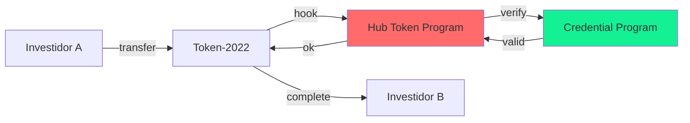
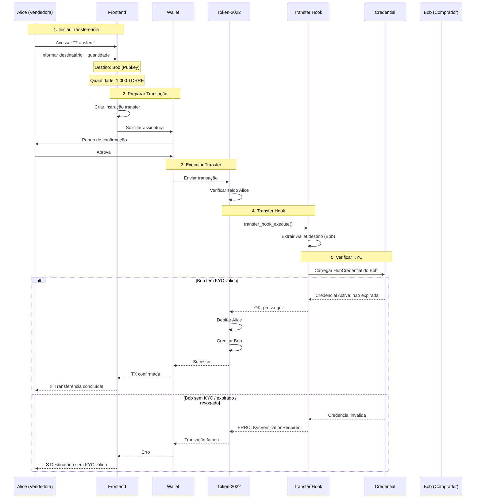
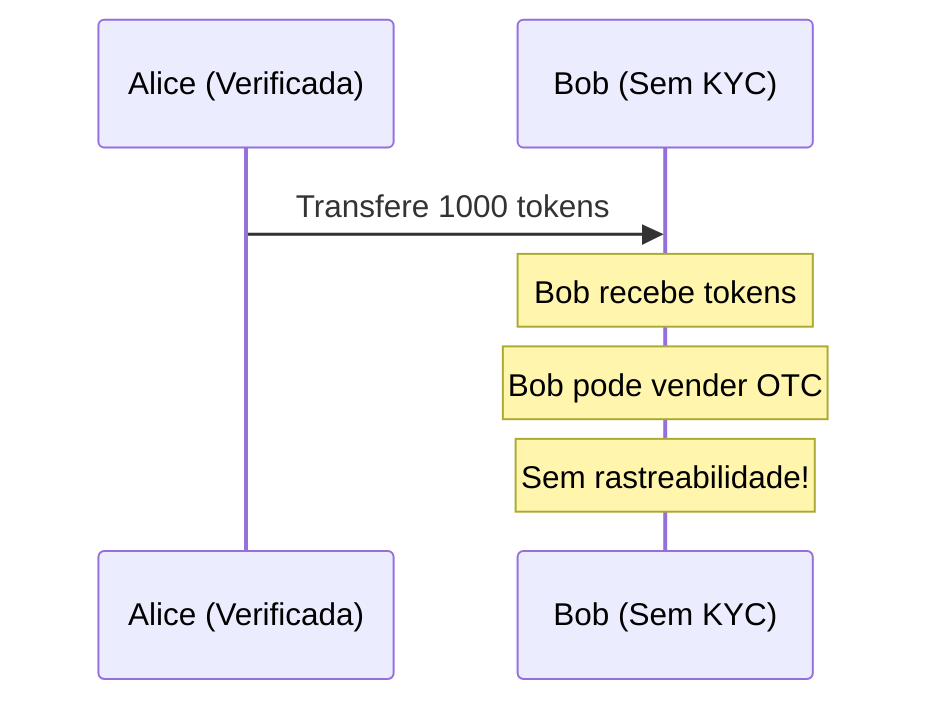
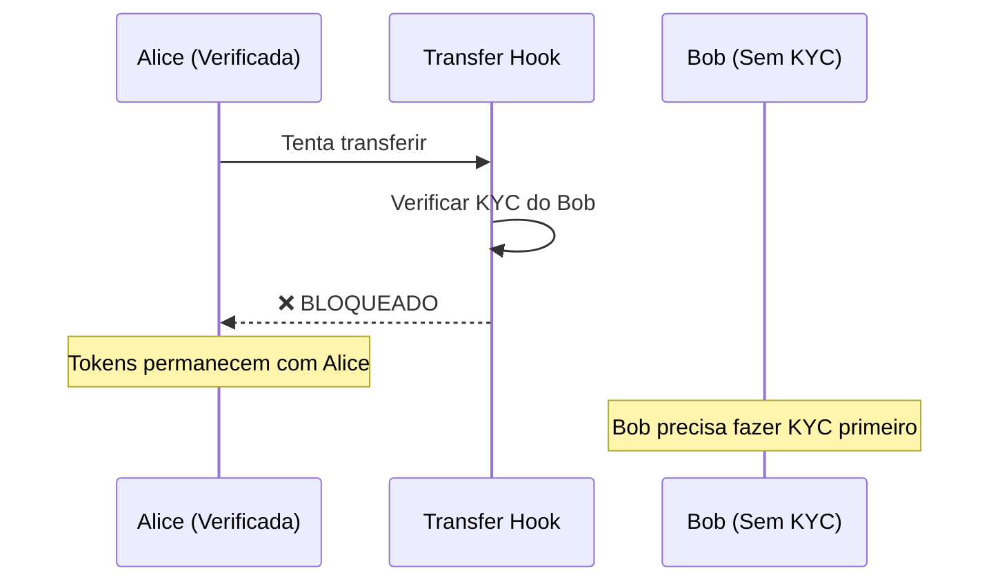

# Transferência de Tokens

## Visão Geral

A transferência de tokens permite que investidores vendam suas participações para outros investidores no mercado secundário. O diferencial do Hub Token é que **toda transferência passa por verificação KYC automática** através do Transfer Hook.

## Conceito Chave: Transfer Hook

O **Transfer Hook** é uma extensão do padrão Token-2022 que intercepta todas as transferências e executa lógica customizada.



---

## Fluxo de Transferência



---

## Verificações do Transfer Hook

O hook verifica os seguintes pontos da credencial do **destinatário**:

```rust
fn verify_destination_kyc(credential: &HubCredential, destination: &Pubkey) -> Result<()> {
    // 1. Credencial pertence ao destinatário
    require!(
        credential.user == *destination,
        HubTokenError::InvalidCredential
    );

    // 2. Status é Active
    require!(
        credential.status == CredentialStatus::Active,
        HubTokenError::CredentialRevoked
    );

    // 3. Não está expirada
    let now = Clock::get()?.unix_timestamp;
    require!(
        credential.expires_at > now,
        HubTokenError::CredentialExpired
    );

    Ok(())
}
```

### Motivos de Bloqueio

| Status | Código de Erro | Descrição |
|--------|----------------|-----------|
| Sem credencial | `KycVerificationRequired` | Destinatário não fez KYC |
| Credencial expirada | `CredentialExpired` | KYC venceu |
| Credencial revogada | `CredentialRevoked` | Admin revogou |
| Credencial suspensa | `CredentialSuspended` | Suspensão temporária |

---

## Por que Transfer Hook?

### Sem Transfer Hook (vulnerável)



### Com Transfer Hook (seguro)



---

## Tipos de Transferência

### 1. Venda P2P (Peer-to-Peer)

Venda direta entre dois investidores.

```
Alice (vendedora) ──► Bob (comprador)
        tokens    ◄──    SOL (off-chain)
```

**Importante:** O pagamento em SOL é feito fora da plataforma. O Hub Token apenas facilita a transferência de tokens.

### 2. Transferência entre Wallets Próprias

Mover tokens entre carteiras do mesmo dono.

```
Wallet Principal ──► Wallet Hardware
                         (Ledger)
```

**Requisito:** Ambas as wallets devem ter KYC aprovado.

### 3. Doação/Presente

Transferir tokens sem contrapartida financeira.

```
Pai ──► Filho
   tokens
```

---

## Interface do Usuário

### Modal de Transferência

```
┌─────────────────────────────────────────────────────────────┐
│                   TRANSFERIR TOKENS                         │
│                  Edifício Torre Norte                       │
├─────────────────────────────────────────────────────────────┤
│                                                             │
│  Seu saldo: 10.000 TORRE                                   │
│                                                             │
│  Endereço do destinatário                                  │
│  ┌───────────────────────────────────────────────────────┐ │
│  │ AMuiRHoJLS2zhpRtUqVJUpYi4xEGbZcmMsJpqVT9uCJw        │ │
│  └───────────────────────────────────────────────────────┘ │
│                                                             │
│  ⚠️  O destinatário precisa ter KYC aprovado               │
│                                                             │
│  Quantidade                                                 │
│  ┌───────────────────────────────────────────────────────┐ │
│  │ 1.000                                          TORRE  │ │
│  └───────────────────────────────────────────────────────┘ │
│  [25%] [50%] [75%] [MAX]                                   │
│                                                             │
│  ─────────────────────────────────────────────────────────  │
│                                                             │
│  Resumo                                                     │
│  Quantidade:          1.000 TORRE                          │
│  Valor estimado:      ~6.000 USD                           │
│  Taxa de rede:        ~0.00001 SOL                         │
│                                                             │
│  ─────────────────────────────────────────────────────────  │
│                                                             │
│  ⚡ A transferência é instantânea e irreversível           │
│                                                             │
│  ┌─────────────────────┐  ┌──────────────────────────────┐ │
│  │      CANCELAR       │  │        TRANSFERIR            │ │
│  └─────────────────────┘  └──────────────────────────────┘ │
│                                                             │
└─────────────────────────────────────────────────────────────┘
```

### Erro de KYC

```
┌─────────────────────────────────────────────────────────────┐
│                    ❌ ERRO NA TRANSFERÊNCIA                 │
├─────────────────────────────────────────────────────────────┤
│                                                             │
│  O destinatário não possui verificação KYC válida.         │
│                                                             │
│  Possíveis motivos:                                        │
│  • KYC não realizado                                       │
│  • KYC expirado                                            │
│  • KYC revogado/suspenso                                   │
│                                                             │
│  O destinatário precisa completar ou renovar o KYC         │
│  antes de receber tokens.                                  │
│                                                             │
│  ┌───────────────────────────────────────────────────────┐ │
│  │                      ENTENDI                          │ │
│  └───────────────────────────────────────────────────────┘ │
│                                                             │
└─────────────────────────────────────────────────────────────┘
```

---

## Código Frontend

### Preparar Transferência

```typescript
const prepareTransfer = async (
  fromWallet: PublicKey,
  toWallet: PublicKey,
  mint: PublicKey,
  amount: number
) => {
  // Derivar ATAs
  const fromAta = getAssociatedTokenAddressSync(
    mint,
    fromWallet,
    false,
    TOKEN_2022_PROGRAM_ID
  );

  const toAta = getAssociatedTokenAddressSync(
    mint,
    toWallet,
    false,
    TOKEN_2022_PROGRAM_ID
  );

  // Verificar se ATA destino existe
  const toAtaInfo = await connection.getAccountInfo(toAta);

  const instructions: TransactionInstruction[] = [];

  // Criar ATA se não existir
  if (!toAtaInfo) {
    instructions.push(
      createAssociatedTokenAccountInstruction(
        fromWallet,  // payer
        toAta,       // ata
        toWallet,    // owner
        mint,        // mint
        TOKEN_2022_PROGRAM_ID
      )
    );
  }

  // Instrução de transfer com hook
  instructions.push(
    createTransferCheckedInstruction(
      fromAta,
      mint,
      toAta,
      fromWallet,
      amount,
      6,  // decimals
      [],
      TOKEN_2022_PROGRAM_ID
    )
  );

  return new Transaction().add(...instructions);
};
```

### Verificar KYC Antes

```typescript
const checkDestinationKyc = async (wallet: string): Promise<boolean> => {
  try {
    const response = await kycApi.verify(wallet);
    return response.isVerified && !response.isExpired;
  } catch {
    return false;
  }
};

// Uso
const handleTransfer = async () => {
  const hasKyc = await checkDestinationKyc(destinationWallet);

  if (!hasKyc) {
    showError('Destinatário não possui KYC válido');
    return;
  }

  // Prosseguir com transferência...
};
```

---

## Eventos Emitidos

```rust
#[event]
pub struct TransferKycVerified {
    pub mint: Pubkey,
    pub from: Pubkey,
    pub to: Pubkey,
    pub amount: u64,
    pub timestamp: i64,
}
```

---

## Considerações Importantes

### 1. Irreversibilidade

Transferências são **irreversíveis**. Uma vez confirmada na blockchain, não há como desfazer.

### 2. Propriedade da Credencial

A credencial KYC é vinculada à **wallet**, não à pessoa. Se o usuário perder acesso à wallet, precisará fazer KYC novamente com uma nova wallet.

### 3. Custo de Gas

Transferências custam aproximadamente 0.00001 SOL em taxas de rede.

### 4. Criação de ATA

Se o destinatário nunca recebeu tokens daquela propriedade, será necessário criar uma ATA (Associated Token Account), o que tem um custo adicional (~0.002 SOL).

### 5. Compliance

Todas as transferências ficam registradas na blockchain, permitindo auditoria completa da cadeia de custódia dos tokens.

---

## FAQ

**P: Posso transferir para qualquer pessoa?**
R: Não. O destinatário precisa ter KYC válido na plataforma.

**P: E se eu quiser vender para alguém sem KYC?**
R: A pessoa precisará completar o KYC primeiro. Não há como contornar.

**P: A transferência é instantânea?**
R: Sim, leva cerca de 400ms para confirmar na Solana.

**P: Quanto custa uma transferência?**
R: Aproximadamente 0.00001-0.002 SOL dependendo se precisa criar ATA.

---

[← Voltar](./dividendos.md) | [Próximo: Infraestrutura →](../infraestrutura/README.md)
