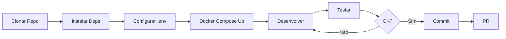

# Guias Práticos

## Visão Geral

Esta seção contém guias práticos para desenvolvedores e operadores do Hub Token.

---

## Índice

1. [Rodar Localmente](./rodar-local.md)
   - Setup do ambiente
   - Instalação de dependências
   - Executar em modo desenvolvimento

2. [Deploy](./deploy-guia.md)
   - Deploy de smart contracts
   - Deploy de serviços
   - Configuração de produção

3. [Troubleshooting](./troubleshooting.md)
   - Problemas comuns
   - Debug
   - Soluções

---

## Quick Start

### Requisitos

```bash
# Verificar versões
node --version     # v20.x
go version         # go1.21.x
docker --version   # 24.x+
solana --version   # 1.18.x
anchor --version   # 0.29.x
```

### Setup Rápido

```bash
# 1. Clonar repositório
git clone https://github.com/hub-token/platform.git
cd platform

# 2. Instalar dependências
npm install
cd services/api && npm install && cd ../..
cd services/kyc-api && npm install && cd ../..
cd real_estate_program/app && npm install && cd ../..

# 3. Configurar variáveis de ambiente
cp .env.example .env
cp services/api/.env.example services/api/.env
cp services/kyc-api/.env.example services/kyc-api/.env
cp services/indexer/.env.example services/indexer/.env

# 4. Iniciar com Docker
docker compose up -d

# 5. Verificar status
docker compose ps
```

### URLs de Desenvolvimento

| Serviço | URL |
|---------|-----|
| Frontend | http://localhost:5174 |
| API Principal | http://localhost:3004/api/v1 |
| API KYC | http://localhost:3005/api |
| Indexador | http://localhost:9090 |
| PostgreSQL | localhost:5436 |

---

## Comandos Úteis

### Docker

```bash
# Ver logs
docker compose logs -f

# Logs de serviço específico
docker compose logs -f api

# Restart de serviço
docker compose restart api

# Rebuild
docker compose build --no-cache api
docker compose up -d api

# Limpar tudo
docker compose down -v
docker system prune -a
```

### Banco de Dados

```bash
# Conectar ao PostgreSQL
docker exec -it hub-postgres-dev psql -U postgres -d hub_indexer

# Backup
docker exec hub-postgres-dev pg_dump -U postgres hub_indexer > backup.sql

# Restore
cat backup.sql | docker exec -i hub-postgres-dev psql -U postgres hub_indexer

# Ver tabelas
docker exec -it hub-postgres-dev psql -U postgres -d hub_indexer -c "\dt"
```

### Solana

```bash
# Verificar saldo
solana balance

# Airdrop (devnet)
solana airdrop 2

# Ver programa
solana program show <PROGRAM_ID>

# Logs do programa
solana logs <PROGRAM_ID>
```

---

## Fluxo de Desenvolvimento



---

## Próximos Guias

- [Rodar Localmente](./rodar-local.md)
- [Troubleshooting](./troubleshooting.md)

---

[← Voltar](../infraestrutura/deploy.md) | [Próximo: Rodar Local →](./rodar-local.md)
