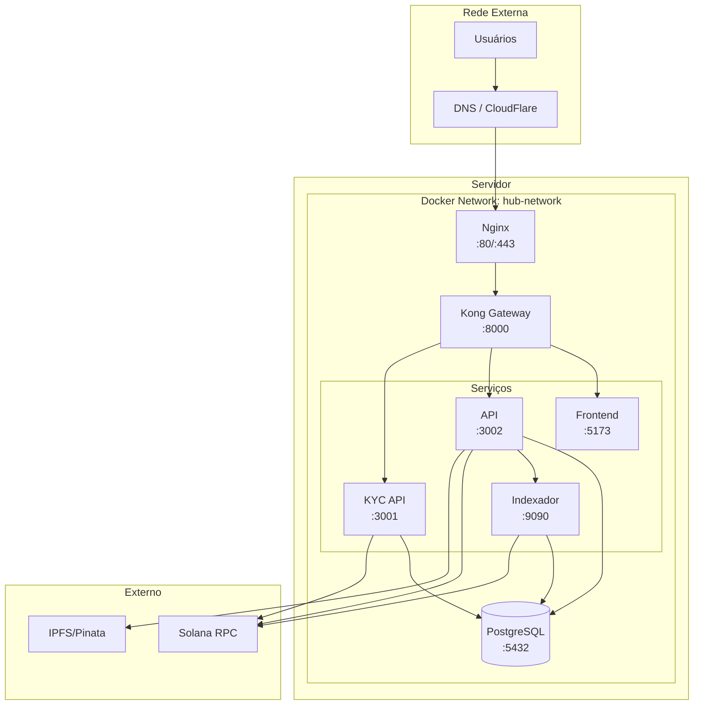

# Infraestrutura

## Visão Geral

O Hub Token utiliza uma infraestrutura containerizada com **Docker** para garantir consistência entre ambientes de desenvolvimento, staging e produção.

## Arquitetura de Infraestrutura



## Serviços Docker

| Serviço | Imagem Base | Porta Interna | Porta Externa (Dev) |
|---------|-------------|---------------|---------------------|
| PostgreSQL | postgres:15-alpine | 5432 | 5436 |
| Indexador | golang:1.21-alpine | 9090 | 9090 |
| API | node:20-alpine | 3002 | 3004 |
| KYC API | node:20-alpine | 3001 | 3005 |
| Frontend | node:20-alpine + nginx | 5173 | 5174 |

## Estrutura de Arquivos

```
/home/ubuntu/services/solana/
├── docker-compose.yml          # Desenvolvimento
├── docker-compose.prod.yml     # Produção
├── .env                        # Variáveis raiz
│
├── services/
│   ├── api/
│   │   ├── Dockerfile
│   │   ├── .env
│   │   └── src/
│   │
│   ├── kyc-api/
│   │   ├── Dockerfile
│   │   ├── .env
│   │   └── src/
│   │
│   └── indexer/
│       ├── Dockerfile
│       ├── .env
│       └── cmd/
│
└── real_estate_program/
    └── app/
        ├── Dockerfile
        ├── nginx.conf
        └── src/
```

---

## Próximos Documentos

- [Docker e Containers](./docker.md)
- [Variáveis de Ambiente](./variaveis-ambiente.md)
- [Deploy e CI/CD](./deploy.md)

---

[← Voltar](../fluxos/transferencia.md) | [Próximo: Docker →](./docker.md)
