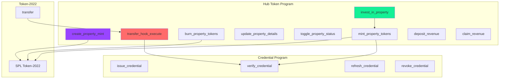
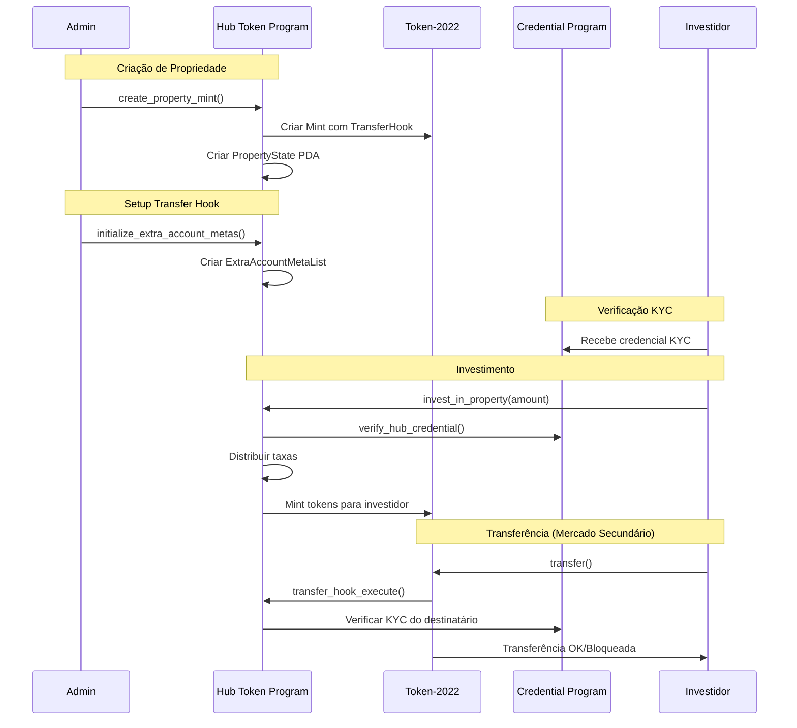

# Smart Contracts (Programas Solana)

## Visão Geral

O Hub Token possui **dois programas Solana** que trabalham em conjunto:

| Programa | Program ID | Propósito |
|----------|------------|-----------|
| **Hub Token Program** | `FDfkSAAqk8uweJusJb8MSNRHXGRvFqokNfjw9m8ve6om` | Tokenização de imóveis, investimentos, dividendos |
| **Credential Program** | `FaJ4XGCLeu7eZiMjBEkANko3TRhpjns3cv6R1vZK94Wt` | KYC e verificação de identidade |

## Arquitetura dos Contratos



## Estrutura de Diretórios

```
real_estate_program/
├── programs/
│   └── hub_token_program/
│       └── src/
│           ├── lib.rs                      # Entry point
│           ├── constants.rs                # Constantes (seeds, fees)
│           ├── error.rs                    # Erros customizados
│           ├── events.rs                   # Eventos para auditoria
│           ├── state/
│           │   ├── mod.rs
│           │   ├── property_state.rs       # Estado da propriedade
│           │   ├── property_details.rs     # Detalhes do imóvel
│           │   └── investment_vault.rs     # Vault de investimento
│           ├── instructions/
│           │   ├── mod.rs
│           │   ├── create_property_mint.rs
│           │   ├── mint_property_tokens.rs
│           │   ├── burn_property_tokens.rs
│           │   ├── update_property_details.rs
│           │   ├── toggle_property_status.rs
│           │   ├── transfer_hook.rs
│           │   ├── invest_in_property.rs
│           │   └── revenue_vault.rs
│           └── utils/
│               └── hub_credential_verification.rs
├── tests/
│   └── hub_token_program.ts
├── Anchor.toml
└── Cargo.toml
```

## Padrões Utilizados

### Token-2022 (SPL Token)

O Hub Token utiliza o padrão **Token-2022** da Solana, que oferece:

- **Transfer Hook** - Executa código customizado em cada transferência
- **Metadata Pointer** - Aponta para metadata do token
- **Permanent Delegate** - Permite controle regulatório se necessário

### PDA (Program Derived Address)

Todas as contas são derivadas deterministicamente:

```rust
// PropertyState PDA
[b"property", mint.key().as_ref()] → bump

// InvestmentVault PDA
[b"investment_vault", mint.key().as_ref()] → bump

// RevenueVault PDA
[b"revenue_vault", mint.key().as_ref(), epoch.to_le_bytes()] → bump

// ExtraAccountMetas PDA
[b"extra-account-metas", mint.key().as_ref()] → bump
```

### Anchor Framework

O projeto usa **Anchor 0.30.1** para:

- Serialização/deserialização automática
- Validação de contas
- Geração de IDL
- Segurança de tipos

## Fluxo de Interação



## Taxas e Constantes

```rust
// constants.rs
pub const PLATFORM_FEE_BPS: u16 = 250;     // 2.5%
pub const RESERVE_FEE_BPS: u16 = 750;      // 7.5%
pub const SELLER_BPS: u16 = 9000;          // 90%
pub const BPS_DENOMINATOR: u16 = 10000;    // 100%

// Milestones de liberação do escrow
pub const MILESTONE_1_PERCENT: u8 = 50;    // 50% vendido
pub const MILESTONE_2_PERCENT: u8 = 75;    // 75% vendido
pub const MILESTONE_3_PERCENT: u8 = 100;   // 100% vendido

pub const MILESTONE_1_RELEASE: u8 = 50;    // Libera 50%
pub const MILESTONE_2_RELEASE: u8 = 30;    // Libera 30%
pub const MILESTONE_3_RELEASE: u8 = 20;    // Libera 20%

// Limites
pub const MAX_PROPERTY_NAME_LEN: usize = 50;
pub const MAX_PROPERTY_SYMBOL_LEN: usize = 10;
pub const MAX_URI_LEN: usize = 500;
pub const MAX_ADDRESS_LEN: usize = 200;
```

## Segurança

### Verificações Implementadas

| Verificação | Descrição |
|-------------|-----------|
| **Authority Check** | Apenas o owner pode gerenciar a propriedade |
| **KYC Verification** | Todas as operações verificam credencial Hub |
| **Supply Check** | Não permite mint acima do supply máximo |
| **Status Check** | Propriedades pausadas não aceitam operações |
| **Overflow Protection** | Aritmética segura em todas as operações |
| **PDA Validation** | Seeds corretas para derivação de PDAs |

### Erros Customizados

```rust
#[error_code]
pub enum HubTokenError {
    #[msg("Não autorizado")]
    Unauthorized,

    #[msg("Nome da propriedade muito longo")]
    PropertyNameTooLong,

    #[msg("Símbolo muito longo")]
    PropertySymbolTooLong,

    #[msg("Supply total inválido")]
    InvalidTotalSupply,

    #[msg("Excede supply máximo")]
    ExceedsMaxSupply,

    #[msg("Propriedade não está ativa")]
    PropertyNotActive,

    #[msg("Mint inválido")]
    InvalidMint,

    #[msg("Verificação KYC necessária")]
    KycVerificationRequired,

    #[msg("Yield inválido")]
    InvalidRentalYield,

    #[msg("Credencial expirada")]
    CredentialExpired,

    #[msg("Credencial revogada")]
    CredentialRevoked,

    #[msg("Credencial suspensa")]
    CredentialSuspended,

    #[msg("Saldo insuficiente")]
    InsufficientBalance,

    #[msg("Vault não inicializado")]
    VaultNotInitialized,
}
```

## Eventos (Auditoria)

```rust
// events.rs
#[event]
pub struct PropertyInitialized {
    pub authority: Pubkey,
    pub mint: Pubkey,
    pub name: String,
    pub total_supply: u64,
}

#[event]
pub struct TokensMinted {
    pub mint: Pubkey,
    pub investor: Pubkey,
    pub amount: u64,
}

#[event]
pub struct InvestmentMade {
    pub property: Pubkey,
    pub investor: Pubkey,
    pub sol_amount: u64,
    pub tokens_received: u64,
    pub platform_fee: u64,
    pub reserve_fee: u64,
    pub seller_amount: u64,
}

#[event]
pub struct TransferKycVerified {
    pub mint: Pubkey,
    pub from: Pubkey,
    pub to: Pubkey,
    pub amount: u64,
}

#[event]
pub struct RevenueDeposited {
    pub property: Pubkey,
    pub epoch: u64,
    pub amount: u64,
    pub eligible_supply: u64,
}

#[event]
pub struct DividendClaimed {
    pub property: Pubkey,
    pub investor: Pubkey,
    pub epoch: u64,
    pub amount: u64,
}
```

---

## Próximos Documentos

- [Hub Token Program](./hub-token-program.md) - Detalhes do programa principal
- [Credential Program](./credential-program.md) - Sistema de KYC
- [Estruturas de Dados](./estruturas-dados.md) - Accounts e structs
- [Instruções](./instrucoes.md) - Todas as instruções detalhadas

---

[← Voltar](../arquitetura/banco-dados.md) | [Próximo: Hub Token Program →](./hub-token-program.md)
