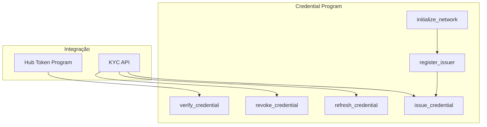
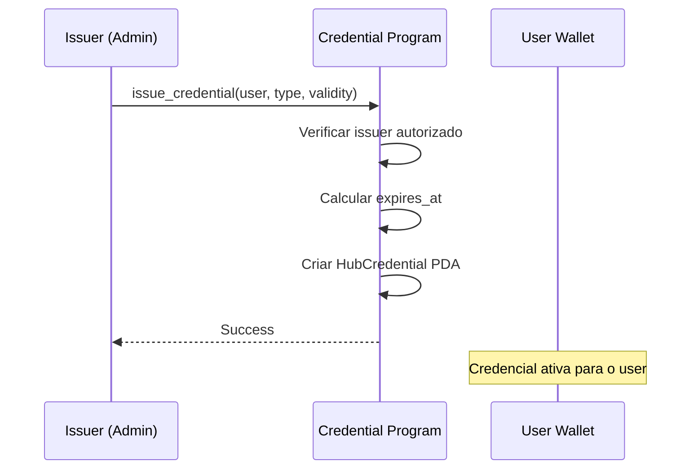
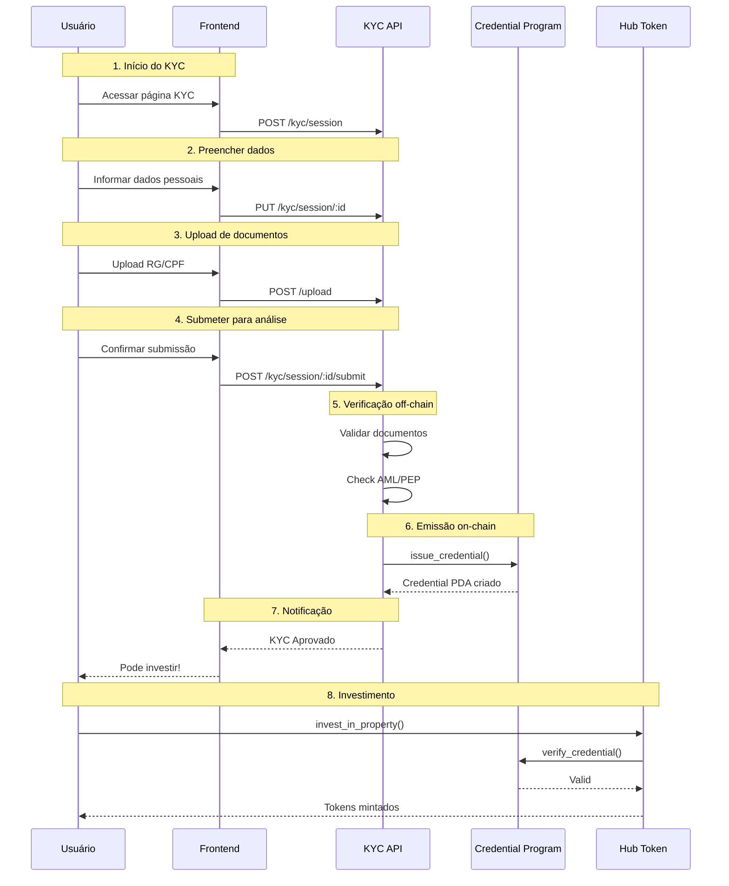

# Credential Program (KYC)

## Visão Geral

O **Credential Program** é responsável pelo sistema de KYC (Know Your Customer) do Hub Token. Ele gerencia a emissão, verificação e revogação de credenciais que autorizam investidores a participar da plataforma.

**Program ID:** `FaJ4XGCLeu7eZiMjBEkANko3TRhpjns3cv6R1vZK94Wt`

## Arquitetura



## Tipos de Credencial

| Tipo | Código | Descrição | Uso |
|------|--------|-----------|-----|
| `KycBasic` | 0 | Verificação básica de identidade | Investimentos até $10k |
| `KycFull` | 1 | KYC completo com AML | Investimentos ilimitados |
| `AccreditedInvestor` | 2 | Investidor acreditado (SEC) | Ofertas privadas (US) |
| `QualifiedPurchaser` | 3 | Comprador qualificado | Ofertas restritas (US) |
| `BrazilianCpf` | 4 | Verificação CPF | Investidores PF Brasil |
| `BrazilianCnpj` | 5 | Verificação CNPJ | Investidores PJ Brasil |

```rust
#[derive(AnchorSerialize, AnchorDeserialize, Clone, Copy, PartialEq)]
pub enum CredentialType {
    KycBasic = 0,
    KycFull = 1,
    AccreditedInvestor = 2,
    QualifiedPurchaser = 3,
    BrazilianCpf = 4,
    BrazilianCnpj = 5,
}
```

## Status da Credencial

| Status | Código | Descrição |
|--------|--------|-----------|
| `Active` | 0 | Credencial válida e utilizável |
| `Expired` | 1 | Período de validade encerrado |
| `Revoked` | 2 | Revogada manualmente |
| `Suspended` | 3 | Suspensa temporariamente |

```rust
#[derive(AnchorSerialize, AnchorDeserialize, Clone, Copy, PartialEq)]
pub enum CredentialStatus {
    Active = 0,
    Expired = 1,
    Revoked = 2,
    Suspended = 3,
}
```

## Estrutura da Credencial

```rust
#[account]
pub struct HubCredential {
    /// Carteira do usuário dono da credencial
    pub user: Pubkey,

    /// Carteira do emissor que criou a credencial
    pub issuer: Pubkey,

    /// Tipo da credencial
    pub credential_type: CredentialType,

    /// Status atual
    pub status: CredentialStatus,

    /// Timestamp de emissão
    pub issued_at: i64,

    /// Timestamp de expiração
    pub expires_at: i64,

    /// URI para metadata adicional (off-chain)
    pub metadata_uri: String,

    /// Bump do PDA
    pub bump: u8,
}
```

### PDA Derivation

```rust
// Seeds para derivar o PDA da credencial
[b"hub_credential", user_pubkey.as_ref()] → bump
```

## Instruções

### 1. initialize_network

Inicializa a rede de credenciais com configurações globais.

```rust
pub fn initialize_network(
    ctx: Context<InitializeNetwork>,
    config: NetworkConfig,
) -> Result<()>
```

### 2. register_issuer

Registra uma nova carteira como emissor autorizado de credenciais.

```rust
pub fn register_issuer(
    ctx: Context<RegisterIssuer>,
    issuer: Pubkey,
    name: String,
    allowed_types: Vec<CredentialType>,
) -> Result<()>
```

### 3. issue_credential

Emite uma nova credencial para um usuário.

```rust
pub fn issue_credential(
    ctx: Context<IssueCredential>,
    credential_type: CredentialType,
    validity_days: u16,
    metadata_uri: String,
) -> Result<()>
```

**Fluxo:**



### 4. verify_credential

Verifica se uma credencial é válida.

```rust
pub fn verify_credential(
    ctx: Context<VerifyCredential>,
) -> Result<bool>
```

**Verificações:**
1. Credencial existe
2. Pertence ao usuário correto
3. Status é `Active`
4. Não está expirada (`expires_at > now`)
5. Emitida por issuer válido

### 5. refresh_credential

Renova a validade de uma credencial existente.

```rust
pub fn refresh_credential(
    ctx: Context<RefreshCredential>,
    new_validity_days: u16,
) -> Result<()>
```

**Condições:**
- Apenas o issuer original pode renovar
- Credencial não pode estar revogada

### 6. revoke_credential

Revoga permanentemente uma credencial.

```rust
pub fn revoke_credential(
    ctx: Context<RevokeCredential>,
    reason: String,
) -> Result<()>
```

**Quem pode revogar:**
- Issuer original
- Admin da rede

---

## Integração com Hub Token

### Verificação no Investimento

```rust
// invest_in_property.rs
fn verify_investor_kyc(credential: &Account<HubCredential>) -> Result<()> {
    // 1. Verificar status
    require!(
        credential.status == CredentialStatus::Active,
        HubTokenError::KycVerificationRequired
    );

    // 2. Verificar expiração
    let now = Clock::get()?.unix_timestamp;
    require!(
        credential.expires_at > now,
        HubTokenError::CredentialExpired
    );

    // 3. Verificar tipo aceito
    require!(
        matches!(
            credential.credential_type,
            CredentialType::KycBasic |
            CredentialType::KycFull |
            CredentialType::BrazilianCpf
        ),
        HubTokenError::InvalidCredentialType
    );

    Ok(())
}
```

### Verificação no Transfer Hook

```rust
// transfer_hook.rs
fn verify_destination_kyc(
    credential: &Account<HubCredential>,
    destination_wallet: &Pubkey,
) -> Result<()> {
    // 1. Verificar owner
    require!(
        credential.user == *destination_wallet,
        HubTokenError::InvalidCredential
    );

    // 2. Verificar status
    require!(
        credential.status == CredentialStatus::Active,
        HubTokenError::CredentialRevoked
    );

    // 3. Verificar expiração
    require!(
        credential.expires_at > Clock::get()?.unix_timestamp,
        HubTokenError::CredentialExpired
    );

    Ok(())
}
```

---

## Fluxo Completo de KYC



---

## Eventos

```rust
#[event]
pub struct CredentialIssued {
    pub user: Pubkey,
    pub issuer: Pubkey,
    pub credential_type: CredentialType,
    pub expires_at: i64,
}

#[event]
pub struct CredentialRefreshed {
    pub user: Pubkey,
    pub new_expires_at: i64,
}

#[event]
pub struct CredentialRevoked {
    pub user: Pubkey,
    pub revoker: Pubkey,
    pub reason: String,
}

#[event]
pub struct CredentialVerified {
    pub user: Pubkey,
    pub verifier: Pubkey,
    pub success: bool,
}
```

---

## Configuração de Validade

| Tipo de Credencial | Validade Padrão | Renovável |
|--------------------|-----------------|-----------|
| `KycBasic` | 1 ano | Sim |
| `KycFull` | 2 anos | Sim |
| `AccreditedInvestor` | 1 ano | Sim (requer re-verificação) |
| `BrazilianCpf` | 2 anos | Sim |
| `BrazilianCnpj` | 1 ano | Sim |

---

## Segurança

### Controle de Acesso

| Ação | Quem pode executar |
|------|-------------------|
| Inicializar rede | Admin único |
| Registrar issuer | Admin |
| Emitir credencial | Issuers registrados |
| Renovar credencial | Issuer original |
| Revogar credencial | Issuer ou Admin |
| Verificar credencial | Qualquer programa |

### Prevenção de Fraude

1. **Credencial por wallet** - Uma credencial por carteira
2. **Issuer verification** - Apenas issuers registrados emitem
3. **Timestamp validation** - Clock da Solana para verificar expiração
4. **PDA derivation** - Não é possível criar credenciais falsas

---

## Uso via SDK

```typescript
// Emitir credencial
await credentialProgram.methods
  .issueCredential(
    { kycBasic: {} },  // CredentialType
    365,                // validity_days
    "ipfs://metadata"   // metadata_uri
  )
  .accounts({
    issuer: issuerWallet.publicKey,
    user: userWallet.publicKey,
    credential: credentialPda,
    systemProgram: SystemProgram.programId,
  })
  .rpc();

// Verificar credencial
const credential = await credentialProgram.account.hubCredential.fetch(
  credentialPda
);

const isValid =
  credential.status.active !== undefined &&
  credential.expiresAt.toNumber() > Date.now() / 1000;
```

---

[← Voltar](./hub-token-program.md) | [Próximo: Estruturas de Dados →](./estruturas-dados.md)
