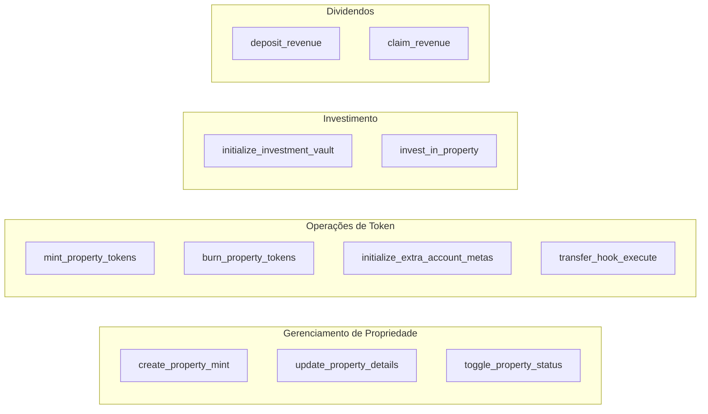
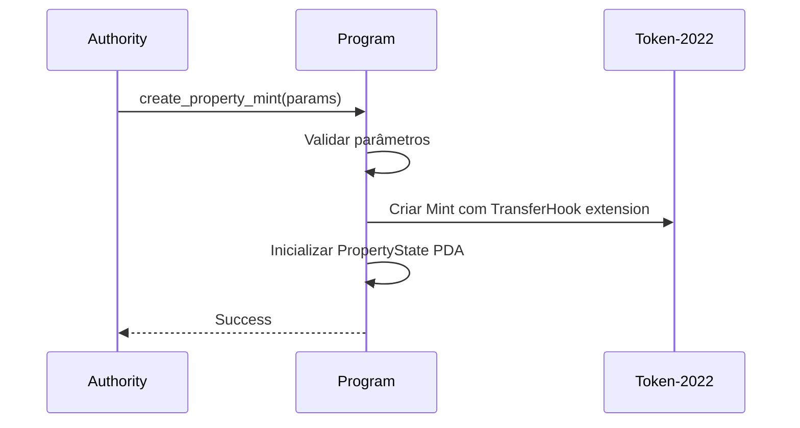
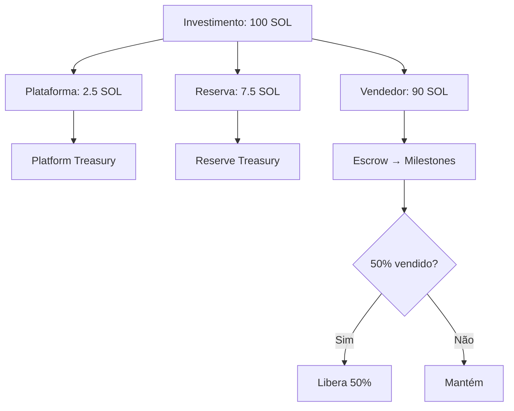
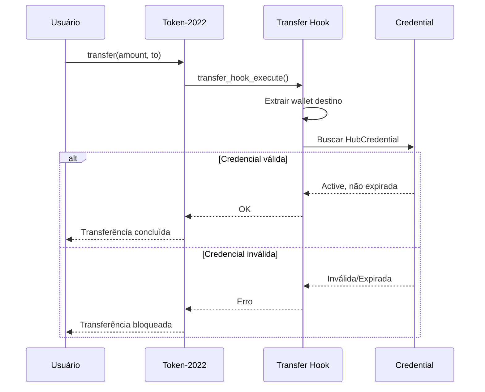
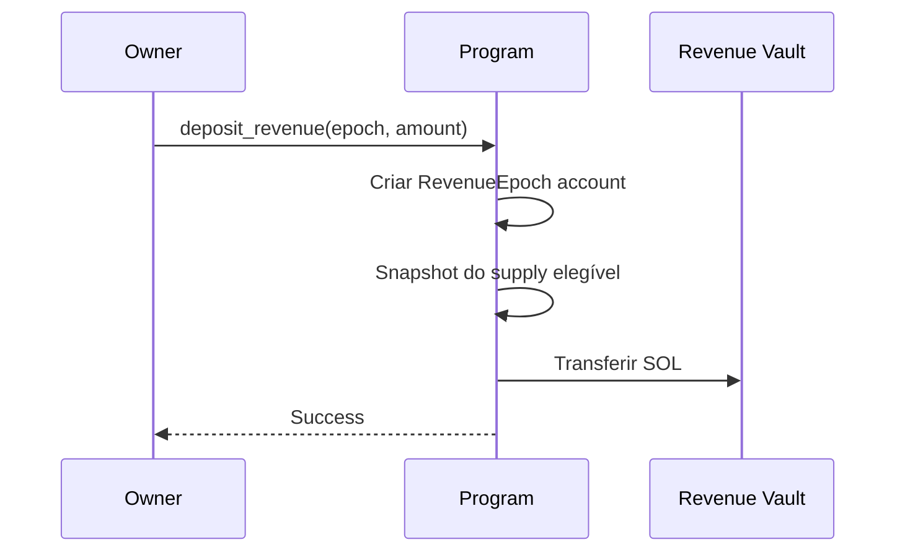
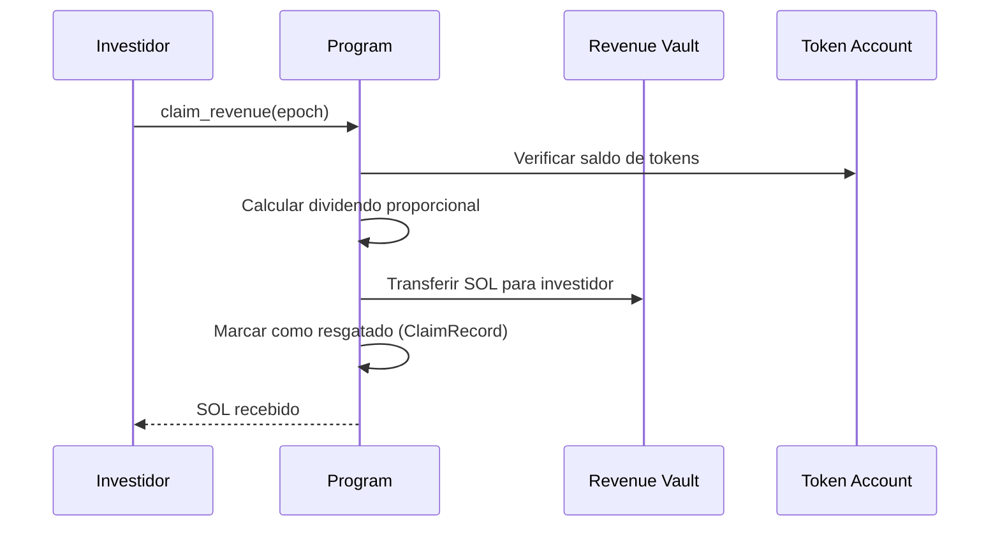
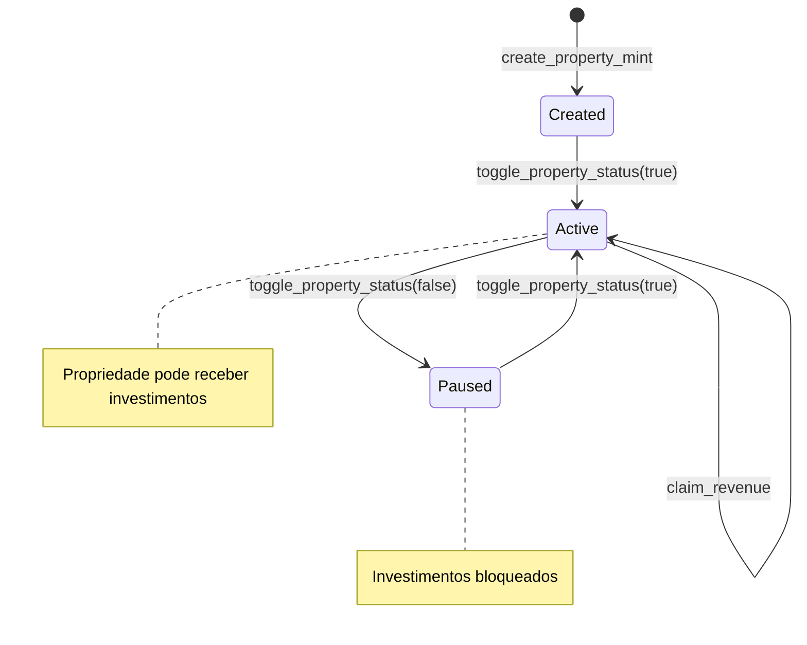

# Hub Token Program

## Visão Geral

O **Hub Token Program** é o contrato principal responsável por toda a lógica de tokenização imobiliária, investimentos e distribuição de dividendos.

**Program ID:** `FDfkSAAqk8uweJusJb8MSNRHXGRvFqokNfjw9m8ve6om`

## Instruções

O programa possui **11 instruções** principais:



---

## 1. create_property_mint

Cria uma nova propriedade tokenizada com um mint Token-2022.

### Parâmetros

| Parâmetro | Tipo | Descrição |
|-----------|------|-----------|
| `property_name` | String | Nome do imóvel (máx 50 chars) |
| `property_symbol` | String | Símbolo do token (máx 10 chars) |
| `decimals` | u8 | Casas decimais (geralmente 6) |
| `total_supply` | u64 | Supply máximo de tokens |
| `seller_wallet` | Pubkey | Carteira que recebe 90% dos investimentos |
| `property_details` | PropertyDetails | Metadata do imóvel |

### Contas Necessárias

```rust
#[derive(Accounts)]
pub struct CreatePropertyMint<'info> {
    #[account(mut)]
    pub authority: Signer<'info>,

    #[account(
        init,
        payer = authority,
        space = 8 + PropertyState::INIT_SPACE,
        seeds = [b"property", mint.key().as_ref()],
        bump
    )]
    pub property_state: Account<'info, PropertyState>,

    #[account(mut)]
    pub mint: Signer<'info>,

    pub token_program: Program<'info, Token2022>,
    pub system_program: Program<'info, System>,
    pub rent: Sysvar<'info, Rent>,
}
```

### Fluxo



### Exemplo de Uso

```typescript
await program.methods
  .createPropertyMint(
    "Edifício Torre Norte",
    "TORRE",
    6,
    new BN(5_000_000_000_000), // 5M tokens
    sellerWallet,
    {
      propertyAddress: "Av. Paulista, 1000 - São Paulo",
      propertyType: "Comercial",
      totalValueUsd: new BN(30_000_000_00), // $30M em centavos
      rentalYieldBps: 850, // 8.5%
      metadataUri: "https://ipfs.io/ipfs/...",
    }
  )
  .accounts({
    authority: wallet.publicKey,
    propertyState: propertyStatePda,
    mint: mintKeypair.publicKey,
    tokenProgram: TOKEN_2022_PROGRAM_ID,
    systemProgram: SystemProgram.programId,
    rent: SYSVAR_RENT_PUBKEY,
  })
  .signers([mintKeypair])
  .rpc();
```

---

## 2. initialize_investment_vault

Inicializa o vault de investimento para uma propriedade.

### Contas

```rust
#[derive(Accounts)]
pub struct InitializeInvestmentVault<'info> {
    #[account(mut)]
    pub authority: Signer<'info>,

    #[account(
        seeds = [b"property", mint.key().as_ref()],
        bump,
        has_one = authority,
    )]
    pub property_state: Account<'info, PropertyState>,

    pub mint: Account<'info, Mint>,

    #[account(
        init,
        payer = authority,
        space = 8 + InvestmentVault::INIT_SPACE,
        seeds = [b"investment_vault", mint.key().as_ref()],
        bump
    )]
    pub investment_vault: Account<'info, InvestmentVault>,

    pub system_program: Program<'info, System>,
}
```

---

## 3. invest_in_property

Permite que um investidor compre tokens de uma propriedade pagando em SOL.

### Parâmetros

| Parâmetro | Tipo | Descrição |
|-----------|------|-----------|
| `sol_amount` | u64 | Quantidade de SOL a investir (lamports) |

### Fluxo de Taxas



### Cálculo de Tokens

```rust
// Cálculo: tokens = (sol_amount * total_supply) / total_value_usd
// Considerando decimals e conversão SOL → USD

let sol_price_usd = get_sol_price(); // Oracle ou fixo
let investment_usd = sol_amount * sol_price_usd;
let tokens_to_mint = (investment_usd * total_supply) / total_value_usd;
```

### Código Simplificado

```rust
pub fn invest_in_property(ctx: Context<InvestInProperty>, sol_amount: u64) -> Result<()> {
    // 1. Verificar KYC
    verify_hub_credential(&ctx.accounts.investor_credential)?;

    // 2. Calcular taxas
    let platform_fee = sol_amount * PLATFORM_FEE_BPS / BPS_DENOMINATOR;
    let reserve_fee = sol_amount * RESERVE_FEE_BPS / BPS_DENOMINATOR;
    let seller_amount = sol_amount - platform_fee - reserve_fee;

    // 3. Transferir taxas
    transfer_sol(ctx.accounts.investor, ctx.accounts.platform_treasury, platform_fee)?;
    transfer_sol(ctx.accounts.investor, ctx.accounts.reserve_treasury, reserve_fee)?;
    transfer_sol(ctx.accounts.investor, ctx.accounts.investment_vault, seller_amount)?;

    // 4. Calcular e mintar tokens
    let tokens = calculate_tokens(sol_amount, &ctx.accounts.property_state)?;
    mint_tokens(ctx.accounts.mint, ctx.accounts.investor_ata, tokens)?;

    // 5. Atualizar estado
    ctx.accounts.property_state.circulating_supply += tokens;
    ctx.accounts.investment_vault.total_invested += sol_amount;

    // 6. Verificar milestones
    check_and_release_milestone(&mut ctx.accounts.investment_vault)?;

    // 7. Emitir evento
    emit!(InvestmentMade {
        property: ctx.accounts.mint.key(),
        investor: ctx.accounts.investor.key(),
        sol_amount,
        tokens_received: tokens,
        platform_fee,
        reserve_fee,
        seller_amount,
    });

    Ok(())
}
```

---

## 4. transfer_hook_execute

Executado automaticamente pelo Token-2022 em cada transferência.

### Propósito

Verificar se o **destinatário** da transferência possui um Hub Credential válido (KYC aprovado).

### Fluxo



### Verificações

1. **Existência** - Credencial existe para o wallet destino
2. **Status** - Status é `Active`
3. **Expiração** - Não está expirada
4. **Emissor** - Emitida por issuer válido

### Código

```rust
pub fn transfer_hook_execute(ctx: Context<TransferHookExecute>) -> Result<()> {
    // Extrair wallet de destino do token account
    let destination_wallet = get_wallet_from_token_account(
        &ctx.accounts.destination_token_account
    )?;

    // Buscar e verificar credencial
    let credential = &ctx.accounts.destination_credential;

    require!(
        credential.owner == destination_wallet,
        HubTokenError::KycVerificationRequired
    );

    require!(
        credential.status == CredentialStatus::Active,
        HubTokenError::CredentialRevoked
    );

    require!(
        credential.expires_at > Clock::get()?.unix_timestamp,
        HubTokenError::CredentialExpired
    );

    // Emitir evento
    emit!(TransferKycVerified {
        mint: ctx.accounts.mint.key(),
        from: ctx.accounts.source_token_account.key(),
        to: ctx.accounts.destination_token_account.key(),
        amount: ctx.accounts.extra_metas.amount,
    });

    Ok(())
}
```

---

## 5. deposit_revenue

Proprietário deposita rendimentos (aluguéis) para distribuição aos holders.

### Parâmetros

| Parâmetro | Tipo | Descrição |
|-----------|------|-----------|
| `epoch_number` | u64 | Número da época (mês/período) |
| `amount` | u64 | Valor em lamports |

### Fluxo



### Snapshot de Supply

O snapshot captura o `circulating_supply` no momento do depósito. Isso previne que alguém compre tokens após o depósito para receber dividendos indevidos.

---

## 6. claim_revenue

Investidor resgata seus dividendos de uma época específica.

### Cálculo do Dividendo

```
dividendo = (saldo_investidor / supply_elegível) × total_depositado

Exemplo:
- Supply elegível: 1.000.000 tokens
- Total depositado: 500 SOL
- Saldo do investidor: 100.000 tokens

dividendo = (100.000 / 1.000.000) × 500 = 50 SOL
```

### Fluxo



---

## Contas e PDAs

### PropertyState

```
Seeds: ["property", mint_pubkey]
Tamanho: ~500 bytes
```

### InvestmentVault

```
Seeds: ["investment_vault", mint_pubkey]
Tamanho: ~200 bytes
```

### RevenueEpoch

```
Seeds: ["revenue_vault", mint_pubkey, epoch_bytes]
Tamanho: ~100 bytes
```

### ExtraAccountMetaList

```
Seeds: ["extra-account-metas", mint_pubkey]
Tamanho: Variável
```

---

## Diagrama de Estados



---

## Testes

### Localização

```
real_estate_program/tests/hub_token_program.ts
```

### Executar Testes

```bash
cd real_estate_program
anchor test
```

### Exemplo de Teste

```typescript
it("Cria uma propriedade tokenizada", async () => {
  const mintKeypair = Keypair.generate();

  const [propertyState] = PublicKey.findProgramAddressSync(
    [Buffer.from("property"), mintKeypair.publicKey.toBuffer()],
    program.programId
  );

  await program.methods
    .createPropertyMint(
      "Test Property",
      "TEST",
      6,
      new BN(1_000_000_000_000),
      sellerWallet.publicKey,
      {
        propertyAddress: "123 Test St",
        propertyType: "Residential",
        totalValueUsd: new BN(1_000_000_00),
        rentalYieldBps: 800,
        metadataUri: "https://test.com/metadata.json",
      }
    )
    .accounts({
      authority: wallet.publicKey,
      propertyState,
      mint: mintKeypair.publicKey,
    })
    .signers([mintKeypair])
    .rpc();

  const state = await program.account.propertyState.fetch(propertyState);
  expect(state.propertyName).to.equal("Test Property");
});
```

---

[← Voltar](./README.md) | [Próximo: Credential Program →](./credential-program.md)
